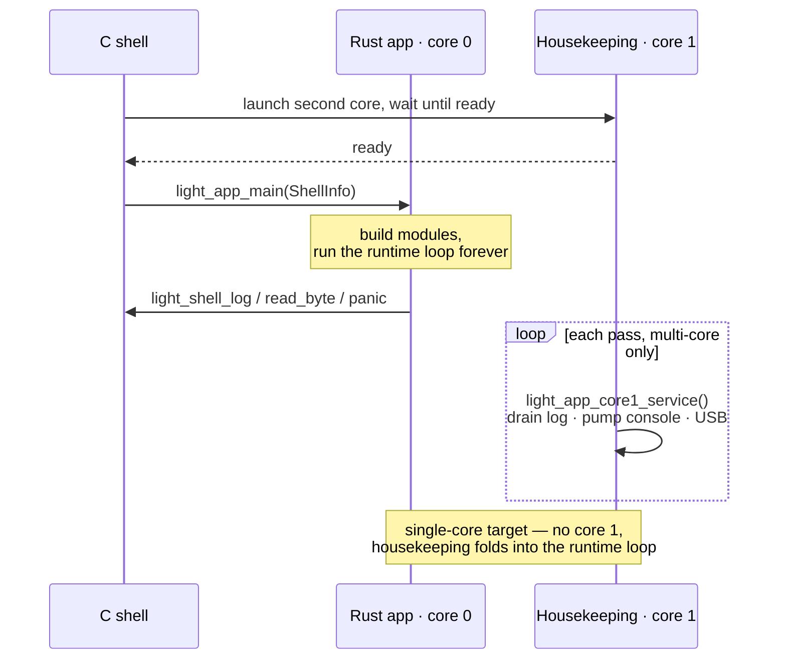

# Light Framework — Specification

This directory is the specification and user documentation for the **Light Framework** by
lightsource aotearoa. Every document here is normative: it defines the structure and behaviour that
the framework's code implements. The documents are the source of truth; the code follows them.

The specification describes the framework as it is. It states contracts, public surfaces, and
invariants in the present tense; it does not narrate how the design was arrived at. Where a design
choice is recorded, it is recorded as a rule with its reason, so the rule outlives the conversation
that produced it.

---

## What the Light Framework is

An embedded application and UI framework for small microcontrollers. It gives a device: a
cooperative module runtime, a widget toolkit rendered to a panel, touch/IMU/gesture input, audio,
storage and filesystems, real-time clock, power management, and a console — as portable Rust
libraries that run unchanged across several chips, and on the host under `cargo test`.

The framework is used by lightsource's own products; the applications in the tree (the widget demo,
the dictaphone, the crossfire USB-MIDI host) are both real applications and the worked examples of
how an application is built on it.

## Core principles

1. **Rust above a C shell.** The framework code is a `no_std` Rust staticlib linked into a firmware
   executable that the platform SDK's build still owns. On the RP2 chips that SDK is pico-sdk; the C
   shell keeps `crt0`, `boot2`, the linker script, multicore launch, PIO and TinyUSB. Rust owns
   everything above the runtime. The same shape carries the bare-CMSIS STM32 ports, where a small C
   shell stands in for the SDK. See [07-ports-and-shell.md](07-ports-and-shell.md).

2. **Host-first, made structural.** Nothing in the portable crates touches hardware directly;
   everything reaches the world through the traits of `light_core::hal`, which a *port* crate
   implements. The same portable code runs under `cargo test` on the host against a mocked board.
   The type system enforces the discipline: portable code cannot name hardware.

3. **Layered crates, one direction of dependency.** The portable crates form a stack; each depends
   only on the ones above it and **never on a port**. A port crate (`light-rp2`, `light-stm32h7`,
   `light-stm32f4`) is chosen by the firmware, not by a library. See the layering below.

4. **Assets are data, not code.** Fonts, look-and-feel themes and whole UI layouts are authored as
   files, compiled by the `crush` tool to binary blobs, and `include_bytes!`'d into firmware.
   Restyling or relaying an interface is a data change with no UI source touched. See
   [08-assets-and-tooling.md](08-assets-and-tooling.md).

5. **The application is a portable crate; the board is its instantiation.** An app's logic lives in
   a hardware-independent crate; a per-board crate supplies the wiring (pins, peripherals, the
   embedded blobs) and links it to a board-support crate. See [09-application-model.md](09-application-model.md).

6. **One version across the tree.** All crates share a single version, bumped in the commit a release
   tags. MIT licensed throughout. The tree is two cargo workspaces — a portable one and a firmware
   one — that share that single version. See [10-build-and-release.md](10-build-and-release.md).

## Conventions

This specification is **normative**: it defines the structure and behaviour the code implements, and
the code follows it. Where the code and this spec disagree, that is a defect — fix the code, or
change the spec deliberately and say why. New conventions and cross-cutting decisions are recorded
here as they are established, so the rules live in the repository rather than in anyone's memory.

### Documentation conventions

- **Hardware-agnostic language.** Describe every behaviour in terms of a general *contract* or
  hardware *capability* ("hardware with a reset line", "a codec over `I2cBus`", "the `PowerSource`
  seam"), so a consumer can add their own hardware against it. A specific part appears only as a
  clearly-labelled **reference / example** implementation of that seam; its part-specific facts
  (registers, quirks, timings) stay inside its own subsection. Do not name board models or vendors in
  the prose. Chip and port names belong only in [07-ports-and-shell.md](07-ports-and-shell.md), whose
  subject *is* the chip.
- **Per-subsystem format.** Each subsystem document states, for its crates: the **responsibility**,
  the **public surface** (the types and traits that define its contract), the **behaviour and
  invariants**, and the **notable design decisions and constraints** that shaped it.
- **Diagrams.** Illustrate relationships with Mermaid in fenced ```mermaid blocks, each with a
  one-line italic caption tying it to the invariant it shows. Keep one visual grammar (solid arrows =
  a compile-time dependency, dashed = a runtime call). Mermaid treats `;` as a statement separator
  and `::` as class-assignment syntax, so neither may appear raw in a label; write angle brackets as
  `&lt;` / `&gt;`.
- **Present tense, no history.** State what the framework is, not how it came to be. A rule that
  needs its reason carries the reason beside it; a superseded design is not described.

### Normative code conventions

The six **Core principles** above are normative rules the code obeys. In addition:

- **The application core is cooperative and single-core; multi-core is used where a chip offers it,
  never required** (see [01-core-runtime.md](01-core-runtime.md)).
- **Modules couple only through the event bus** — never by calling each other or sharing state.
- **Large objects live in `.bss`** via `StaticCell`/`ConstStaticCell`, taken once as `&'static mut`,
  never built on the small application-core stack.
- **The board wiring is the application's, never a framework crate's** (see
  [09-application-model.md](09-application-model.md)).
- **Hardware that moves a real rail is safe by default** — a survivable ceiling raised only by code
  that knows the board's wiring (see [06-power-and-time.md](06-power-and-time.md)).
- **A port is the hardware extension point:** implement the `light_core::hal` traits a board needs
  plus one `critical-section`, and nothing above `light-core` changes (see
  [07-ports-and-shell.md](07-ports-and-shell.md)).

## The execution model

A firmware image is the C shell plus the Rust staticlib. At boot the shell brings up the platform,
then hands control to Rust through a small ABI:

- `light_app_main(&ShellInfo) -> !` — the Rust entry. The shell calls it once with the resolved
  clock rates; it never returns. It constructs the peripherals, builds the modules, and runs the
  runtime loop forever on the application core.
- `light_app_core1_service()` — on a **multi-core** chip, called repeatedly on the second core: it
  drains the log queue to the shell's output and pumps console input bytes into the app, so the
  application core never touches stdio and a busy render loop cannot stall the console. A
  **single-core** chip has no second core to call this; the same housekeeping runs inline on the
  application core (see [07-ports-and-shell.md](07-ports-and-shell.md)).
- The Rust side calls back into the shell for the few things the SDK owns: `light_shell_log`,
  `light_shell_read_byte`, `light_shell_panic`.

The framework runs on both single-core and multi-core targets. The application — its modules and the
runtime loop — always occupies one application core, and that single-core cooperative model is the
whole of what an application author reasons about. Where the chip has a second core, the framework
*actively uses* it to offload the console and (on the RP2 device role) USB, so the two never
contend; where it does not, that work folds into the same loop. Multi-core is an optimisation taken
where a chip offers it, never a requirement.



*The shell owns boot and clocks, then hands control to Rust through `light_app_main`, which never
returns. On a multi-core chip the second core runs the console/USB housekeeping in parallel; on a
single-core chip the same work runs inline in the runtime loop.*

Above that ABI, the app is a set of **modules** driven by a cooperative **runtime**. A module is
polled each pass and reports whether it is busy or idle; the runtime idles the core when all are
idle. Modules communicate through a typed **event bus**. This is the whole concurrency model on the
application core: no preemption, no async runtime. See [01-core-runtime.md](01-core-runtime.md).

## The layering

Portable crates, each depending only on those above it, never on a port:

    light-core        the port interface (hal), the module runtime, log queue, event bus, mailbox,
                      console line reader, CLI
    light-font        the LGF bitmap font format: no_std reader; encoder behind `alloc`
    light-draw        the rasteriser: canvas, rotation/flip transforms, pixel formats, regions, text
    light-display     the chunked display core, the frame layer, reference panel drivers (ST7789/SH1107/…)
    light-input       touch tracking + gestures, touch controllers, the IMU model + drivers;
                      the BoardEvent HAL trait
    light-ui          the widget toolkit: pages, layouts, buttons, scroll, focus, animated transitions
    light-midi        the USB-MIDI forwarder engine and its transport trait
    light-audio       codec drivers over the I2C bus trait
    light-rtc         real-time clock drivers over the I2C bus trait
    light-sd          SD/TF card access: the SPI-mode block layer
    light-fs          filesystems: FAT16/FAT32 over any BlockDevice
    light-power       power-supply management: operating points, PD contracts, the request ceiling
    light-power-manager  portable idle/backlight power policy over a per-board mechanism
    light_ui_components  higher-level UI components integrating other layers (e.g. a file picker)

Ports (target-only, chosen by the firmware, in the firmware workspace — not host-tested):

    light-rp2         RP2040 (Cortex-M0+) and RP2350 (Cortex-M33 or Hazard3), one source over the pac
    light-stm32h7     STM32H743 over bare CMSIS
    light-stm32f4     STM32F411 over bare CMSIS

Host tooling (never linked into firmware):

    tools/crush, tools/crush-core   the asset compiler (fonts → LGF, themes → LTH, designs → LUI)
    tools/light-host-gui            an egui window that renders a light-ui UI offscreen on the desktop
    tools/light-ui-editor           a desktop editor for light-ui designs, over light-host-gui

## Targets

The reference ports run on the RP2040 and RP2350 (both the Arm and Hazard3 cores), and the STM32H743
and STM32F411 over bare CMSIS; a consumer adds a chip by writing a port (see
[07-ports-and-shell.md](07-ports-and-shell.md)). A host build exercises the portable crates under
`cargo test` against a mocked board. Hardware-verified across a range of RP2350 touch boards of
differing sizes, an OLED-panel board, and the crossfire USB-MIDI host.

---

## The document set

| Document | Covers |
| --- | --- |
| [00-overview.md](00-overview.md) | This file: what the framework is, its principles, the layering, the document map. |
| [01-core-runtime.md](01-core-runtime.md) | `light-core`: the HAL/port interface, the module runtime, the event bus and mailbox, logging, the console and CLI, the host-test model. |
| [02-graphics-and-ui.md](02-graphics-and-ui.md) | The rendering stack: `light-font`, `light-draw`, `light-display`, `light-ui`, `light_ui_components`. |
| [03-input.md](03-input.md) | `light-input`: touch tracking and gestures, the touch controllers, the IMU model and drivers, the `BoardEvent` trait. |
| [04-audio-and-midi.md](04-audio-and-midi.md) | `light-audio` (codecs, the I2S transport) and `light-midi` (the USB-MIDI forwarder). |
| [05-storage.md](05-storage.md) | `light-sd` (the SPI block layer) and `light-fs` (FAT16/32 over `BlockDevice`). |
| [06-power-and-time.md](06-power-and-time.md) | `light-power` (PD sink, operating points), `light-power-manager` (idle policy), `light-rtc`. |
| [07-ports-and-shell.md](07-ports-and-shell.md) | The ports (`light-rp2`, `light-stm32h7`, `light-stm32f4`), the C shells, and the shell ABI. |
| [08-assets-and-tooling.md](08-assets-and-tooling.md) | `crush`/`crush-core`, the LGF/LTH/LUI blob formats and their versioning, the design `extends` mechanism, `light-host-gui`, `light-ui-editor`. |
| [09-application-model.md](09-application-model.md) | The application model: portable app crates, board-support crates, per-board instantiation crates, the design-as-data workflow, the worked examples. |
| [10-build-and-release.md](10-build-and-release.md) | The build system: CMake + Corrosion, the presets, the `light-*.ps1` script layer, flashing, host tests, versioning and releases. |

Each subsystem document states, for its crates: the responsibility, the public surface (the types
and traits that define its contract), the behaviour and the invariants, and the notable design
decisions and constraints that shaped it.
