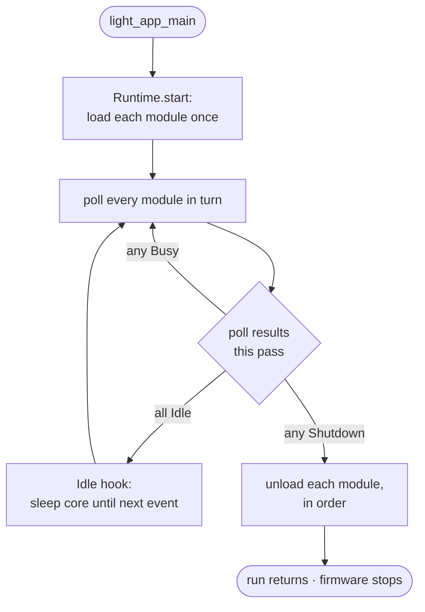
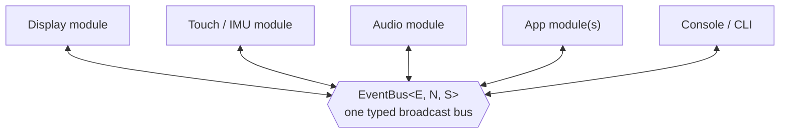

# Core and Runtime — `light-core`

`light-core` is the portable, `no_std` foundation every other crate depends on. It defines the
**port interface** (the traits a chip implements), the **module runtime** (the concurrency model),
and the small services every application needs: a bounded log queue, a typed event bus, a mailbox, a
console line reader, and a command-line grammar. It touches no hardware: everything it needs from
the world arrives through the traits in `hal`, so the same code runs under `cargo test` on the host
against a mocked board.

## Responsibility

- Define the seam between portable code and a chip — the `hal` traits — so no crate above it names a
  register or a pin.
- Provide the runtime that schedules an application's modules cooperatively on one core.
- Provide the inter-module and cross-core plumbing: the event bus, the mailbox, the log queue.
- Provide the console primitives: a line reader and a CLI command table.
- Make the host-first rule structural: portable code compiles and runs on the host because it only
  ever calls `hal` traits, which a mock implements.

## The port interface — `hal`

`light_core::hal` is the set of traits a port crate implements for a chip. The rest of the framework
is written against these, never against a concrete peripheral. The core ones:

- **`Clock`** — the monotonic time source: microsecond `now`, and blocking `delay_ms`. The port's
  `SysClock` implements it; a free `now_us` function is also exposed by the port for hot paths.
- **`I2cBus`** — a byte-level I2C master (write, read, write-then-read), with an `I2cError`. A
  blanket impl for `&RefCell<B>` lets several drivers share one bus. Every I2C peripheral driver
  (codecs, RTC, IMU, touch, PD sink) is generic over `I2cBus`.
- **`SpiDisplayBus`** — the write-only command/data path a panel driver pushes pixels through,
  abstracting a SPI or PIO-QSPI display link.
- **`OutputPin` / `InputPin`** — single GPIO lines.
- **`BlockDevice`** — a 512-byte block device (`block_count`, `read_block`, `write_block`,
  `BlockError`), with a blanket impl for `&mut T` so a filesystem can mount over a borrowed card.
  This is the seam between `light-sd` and `light-fs` (see [05-storage.md](05-storage.md)).
- **`AudioStream`** — the transport contract an audio module drives (stream push/free, capture,
  active gating), so an app's audio logic is independent of the concrete I2S port (see
  [04-audio-and-midi.md](04-audio-and-midi.md)).
- **`Idle`** — what the runtime calls when every module is idle (e.g. a `Breathe` low-power wait).

A port also supplies one `critical_section` implementation. That single item — plus the `hal` impls
— is what lets the identical portable code link against a real chip or against a host mock.

## The module runtime

The whole concurrency model on the application core is cooperative modules, no preemption and no
async runtime.

- **`Module`** — the trait an active component implements: a `name`, an optional `load` (once, at
  start), a `poll` (each pass), and an optional `unload` (at shutdown). A module owns its hardware
  and its state; it reacts to events and produces events.
- **`Poll`** — what `poll` returns: `Idle` (nothing to do), `Busy` (did work, poll again promptly),
  or `Shutdown` (tear the runtime down). Shutdown flows through the runtime like any other result,
  so every module's `unload` runs in order before the firmware stops.
- **`Runtime<N>`** — holds up to `N` modules (`add`), `start`s them (each `load`), then `run`s the
  loop: poll every module round-robin; when all report `Idle`, call the `Idle` hook (which lets the
  core sleep) until the next event. `run` returns only on shutdown.

An application's `light_app_main` builds its modules, adds them to a `Runtime`, and calls `run`,
which never returns (see [09-application-model.md](09-application-model.md)).

*The loop is cooperative: it advances only as modules yield, sleeps the core through the `Idle` hook
when every module is idle, and tears down cleanly when any module returns `Shutdown`.*

### Single-core and multi-core targets

The application — its modules and the runtime loop — always runs on **one** core, the *application
core*. That is the whole of the concurrency model an application author reasons about, and it is the
same on every target, from a single-core chip to a dual-core one.

What differs is where the framework's *housekeeping* runs — draining the log queue to the console and
pumping console input (and, on the RP2 device role, servicing USB):

- On a **multi-core** target the framework actively uses the second core for that housekeeping. The
  shell drives `light_app_core1_service` on it (see the shell ABI in
  [07-ports-and-shell.md](07-ports-and-shell.md)), so an arbitrarily busy render loop on the
  application core can never stall the console, and vice versa.
- On a **single-core** target there is no `light_app_core1_service`; the identical housekeeping runs
  inline on the application core, folded into the runtime loop. Behaviour is the same — the only thing
  lost is the isolation between a busy loop and the console, which single-core code accounts for by
  keeping the housekeeping cheap and non-blocking.

So multi-core is an optimisation the framework takes where a chip offers it, not a requirement: the
same application, the same modules and the same event bus run unchanged on a single-core part.

## Events — `events`

Modules do not call each other; they publish and subscribe on a shared bus.

- **`EventBus<E, N, S>`** — a fixed-capacity (`N` events) broadcast bus with `S` subscriber slots,
  parameterised by the application's event type `E: Copy`. A board static; its depth and subscriber
  count are board facts. `subscribe` returns a `Subscription`; `publish` broadcasts (returning the
  event on overflow); `poll(&Subscription)` reads the next event for that subscriber.
- **`Bus<E>`** — the capacity-erased trait `EventBus` implements, so a module can hold `&'static dyn
  Bus<E>` without naming the bus's const parameters. Modules generic over the app event (e.g. the
  board input modules) take `&dyn Bus<E>`.

The application's event type is a single enum carrying every kind of thing that happens — input
events, commands, status changes, and a board **extension** variant `Ext(X)` for the board's own
affairs. This one type is the vocabulary the whole app speaks.

*Modules never call each other. Each publishes and subscribes on the one bus, so a board can add its
own modules (audio, battery, RTC) to an app without the app naming them — they ride the same bus
through the `Ext(X)` variant.*

## Mailbox and log queue

- **`Mailbox<T, N>`** — a bounded single-producer/single-consumer queue, the lock-free hand-off used
  where one side must never block (e.g. console bytes arriving on core 1 for core 0 to consume). A
  full mailbox drops, and the drop is counted.
- **`log`** — a bounded log queue with the usual levels (`debug`/`info`/`warn` macros). Records are
  enqueued on the application core and drained to the console by whoever runs the framework's
  housekeeping: a **second core** where the chip has one (`light_app_core1_service`, so formatting and
  output never stall the render loop), or the application core inline on a single-core target. Either
  way the enqueue side is cheap and the drain is off the hot path of a module's `poll`. `log::set_clock`
  gives records timestamps; `log::drain(n, sink)` empties up to `n` records to a sink.

## Console and CLI — `console`, `cli`

- **`LineReader<N>`** — assembles console input bytes into lines of up to `N` characters, dropping
  and counting overlong lines.
- **`cli`** — the command grammar: a static `Cli<E>` over a `&[Command<E>]` table; each `Command`
  has a name, a usage string, and a `parse(&mut Words) -> Parsed<E>` function that turns the rest of
  the line into an application event (or a usage error, or a directly-handled action). `dispatch`
  returns an `Outcome` (a quiet no-op, an event to publish, a handled command, or shutdown). The
  built-in rows and the app's own rows are composed by the application; the same grammar drives a
  bring-up rig, where a host script replays an interaction over the console.

## Static allocation — `StaticCell` / `ConstStaticCell`

Re-exported from `static_cell`. The big objects (framebuffers, the widget arena, module state) live
in `.bss` as statics taken once as `&'static mut`, never built on the small core-0 stack. This is a
recurring discipline across the firmware: a large value on the stack can overflow into the other
core's stack region.

### mk5 decision — capacities have defaults and derive where they can

*Decided and implemented for mk5 (proposal G, capacities half).* mk4 made every board hand-pick the
fixed-capacity const generics — `EventBus<E, N, S>`, `Runtime<N>`, `Ui<A, N>` — and a wrong
subscriber count `S` surfaced only as a runtime `expect("subscriber slot")` panic. mk5:

- gives the runtime and the event bus **default const-generic parameters** (`light_core::DEFAULT_MODULES`
  and `DEFAULT_EVENT_DEPTH`), so a board writes `EventBus<AppEvent>` / `Runtime` and names a capacity
  only when it differs — cleaner than a type alias, and fully backward-compatible with the explicit
  `EventBus<E, N, S>` boards that need other numbers. (`Ui<A, N>`'s arena is a page-complexity fact
  with no meaningful default, so it stays explicit.)
- **derives the default subscriber count from the module set**: the default `S` *is*
  `DEFAULT_MODULES`, one slot per module a default `Runtime` can hold, so a board on the defaults can
  never under-provision the bus. Over-provisioning surfaces at **startup** — `subscribe` returns
  `None` and `Runtime::add` returns `Error::Capacity`, both in the init path — never as a mid-run
  panic (every subscription is taken at startup). A per-board compile-time count would need a
  module-registration macro; the derived default is the feasible slice, and the explicit path stays
  for boards that outgrow it.
- keeps the capacities a board *does* set in **one documented place** per board (its statics and the
  `Runtime<N>` in `light_app_main`) rather than scattered across call sites.

## Behaviour and invariants

- No portable crate reaches hardware except through a `hal` trait; a port supplies the impls and the
  one `critical_section`.
- The application runtime is cooperative on the one application core (whether or not the chip has a
  second core for housekeeping): a module must not block the poll loop for longer than the slowest
  real-time deadline in the system tolerates; long or blocking work (a slow card read) is either
  chunked or absorbed by a hardware buffer (see the audio IRQ ring in
  [04-audio-and-midi.md](04-audio-and-midi.md)).
- Modules never share state directly; all cross-module communication is events on the bus.
- The core builds and tests on the host (`cargo test`) because everything hardware-facing is a trait.

## Design decisions and constraints

- **Host-first is structural, not conventional.** The predecessor C framework had a host-first
  discipline; mk4 makes it a property of the type system — portable code cannot name hardware, so it
  cannot fail to be host-testable.
- **Cooperative, not async.** The runtime is a plain poll loop. The cost is that a module must yield;
  the benefit is no executor, no futures, no hidden allocation, and a model small enough to reason
  about on a 4 KB stack.
- **The event bus is the only coupling.** Keeping modules decoupled behind one broadcast bus is what
  lets a board add its own modules (audio, battery, RTC) to the same app without the app naming them
  — they ride the same bus through the `Ext(X)` extension variant.
