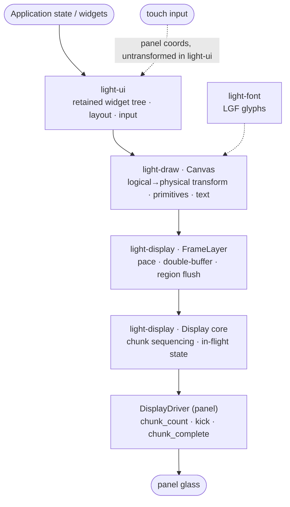
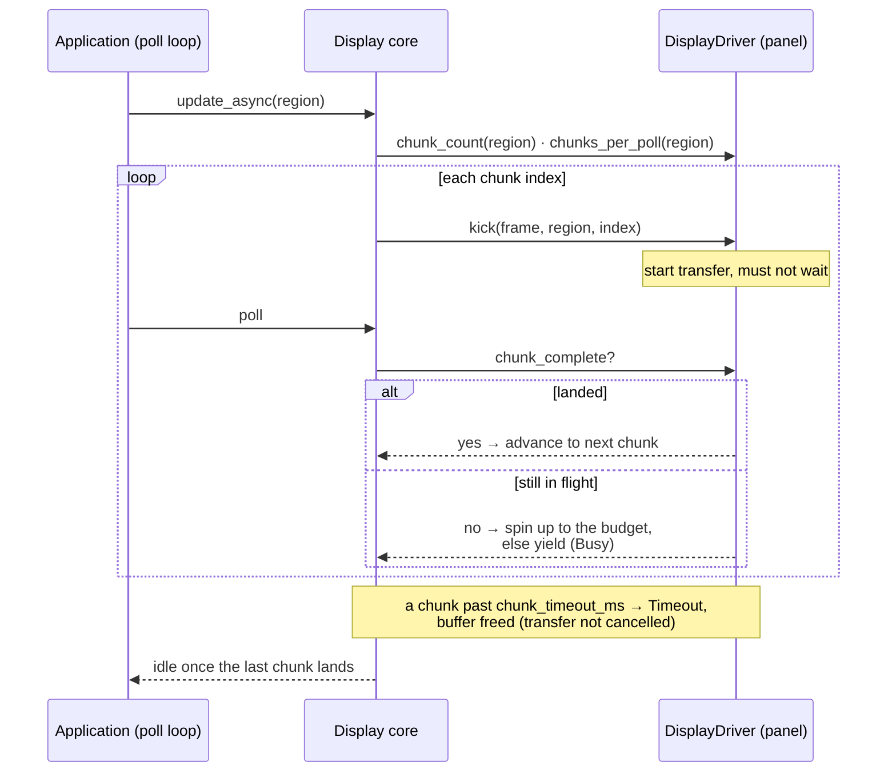
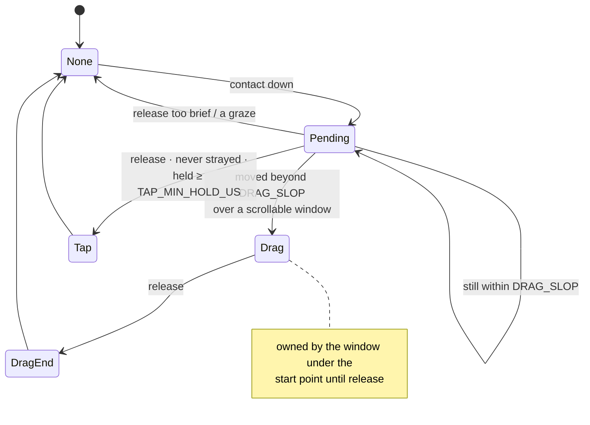

# Graphics and UI

The rendering stack turns application state into pixels on a panel and turns touches back into
events. It is five portable crates, each depending only on those above it and never on a port:
`light-font` (the bitmap font format), `light-draw` (the rasteriser), `light-display` (the display
core, frame layer and panel drivers), `light-ui` (the widget toolkit), and `light_ui_components`
(higher-level components that wire the toolkit to other subsystems). Everything here is `no_std`,
reaches hardware only through `light_core::hal`, and runs unchanged under `cargo test` against a
mocked board.

Three ideas run through the whole stack. **Assets are data**: fonts, themes and whole UI layouts are
authored as files, compiled by `crush` to binary blobs, and `include_bytes!`'d into firmware, so
restyling or relaying an interface is a data change with no source touched. **Logical versus
physical coordinates**: the rasteriser draws in a logical frame that stays upright however the panel
is mounted, and a single affine transform maps it to the buffer, so a rotated device needs no
special-casing above the transform. **Full-repaint with region tracking**: every frame redraws the
whole widget tree onto a cleared buffer, and only the *pushed* region — the bytes that travel to the
panel — is optimised, which is where cost scales with panel size.

*State flows down to pixels: `light-ui` lays out and paints through a `light-draw` canvas, the frame
layer paces and region-flushes into the display core, and the panel driver pushes chunks to the
glass. Touch travels back up in panel coordinates, untransformed inside `light-ui` — the one place
that knows the rotation.*

---

## Bitmap fonts — `light-font`

### Responsibility

Define the LGF (Light Glyph Font) format — a rendered bitmap font as data — and a `no_std` reader
that parses a blob in place. Provide an `alloc`-gated encoder that `crush` uses to build blobs.

### Public surface

- **`Font<'a>`** — a parsed font borrowing the blob; `Copy` (a pointer and a length). `Font::parse`
  validates and wraps a slice. Accessors: `cell_width`, `cell_height`, `ascent`, `pitch`,
  `glyph_count`, `pixel_size`, `glyph_len`. `has(c)` tests presence; `glyph(c)` returns the packed
  rows or `None`; `pixel(c, x, y)` reads one pixel (false outside the cell or for a missing glyph);
  `chars()` iterates every present code ascending.
- **`Encoder`** (feature `alloc`) — `new(cell_width, cell_height, ascent, pixel_size)`, `add(c,
  rows)` (any order; refuses the wrong size), `encode()` → `Vec<u8>`.
- **`Error`** — `TooShort`, `BadMagic`, `UnsupportedVersion(u8)`, `UnsupportedFlags(u8)`,
  `Inconsistent`.
- Constants: `MAGIC` (`b"LGF1"`), `VERSION` (1), `FLAG_MONO_MSB` (0x01), `HEADER_LEN` (48).

### Behaviour and invariants

- **Layout** (little-endian): a 48-byte header — magic, `u8` version, `u8` flags, `cell_width`,
  `cell_height`, `ascent` (baseline row from the top of the cell), `pitch` (bytes per row =
  `(cell_width + 7) / 8`), `u16 glyph_count`, `u16 pixel_size` (resolved `y_ppem`), a reserved
  `u16`, then a 32-byte presence bitmap (bit `c` set when char code `c` has a glyph) — followed by
  `glyph_count * pitch * cell_height` bytes of glyphs in ascending char code.
- **Fixed cells, one encoding.** Every glyph occupies the same cell; the only flag encoding is 1 bpp,
  MSB-first, row-major (`FLAG_MONO_MSB`). Anything else is rejected.
- **Lookup by popcount, not an offset table.** A glyph's index is the number of present codes below
  it — a popcount over at most 32 bytes — so there is no offset table to keep in step with the data.
- **`parse` says no to what it does not understand.** It checks length, magic, version and flags,
  then two consistency invariants — the pitch must match the cell width, and the presence-map
  popcount must equal `glyph_count` — before confirming the blob is long enough to hold every glyph.

### Notable design decisions and constraints

- The blob header convention (magic + `u8` version) is shared with LTH themes and LUI UIs, so every
  format is version-checked the same way; a field addition that stays backward-compatible does not
  bump the version.
- `Font` is `Copy` and borrows: glyph data is transient, so a UI carries no font lifetime (it keeps
  only cell metrics) and a font can be swapped freely.

---

## The rasteriser — `light-draw`

### Responsibility

Draw primitives and text in logical coordinates onto a physical buffer, honouring a rotation/flip
transform and a clip rectangle, in the panel's pixel format.

### Public surface

- **`Canvas<'a>`** — the drawing context over a `&mut [u8]` buffer. Constructed with `new(buf,
  format, width, height)`. Orientation: `set_rotation`, `set_flip`, `set_offset(dx, dy)` (a logical
  translation for a page-transition slide), `set_clip`/`clear_clip`/`clip`. Queries: `width`,
  `height` (logical, swapped under R90/R270), `format`, `transform`, `buffer`. Mapping:
  `transform_rect`, `untransform_point` (physical → logical, for input). Fields `fg`, `bg`.
  Primitives: `set`/`get`, `clear`, `line`, `rect`, `fill_region`, `circle`, `arc`, `rect_rounded`,
  `rect_shaded`, `rect_rounded_shaded`. Blits: `blit_rotated` (with `scale_inscribed` and
  `SCALE_ONE`), `blit_offset`. Text: `text` (ink only) and `text_boxed` (ink plus background), each
  returning the logical `Region` the cells covered.
- **`PixelFormat`** — `Mono1` (1 bpp, eight per byte, leftmost pixel in bit 0), `Rgb565` (16 bpp,
  big-endian: the wire order push panels take, so the frame buffer *is* the transfer), `Rgb565Le`
  (native little-endian halfwords, for a scanout engine that reads the buffer by DMA). Helpers
  `stride`, `buffer_len`, `is_rgb565`.
- **`Region`** — an inclusive physical rectangle: `new`, `full`, `width`, `height`, `union`,
  `clamped`.
- **`Rotation`** (`R0`/`R90`/`R180`/`R270`), **`Flip`** (`None`/`Horizontal`/`Vertical`/`Both`),
  **`Transform`** (a 2×3 integer affine with `IDENTITY`, `apply`, `for_canvas`, `rect`), **`Point`**.
- **`corner`** module (bitflags for rounded corners), free functions `lerp565`.

### Behaviour and invariants

- **Logical draws onto a physical buffer through one transform.** `Transform::for_canvas` composes a
  flip (in logical space, first) with a rotation, giving a matrix whose entries are in `{-1, 0, 1}`
  with determinant ±1 — so its inverse (used for input) is exact integer arithmetic. Under R90/R270
  the logical dimensions are the physical ones swapped.
- **Everything clips.** Every primitive honours an inclusive logical clip that is never larger than
  the canvas; nothing can index outside the buffer, and a widget's border stops exactly where its
  fill does. A non-zero offset shrinks the clip to the window that still lands on the buffer, and
  `set_clip`/`clear_clip` stay inside that bound.
- **Runs, not per-pixel transforms.** A horizontal logical run maps to a fixed stride through the
  buffer (contiguous under R0/R180, a column under R90/R270), so a fill is a `memset` and text is a
  few runs per row. This is what makes a full repaint affordable — a per-pixel transform-and-clip
  path put a 240×280 frame at ~22 ms. RGB565 ink-only text (every label) and same-colour fills each
  take a tight loop.
- **Text** draws a cell's top-left at the origin, looking each glyph up once per character, and
  reports the clipped logical region covered; a missing glyph is blank, off-canvas cells clip.
- **Conventions fixed on hardware.** 0° points right and angles increase clockwise on screen; an
  arc is sampled at half-pixel spacing so joins never open; a filled disc uses the same spans its
  outline traces; a rounded rect clamps its radius to half the shorter side (degenerating to a
  stadium, not nonsense); Q15 trig rounds rather than truncates. Sine is a 91-entry Q15 table, so
  the crate is free of floating point.
- **Blits work in physical space and ignore the transform** — they move an image rather than draw
  through the mapping, which is what makes them usable to animate *between* two rotations.
  `blit_rotated` inverse-samples (so scaling leaves no gaps) and `scale_inscribed` gives the largest
  scale a rotation still fits in the buffer. Blits are RGB565-only; `blit_offset` slides one image
  over another and leaves the uncovered band untouched. `Rgb565Le`'s byte order is a property of who
  *consumes* the buffer, not of the framework, and a byte-swap mismatch stays invisible while the
  image is byte-swap-invariant — as white-on-black is.

### Notable design decisions and constraints

- Two pixel formats plus the byte-order variant cover the two panel classes: push panels (SPI/QSPI)
  whose buffer is the wire transfer, and scanout panels whose buffer a DMA engine reads as `u16`.
- `Mono1` packs the leftmost pixel in bit 0 — the order the SH1107 driver unpacks.
- **A fill scans along whichever logical axis the rotation has put on a physical row** (mk5
  decision). Pixels are adjacent in one buffer direction only, so a run along that direction can be
  written as whole bytes (`Mono1`) or a memset (`Rgb565`), while a run across it steps the buffer
  and costs a pixel at a time. Which logical axis that is depends on the rotation, and under a
  quarter turn the two swap over — so `fill_region` and a filled `rect` choose the direction rather
  than always scanning rows. The picture is identical either way, which is what a test asserts: the
  same rectangle drawn under all four rotations on a square canvas must cover the same pixels.
- **Text is walked in rows whatever the rotation, and that is a measurement, not an oversight.**
  Applying the argument above to the glyph cell — walking it in columns so each run of like pixels
  lies along a physical row — was tried on a rotated one-bit panel and made a repaint half as slow
  again (3294 → 4953 µs on an identical frame). A fill is one long run per row, so what a run costs
  per *pixel* decides it; a glyph is a dozen short ones, so what a run costs per *call* decides it,
  and the transposed walk pays more per call (the glyph read down a bit column rather than along a
  pre-sliced row, and a run set up for every stroke). An argument that holds for one primitive does
  not automatically reach another with a different shape. A rotation-equivalence test for text
  remains, drawing asymmetric glyphs under all four rotations, since it is worth pinning regardless.
- **`Mono1` writes runs a byte at a time** (mk5 decision). A run along a physical row is a mask on
  the first byte, a `fill` through the middle and a mask on the last, rather than eight
  read-modify-writes per byte; any other direction lands on a different byte each pixel and is still
  taken one at a time. Both halves matter together: measured on a one-bit panel mounted under a
  quarter turn, a repaint was several milliseconds, which on a board that is also forwarding
  time-critical traffic is long enough to be felt elsewhere. A rasteriser's inner loop is not a
  private concern of the display when the application core is shared.

---

## The display stack — `light-display`

### Responsibility

Own the frame buffer and drive updates to a panel. Three layers: the **chunked display core**
(`display`), which sequences an update as chunks and owns all the in-flight state; the **frame
layer** (`frames`), which paces, double-buffers and region-flushes above it; and the **panel
drivers**, each of which sees only a `light_core::hal` bus and nothing about the chip behind it.

### Public surface

- **`Display<'b, D: DisplayDriver>`** — the core. `new(driver, buf, width, height, format, now)`;
  optional `set_back_buffer` (double buffering) and `is_double_buffered`. Drawing access:
  `frame_mut` (the back buffer, or the single buffer unless an update is reading it — then `None`),
  `front`. Update lifecycle: `update_async(region)`, `poll` (`Ok(true)` busy / `Ok(false)` idle),
  `wait`, `update_blocking`, `busy`. Double buffering: `swap`, `freeze`, `freeze_render`, `thaw`,
  `is_frozen`, `frame_and_capture`. `init`, `driver`, geometry accessors, and a public `timeouts`
  counter.
- **`DisplayDriver`** — the trait a panel implements: `init`; `chunk_count(region)`;
  `chunks_per_poll(region)` (the spin-or-yield budget); `kick(frame, region, index)` (start pushing
  chunk N, must not wait); `chunk_complete`; `chunk_timeout_ms`.
- **`Frame<'a>`** — a read-only buffer view handed to `kick`: `buf`, geometry, `stride`, and helpers
  `row` (one row-run inside a region) and `rows` (contiguous full-width rows).
- **`UpdateError`** — `Busy`, `Timeout`.
- **`FrameLayer`** — `const new(width, height, format)`. `set_frame_rate`, `set_orientation`,
  `canvas`, `transform`/`untransform_point`, `physical_size`/`logical_size`, `frames`. Frame loop:
  `frame_begin` (cleared canvas) / `frame_begin_over` (uncleared) / `frame_end`; `poll`; `busy`.
  Dirty tracking: `invalidate(LogicalRegion)`, `invalidate_all`, `pending`, `to_physical`. Public
  fields `bg`, `draw_over`, and the `skipped` counter. Constant `MAX_REGIONS` (8).
- **`LogicalRegion`** — a signed logical rectangle (content near an edge falls off as negative, not
  wrapped).
- **Drivers**: `st7789::St7789`, `st7735::St7735`, `sh1107::Sh1107` (all over `SpiDisplayBus`),
  `axs15231b::Axs15231b` (over `QspiDisplayBus`), `scanout::Scanout` (the degenerate driver for a
  scanned RGB/DPI panel), and `st7701s::init` (a free bit-banged bring-up function, not a
  `DisplayDriver`).

### Behaviour and invariants

**The chunk model.** A driver answers three questions about an update — how many chunks, how to push
chunk N, has the one in flight landed — and the core owns everything else: the in-progress state,
the per-chunk deadline, the chunk index, and the spin-or-yield budget. This is the most
hardware-tested design in the stack, made host-testable, and it encodes three bugs it was born from
as invariants:

- The **deadline bounds one chunk**, measured from when that chunk was kicked — not the whole update
  — so a late-returning caller whose chunk completed in the meantime is a healthy update, not a
  timeout.
- **`chunks_per_poll`** is the spin budget: 0 means yield the moment the chunk in flight is not done
  (right when a chunk is one large transfer to overlap with real work); non-zero means spin for up
  to that many completions (right when chunks are small and numerous, where yielding would advance
  one chunk per pass). It is asked once per update, because the answer depends on how *this* region
  chunked.
- A second `update_async` while busy is **refused (`Busy`), not queued**; a stalled chunk **times
  out and frees the buffer** (the transport in flight is not cancelled).

*The driver answers only three questions; the core owns the index, the per-chunk deadline and the
spin-or-yield budget. The deadline bounds one chunk (from its own kick), not the whole update.*

**Rust makes the buffer rule structural.** While an update is in flight the frame buffer cannot be
mutated, because `frame_mut` returns `None` (single-buffered) — the borrow checker enforces the
rule. `kick`'s `start_data` is `unsafe` because it hands the transport a
borrow of the core's buffer, sound precisely because the core refuses mutation until the transfer
lands.

**Double buffering and freeze.** Drawing goes into the back buffer while an update reads the front;
`swap` exchanges them and is refused while an update is reading. `freeze` copies the panel image
into the back buffer and suspends swapping so an animation can keep the pre-rotation or outgoing
image; `freeze_render` is its mirror — lock swapping without capturing and hand back the back buffer
for a fresh image a blit will slide over a static front (a page covering the one beneath).

**The frame layer's two contracts.** *Every frame is a full repaint* — `frame_begin` clears the
buffer, because under double buffering the buffer being drawn was last touched two frames ago and
cannot be patched incrementally. *Invalidate means "the panel is wrong here", not "I drew here"* —
content that moves leaves the panel wrong where it used to be, so the layer pushes what was
invalidated *last* frame too; what carries forward is what the caller invalidated, never what was
pushed (carrying the pushed area makes it grow monotonically until every frame sends the whole
panel).

- Up to `MAX_REGIONS` disjoint regions are tracked, merged transitively when one addition bridges
  two; past that the frame collapses to the whole canvas (which can only push more than needed).
  Disjoint regions are queued and fed to the display one update at a time, so content at opposite
  edges sends two small updates rather than one tall narrow union.
- Regions are logical, mapped to physical panel coordinates through the same canvas transform at
  push time and re-clipped against the canvas as it is *now*, so a region recorded before a rotation
  cannot become an inverted region a driver never finishes.
- **The swap is at `frame_end`, not the next `frame_begin`**: swapping late meant every push read
  the previous frame, and a moving square left a trail.
- **Pacing.** `set_frame_rate` gives a per-frame deadline set forward from *now* (so a stall leaves
  no backlog); a frame is only counted `skipped` once a whole interval has been lost to a busy
  display, so the count is of frames that never happened. `None` from `frame_begin` means draw
  nothing and retry — how a display that cannot keep up skips frames instead of tearing.
- `FrameLayer::new` is `const` so a layer can be a `static` initialised in place — it carries three
  region lists, and building one on the stack to move into a static overran core 0's 4 KB stack.
- `draw_over` / `frame_begin_over` never clear the canvas: every frame draws *over* the previous
  one, for a single-buffered scanned panel where a cleared live buffer would flash black under the
  beam. The paint must then cover every pixel it owns.

**The reference drivers.** A new panel is a new `DisplayDriver` impl over one of the display-bus
traits; the shipped drivers are reference implementations of the two panel classes — push/GDDRAM
panels behind a display bus (`SpiDisplayBus`/`QspiDisplayBus`), and a continuously-scanned RGB/DPI
panel behind the scanout engine. The part-specific facts below — GDDRAM offsets, init tables,
timings, quirks — are facts about those parts, not the framework.

- **ST7789 / ST7735** — 4-wire SPI, RGB565. A full-width region is one contiguous chunk however
  tall; a narrower region goes one row per chunk (eight rows per poll). Each carries a measured
  GDDRAM offset for where the glass sits (`set_offset`), and a blocking `clear` that must run *after*
  `set_offset` or a band of un-initialised GDDRAM shows as a noise strip. ST7735 also carries a
  `MADCTL` byte for a differently-mounted panel and BGR order.
- **SH1107** — 1 bpp OLED over SPI, vertical addressing, one column per chunk (eight per poll). The
  `Mono1` row-major source is transposed byte-by-byte into the controller's column-major pages; the
  column address is sent as both nibbles low-first and the page re-armed per column, per the
  reference driver.
- **AXS15231B** — the LCD half of a combined LCD-and-touch part, over QSPI. The
  init table is the vendor reference verbatim (register soup with no datasheet), sending no
  SLPOUT/DISPON. **Every update is the full frame** whatever region was asked, because the glass
  ignores its own windowing: per-row RAMWR bursts are accepted once then silently ignored, and a
  windowed band lands at row 0 regardless of the y offset. A full 172×640×2 frame at 37.5 MHz is
  ~12 ms — inside the frame budget, and the price of a panel that ignores windowing.
- **Scanout** — the framebuffer *is* the display: a hardware engine streams it to the glass
  continuously, so the chunk model degenerates on purpose — every region is zero chunks and every
  update completes the moment it starts. Panel bring-up and starting the engine are the *board's*
  work, done before the `Display` is constructed over the live buffer.
- **ST7701S** — a bit-banged bring-up over the panel's 9-bit control SPI (a D/C bit ahead of each
  byte, which fits no hardware SPI block worth configuring for a one-shot init), after which the
  panel is fed over the 16-bit RGB (DPI) interface by the scanout engine and this bus is never
  touched again. The init table is the vendor reference; this panel genuinely wants SLPOUT and
  DISPON, unlike the AXS15231B.

### Notable design decisions and constraints

- A driver sees only its `light_core::hal` bus, which is the rule that lets the same driver run
  unchanged on any port.
- The chunk model spans two panel classes uniformly: a GDDRAM push panel chunks by row/column and
  reports completion of a DMA transfer; a scanned panel reports zero chunks. The frame layer and the
  UI above notice no difference.

---

### Region buffering — the page slide on a single buffer

Double buffering exists **only** to serve the whole-page slide and rotation animations: steady-state
UI pushes just the invalidated regions, and without a back buffer the toolkit snaps them. On the
largest panels the second framebuffer is the dominant RAM user, so the toolkit can run the slide on a
**single buffer** by scrolling the outgoing image off it in place. A board opts in with
[`Display::set_region_buffering`](../crates/light-display) and supplies no back buffer; the page step
then runs each half of the slide with a different single-buffer mechanic instead of the capture path's
blit-from-a-second-frame:

- **A mirrored slide from two single-buffer mechanics.** A slide that reads right opens and closes as
  mirror images: on **open** the outgoing page slides *off* to reveal the child (a REVEAL); on **close**
  it slides back *on* to hide it (a COVER) — the same page, the same edge, one motion reversed. On a
  single buffer each half is a different trick. The **reveal** (open): the outgoing image is already in
  the buffer and survives there as *pixels* (its widget tree is torn down at navigate, the image is
  not), so each step scrolls the still-outgoing part off by the step's travel with
  [`Canvas::shift_region`](../crates/light-draw) — an in-place, single-axis shift that drops what falls
  past the edge and leaves the uncovered strip — then paints the incoming into that strip from the live
  tree: a static-incoming, paint-only-the-new-strip shape. The **cover** (close): the returning page is
  not in the buffer, so it is redrawn at a shrinking offset over the outgoing (the `over` mechanic).
  Neither holds a second frame or a second tree. The two are aligned to leave and return the *same*
  edge; `over` negates the horizontal axis but not the vertical, so the cover-close's reversal is
  suppressed on the vertical axis to keep the mirror. On a panel that accepts only full-frame pushes
  the whole composited buffer is pushed each step — the *buffer* is what region buffering saves, not
  the transfer.
- **Any single-buffer format.** `shift_region` scrolls an RGB565 buffer along either axis by whole-pixel
  byte moves. It scrolls a 1 bpp (`Mono1`) buffer along either axis too, by two mechanics: a vertical
  shift moves whole rows (a byte move, so the column run must be byte-aligned), and a horizontal shift
  — sub-byte, since eight pixels pack into a byte along a row — moves pixel by pixel. Both are cheap on
  the small buffers a 1 bpp panel has. `Display::region_buffering()` is therefore true for either
  format once opted in and single-buffered; a rotated panel's on-screen horizontal slide is a vertical
  buffer shift and vice versa, and both work.
- **Rotation snaps.** Every pixel moves along an arc each frame, so a rotation has no small moving
  region and genuinely needs the whole prior image to `blit_rotated`, which the single-buffer path
  snaps (`rotation_step` falls back without a back buffer). A board that wants the rotation *animated*
  keeps a back buffer and pays for the frame; region buffering targets the slide, which is the common
  animation and where the RAM ceiling bites.

**Invariants, as tested.** A differential host test drives the same open transition through a capture
display and a single-buffer region display and asserts the pushed frames are **byte-identical at every
step** of the reveal, so the in-place shift is exactly as correct as the capture path without a second
frame; a second test locks the routing (open reveals via the shift, close covers via `over`); and
`shift_region` carries per-format tests for each axis. A board that does not opt in, and the
double-buffered and scanout paths, are unaffected.

## The widget toolkit — `light-ui`

### Responsibility

A retained tree of windows, buttons and labels over the frame layer, driven by `const` descriptors
in flash, that lays itself out, paints itself, animates page transitions and rotation, and turns
touches into application events. Hardware-free (it knows nothing of touch controllers, buttons or
IMUs), and exercisable entirely on the host.

### Module structure

The toolkit is divided into focused modules, each independently testable, in the same way
`light-core` is. `lib.rs` holds the `Ui` context, the arena/tree fundamentals, the mutation setters
and the tests; the rest lives in:

- `model` — the widget types (`Widget`, `Kind`, `Window`, `Button`, `Label`, `WidgetId`, `Nav`,
  `Layout`, `Axis`, `Descent`, `Shade`, `TextSlot`, `IndicatorShape`).
- `desc` — the declarative descriptors (`Page`, `Desc`, the `file_list!` macro).
- `style` — `Style`/`Fonts`/`FontRole` (the theme applied at paint; the LTH parser stays in `theme`).
- `layout` — the stack/row/linear layouts, the axis, relayout, the shared `viewport`.
- `scrolling` — scrolling and the scroll clamp (named `scrolling`, not `scroll`, so it does not
  shadow the public `scroll` flags module in `model`).
- `input` — the tap-versus-drag state machine, swipe classification, focus, activate (the largest
  single piece).
- `nav` — navigation (`navigate`/`_returning`/`_back`) and the parent-based back model.
- `anim` — the page-transition and rotation animations.
- `render` — `paint`/`render`/`commit` and dirty tracking.
- `lui` and `theme` — the LUI blob runtime and the LTH theme parser.

The `Ui<A, N>` context ties them together.

### Public surface

- **`Ui<A, const N: usize>`** — the context: a widget arena of at most `N`, focus and touch state,
  and dirty tracking. `A` is the application's event type; `N` is the most widgets one page needs.
  `const new()` (so it can be a `static` — the arena is the biggest object and core 0's stack is 4
  KB). Setup: `set_style`/`set_theme`/`set_focus_shade`/`set_safe_inset`, `fit(layer)`. Tree build:
  `create_window`/`create_button`/`create_label`, `build(desc)`, `destroy`, `find(tag)`, `get`,
  `root`, `focused`, `child_ids`. Navigation: `navigate`, `reload`, `navigate_returning`,
  `navigate_back_to`, `navigate_back`, `set_default_descent`, `page`. Layout:
  `layout_stack`/`layout_row`/`layout_linear`/`layout_grid`, `set_layout_axis`,
  `set_corner_radius`, `relayout`.
  Scrolling: `set_scroll`, `scroll_to`/`scroll_by`/`scroll_into_view`. Input:
  `touch(x, y, touching, now_us)`, `press_at`, `swipe_direction`, `activate`,
  `focus_next`/`focus_prev`/`set_focus`. Mutation: `set_visible`/`set_enabled`/`set_min_size`/
  `set_max_size`/`set_label`/`set_text`/`widget_text`, list helpers
  `set_list_text`/`set_list_row`/`fill_list`, `set_indicator`/`set_subtitle`. Rotation:
  `set_rotation(layer, rotation)`. Render: `paint`, `paint_within`, `render(layer, display, style, now_us)`,
  `commit`, plus `is_animating`, `is_dirty`, `dirty_bounds`, `invalidate_widget`/`invalidate_all`.
  LUI: `build_lui_with`/`navigate_lui` (any event type via an `emit` closure) and `build_lui` (the
  `Ui<u16>` identity).
- **Descriptors (`const`, in flash):** `Desc<A>` (a builder: `window`/`frame`/`button`/`label`,
  `emit`/`navigate`/`back`, `rounded`/`shaded`, `stack`/`row`/`linear`/`grid`, `scroll`,
  `min_size`/`max_size`/`grow`, `rect`, `tag`, `subtitle`, `children`); `Page<A>` (content + `parent` +
  `descend`). Macro **`file_list!`** generates a `pub static` slice of row descriptors for a
  selectable list.
- **Runtime widget model:** `Widget<A>`, `Kind` (`Window`/`Button`/`Label`), `Window`, `Button<A>`,
  `Label`, `Nav<A>` (`Stay`/`To`/`Back`), `WidgetId`, `TextSlot`, `Shade`, `IndicatorShape`
  (`Dot`/`Play`), `Layout` (`None`/`Stack`/`Row`/`Linear`/`Grid`), `Axis`, `Descent`, `scroll` flag
  module.
- **Style:** `Style<'f>` (a `Theme` plus `Fonts`), `Fonts<'f>` (`uniform`/`new`, one face per
  `FontRole`), `FontRole` (`Title`/`Body`). Re-exports `Theme`.
- **Outcomes:** `Touch<A>` (`None`/`Pending`/`Drag`/`DragEnd`/`Tap { hit, emitted }`), `SwipeDir`,
  `Error` (`Full`/`NoContent`), `Rect` (= `LogicalRegion`). Tuning constants: `DRAG_SLOP`,
  `TAP_MIN_HOLD_US`, `ACTIVATE_FLASH_US`, `TEXT_MAX`, `ROTATE_MS`, `PAGE_MOVE_MS`.

### Behaviour and invariants

- **What comes out is an event, not a callback.** A button carries the value it *emits* — of the
  application's own event type — and optionally where it navigates; activation returns the emitted
  value for the caller to publish on its bus. A tap, a console line and a boot script all become the
  same event, handled on a module's own poll rather than inside the input path.
- **Descriptors in flash, one page at a time.** The tree is built from `const` `Desc` trees;
  navigating tears the current page down and builds the next, so only one page's widgets exist.
  Widgets live in the fixed arena — a tree too big for it is a build `Error::Full` at the call that
  adds the widget, never a silent drop.
- **Parent, not history.** A `Page` names its `parent` (where it sits, like a directory), so back
  goes somewhere predictable however the user arrived and costs no history stack.
  `navigate_returning` overrides the back target for exactly one page.
- **Absolute logical coordinates.** Every widget rect is in absolute logical canvas coordinates,
  never parent-relative, so a hit test, a clip and an invalidation are the same arithmetic wherever
  a widget sits. Input arrives in *panel* coordinates and is untransformed inside the toolkit —
  the one place that knows the rotation.
- **Layout.** `Stack` divides the content area into equal-height rows (pins vertical), `Row` into
  equal-width columns (pins horizontal), `Linear` runs along the tree's `Axis` — so a tree authored
  once instantiates portrait or landscape from the outside via `set_layout_axis`. A `min_size` is
  what makes a stack *overflow* (and scroll) rather than shrink without limit; min wins over max. In
  a horizontal layout `grow` children take the surplus, letting pinned buttons flank a stretching
  one. `Grid { cols, gap }` fills its children row-major into `cols` equal columns and as many equal
  rows as they need, `gap` apart on both axes — a keypad, a palette — and pins *both* axes: it is
  the one layout whose shape does not follow the tree's `Axis`. A column is as wide as the widest
  bound among its cells and a row as tall as the tallest, so one pinned cell resizes its line
  rather than breaking the grid; the last column, and the last row of a non-scrolling grid, absorb
  the division remainders (as a stack's last row does); cells pinned taller than their share
  overflow and scroll vertically under `scroll::VERTICAL` with the same clamp as a stack. A short
  last row leaves its trailing cells empty; sibling order is reading order, so focus cycles across
  the rows. A `viewport` helper is the single source painting, hit-testing, the stack layout and
  the scroll clamp all agree on for where content is allowed to be.
- **Scrolling.** A scrolling window clips its children to its viewport in both painting and
  hit-testing (what cannot be seen must not respond); rects stay absolute — scrolling shifts every
  rect under the window. The rounded bottom corners belong to the *container*: a scrolling window
  re-masks them after its children, so content slides beneath a curve that never moves. Rounded
  corner geometry is drawn concentric with the frame's arcs (measured on glass), because
  `rect_rounded`'s safety clamp cannot draw a row flush against a rounded container.
- **Touch is a tap-versus-drag state machine** fed the panel's current state each tick. A **tap**
  fires on release only when the contact never strayed beyond `DRAG_SLOP` *and* rested at least
  `TAP_MIN_HOLD_US` — the deliberateness filter that drops a brush or a jittered graze. A move
  beyond the slop over a scrollable window becomes a **drag** owned by the window under the start
  point until release. A tapped button wears a pressed *flash* for `ACTIVATE_FLASH_US` (instant
  acknowledgement independent of focus). `swipe_direction` classifies a swipe in the logical frame,
  so a swipe means the same thing however the interface is rotated. Touch samples are dropped while
  a rotation animates, since the layout the touch began against is being replaced.

*A tap is the deliberate case — never strayed, held long enough; anything past the slop over a
scrollable window is a drag the window owns. `swipe_direction` reads the drag in the logical frame so
it means the same however the interface is rotated.*

- **Rendering.** `render` is a no-op unless something is dirty; it repaints the *entire* tree onto a
  cleared canvas (full-repaint contract) and hands the layer only the invalidated regions via
  `commit`, then closes the frame. Widgets own their rects — a button and a label fill their
  interior with the surface/background — so a draw-over frame leaves nothing of the previous image.
  On a layer that draws *over* (a persistent buffer, typically one the glass is scanning live) the
  same walk is **cropped to the dirty bounds** (`paint_within`): the pixels outside are already right,
  and each widget is a fill and then its text, so a beam crossing an unchanged-but-repainted cell
  between the two shows it blank for a refresh — a page of cells flashed a band of them on every tap
  until the repaint was confined to the tapped one. A refused frame leaves the dirty flag and regions
  standing for a later pass.
- **Animations are mutually exclusive by construction.** A **page transition** is a mirror: on OPEN
  the outgoing page slides *off* to reveal the child (a reveal), on CLOSE it slides back *on* to hide
  it (a cover) — the same page, the same edge, one motion reversed. With a back buffer the reveal
  freezes the outgoing and slides it off the live incoming, and the cover renders the returning parent
  into the back and slides it on over the static outgoing; on a single buffer the reveal scrolls the
  outgoing off in place (region buffering, see the memory-model decision above) and the cover redraws
  the incoming at a shrinking offset. Either way open and close mirror. Direction comes from the
  page's `Descent` (its own, then the tree default, then a layout-derived seed: a `Row`/horizontal page
  runs the vertical axis, everything else the horizontal one), and the sign is the descent axis's
  alone — it does not turn on `back` — so the reveal leaves and the cover returns the same edge. A **rotation** animation freezes the pre-rotation image into the back
  buffer and `blit_rotated`s it turning (shrunk to stay inscribed) for `ROTATE_MS`, applying the
  real rotation once on the final step; it falls back to a correct snap when there is no back buffer
  or the format is not RGB565. `set_rotation` declines while a transition runs, deferring the target
  (a board turned twice mid-transition settles where it ended up); the transition declines while a
  rotation runs. Input is collected but not acted on during a rotation.
- **Theming is applied at paint.** `set_style` binds the theme's colours/metrics and each font's
  cell metrics (fonts stay borrowed — the `Ui` carries no font lifetime, only the metrics for layout
  and truncation). Focus is a solid inverted fill or a themed `focus_surface` shade; a title-bar
  `indicator` (`Dot`/`Play`) draws inline on a title cell the caller left blank, so blinking never
  reflows the text; a `subtitle` reserves a fixed two-row header band so the content never jumps.

### Notable design decisions and constraints

- The `Ui` is `const`-constructible and held by `&'static mut` in an application so a page-sized
  arena never has to be built on the small firmware stack.
- Handlers conventionally navigate last and touch nothing afterwards: a `WidgetId` from a torn-down
  page is stale (the arena answers `None`), so activation returns the event *before* anything
  navigates.
- `safe_inset` is uniform on every edge rather than per-edge, because the interface rotates while the
  glass corners are fixed in the panel's frame — a uniform inset is the only value invariant under
  rotation.

### The LUI runtime — UI as data

`light-ui` reads LUI blobs, the third of the framework's data-asset formats: a whole UI layout
authored, compiled by `crush` to the LUI3 format, embedded or loaded, and read at runtime with no UI
source touched.

- **`Lui<'a>`** parses and validates the blob (magic `b"LUI3"`, `VERSION` 3), exposing
  `page_count`, `root`, `device` (`width, height, corner_radius`), `landscape`, and `page(i)` located
  through an offset table without scanning. **`LuiPage<'a>`** carries the window (title, layout, gap,
  `cols` for a grid, scroll, subtitle, per-page `descent`) and its **`LuiChild<'a>`** children —
  buttons, labels, and one level of `frame` (a container with its own layout, gap, `cols` and a flat
  list of leaves). Every string is a
  zero-copy `&str` view into the blob; a blob that nests deeper than one level, which the compiler
  never emits, is rejected as truncated.
- **`Ui::build_lui_with`** turns a page into a live widget tree of any event type via an `emit`
  closure mapping each blob child (and its running index) to the app's event; `build_lui` is the
  `Ui<u16>` identity (each button emits its child index). Leaves get a default tag of `index + 1`;
  frames take only an explicit tag and consume no emit index. `navigate_lui` builds a page *with* the
  page-transition slide, the blob analogue of `navigate`/`navigate_back`.
- **`LuiRuntime<const N: usize>`** wraps a `'static Ui` and a parsed blob and owns a bounded
  navigation history: `start` opens the root, `touch` feeds a sample and resolves a tapped button's
  goto/back against the blob (returning any app event id), `activate(slot)` does the same for a
  caller wiring input another way. The blob must be `'static` (`include_bytes!`'d on device, leaked
  on the host), and the `Ui` is held by `&'static mut` so it can live in a `ConstStaticCell`.

### Themes — `light-ui::theme`

An LTH blob (`b"LTH1"`, `VERSION` 1) is a tagged list — magic, version, entry count, then `key,
length, payload` triples. **`Theme::parse`** starts every field from **`Theme::DEFAULT`** (the
pre-theme monochrome white-on-black look) and applies known keys over it. Colours are RGB565;
`Shade`s are two colours; metrics travel as `u16` and saturate into the toolkit's `u8`. **The parser
skips entries it does not know** — the whole forward-compatibility story: a newer `crush` still
styles an older firmware with the subset both understand — but a *known* key with the wrong length,
or an out-of-range `descent`, is corruption (`ThemeError::BadEntry`), not a future format. Keys cover
the ground, frame, title/text/button/focus colours, an indicator colour, a bar band, focus and
button surfaces, corner radius, the glass's screen radius, and a default `descent` seed (behavioural,
not a colour — an explicit `set_default_descent` always wins over it).

---

## Higher-level components — `light_ui_components`

### Responsibility

Wire the UI-only `light-ui` to other parts of the platform. `light-ui` draws a list and reports which
row was tapped but knows nothing of a filesystem or clock; this crate is where those meet the
toolkit, so it depends — by design — on framework modules `light-ui` does not.

### Public surface

- **`FilePicker<const CAP: usize>`** — a directory listing bound to a `light-ui` list. `const
  new(order, filter)`; `scan(fs, dir)` lists a directory, `next_page`/`prev_page` step through it,
  `has_next`/`has_prev`/`page`/`total` report paging state, `name`/`size`/`is_dir(index)` read a
  row, `len`/`is_empty`/`clear`. `fill(ui, tag_base)` writes the names into a `file_list!` and hides
  the empty rows; `fill_nav(ui, prev_tag, next_tag)` shows/hides the paging buttons.
- **`Order`** (`NameAscending`/`NameDescending`), **`Filter`** (a bare `fn(&DirEntry) -> bool`, so
  it stays `const`-constructible and nameable in a `static` picker's type), `keep_all`. Re-exports
  `DirEntry`.

### Behaviour and invariants

- **No allocator, bounded storage.** The picker holds at most `CAP` owned entries (name truncated at
  a char boundary), copied out of the transient `DirEntry` so nothing borrows across a scan. The app
  fixes two policy choices at construction: the `Order` entries are kept in, and the `Filter`
  deciding which entries belong.
- **Keyset (cursor) paging, not offset.** A directory with more than `CAP` matches is paged; each
  step re-lists the directory and keeps only one page's window, defined relative to the boundary
  entry it adjoins — the next page is the best `CAP` that sort *after* the current last, the previous
  page the best `CAP` under the *reversed* order that sort before the current first (flipped back
  afterward). So only `CAP` entries are ever held whatever the page, and every match is reachable.
- **The app still owns the pieces the picker connects** — it authors the list's rows (with
  `file_list!`) and mounts the card; the picker just lists a directory against them and turns a
  tapped row index back into a filename.

### Notable design decisions and constraints

- The first and (so far) only component; the crate exists as the layer where filesystem-, clock- or
  network-integrated UI lives, keeping `light-ui` itself hardware- and subsystem-free.
