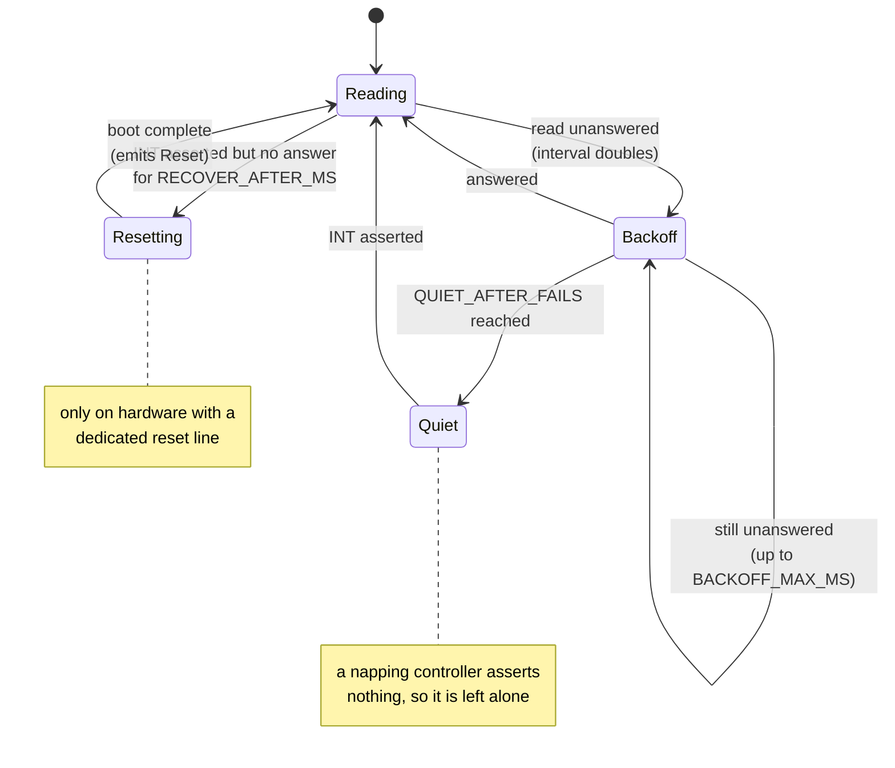

# Input — `light-input`

`light-input` is the framework's touch, gesture and orientation layer. It turns the raw output of a
touch controller into a stream of taps, drags and swipes; it drives an inertial sensor and settles
its readings into a screen orientation; and it defines the HAL trait through which a board's generic
touch and IMU modules publish onto an application's event bus without naming the application.

The crate is `no_std` and portable. Nothing in it touches hardware directly: every controller and
sensor reaches the world through the traits of `light_core::hal` (`I2cBus`, `InputPin`, `OutputPin`,
`Clock`), and every module runs unchanged under `cargo test` against a mocked bus. It is the mk4
successor to what the predecessor C framework split across separate touch and IMU modules; the
drivers are ports of that framework's drivers, but their cadence and recovery rules were re-checked
against mk4's loop rate rather than copied — that re-derivation is where the CST816T's minimum read
gap came from.

This document describes the crate as built in mk4.

## Responsibility

- Own the canonical raw touch sample and the software gesture recogniser that classifies drags into
  swipes with device-space endpoints.
- Provide reference touch-controller drivers (CST816T, CST328, GT911, AXS15231B), each producing that
  same sample type and each carrying the shared poll/recovery discipline that survives a napping
  controller on a shared bus.
- Provide the IMU model — axis mapping into the device frame, orientation settling from gravity, and
  a poll throttle — and a reference QMI8658 driver behind it.
- Define `BoardEvent`, the contract relating a touch panel and an IMU to an application's bus-event
  type.

## Public surface

- `TouchSample` — the canonical raw touch sample, defined in `touch` and re-exported at the crate
  root. Every touch driver re-exports this one type as its own `Event`, so gesture tracking and the
  `BoardEvent` contract are controller-independent.
- `touch::{Gesture, Swipe, Tracker, HardwareGestures, TouchController, TouchDiagnostics}` — the swipe
  directions, the settled gesture record, the software tracker, the trait a controller with its own
  gesture engine implements, the trait every driver implements (`probe`/`poll`/`diagnostics` plus a
  default-no-op `reset`), and its diagnostics record.
- `drivers::{cst816t::{Cst816t, Event, I2C_ADDR, CHIP_ID, …}, cst328::Cst328, gt911::{Gt911, CoordMap},
  axs15231b::{Axs15231bTouch, CoordMap}}` — the touch-controller drivers and their coordinate maps,
  grouped under `drivers`.
- `imu::{Imu, ImuDriver, Sample, AxisMap, Orientation, scale_sample, AXES, X, Y, Z}` — the IMU model,
  the driver trait it wraps, the sample and axis-map types, the orientation enum, and the shared
  fixed-point scaling helper.
- `drivers::qmi8658::Qmi8658` — the QMI8658C driver, an `ImuDriver` implementation.
- `BoardEvent` — the HAL trait an application's event enum implements so a board's generic input
  modules can raise events on its bus.

## The canonical touch sample — `TouchSample`

Every touch controller, whatever its wire protocol, reports the same four-variant event, and the
rest of the crate is written against it:

```
enum Event {
    Down { x: u16, y: u16 },
    Move { x: u16, y: u16 },
    Up,
    Reset,   // the recovery reset fired; reported so the caller can count it
}
```

Coordinates are in the device's own coordinate space — the panel's physical orientation. An
application drawing through a rotated canvas maps them itself. The model is single-touch throughout:
each driver tracks only the first contact and reports one finger's life as `Down`, then zero or more
`Move`s, then `Up`. `Reset` is not a finger event; it surfaces the recovery reset (where a driver has
one) so the caller can count it and re-probe the chip.

The type is `TouchSample`, defined in `touch` and re-exported at the crate root; each of the four
drivers re-exports it as its own `Event` (`pub use crate::TouchSample as Event`), so they are all the
same type.

## The gesture tracker — `touch::Tracker`

The `Tracker` turns a controller's `Event` stream into swipes. It tracks a touch from its `Down` to
its `Up` and classifies the drag when the finger lifts, so the reported start and end are both final.
No controller reports *where* a gesture happened; the endpoints always come from this tracking.

`Swipe` is one of `Up`, `Down`, `Left`, `Right`, in device coordinates (`Up` is toward `y = 0`,
`Left` toward `x = 0`). A settled `Gesture` carries the `swipe`, the `start` and `end` coordinates,
and a `from_hardware` flag recording whether the classification came from the controller's engine or
from the tracked coordinates.

**Classification.** On `Up`, the tracker computes the travel from the down point to the last sampled
point. The dominant axis wins — a swipe only has to be *mostly* straight — and the winning axis must
have moved at least `swipe_min_distance`; below that, the touch was a tap and nothing is reported. A
`Tracker::new(x_max, y_max)` defaults the threshold to an eighth of the shorter axis, so it scales
with the panel rather than suiting whichever display it was developed against;
`set_swipe_min_distance` overrides it.

**Hardware first refusal.** `feed` takes an optional `&mut dyn HardwareGestures`. A controller with
its own gesture engine gets first refusal for the *classification* only: if `read_gesture` returns a
swipe, that is the reported direction and `from_hardware` is set, but the endpoints are still the
tracker's. If the engine declines (`None`) — no engine, or a code the tracker has no equivalent for —
the tracker classifies from coordinates. `read_gesture` is a pure query and must not report a stale
result from an earlier touch.

**Suppression.** A consumer that spent the movement itself — a drag-scroll — calls `suppress()` to
claim the touch in progress; its `Up` then classifies as nothing. `suppress` is gated on a touch
actually being in progress, so a stray call cannot leak forward and eat the *next* gesture. Each new
`Down` clears the suppressed flag, so every touch starts unclaimed.

**Delivery.** `feed` returns the gesture immediately when the `Up` produced one, and also latches it
as `pending`. `take()` collects the pending gesture so each is reported exactly once however often it
is asked; only one is held, and a second completing before the first is collected replaces it.
`tracking()` reports whether a touch is currently in progress.

## The touch-controller drivers

A touch controller is supported by writing a driver that produces `Event` and implements
`HardwareGestures` (declining unless the part has a real engine); the gesture tracker and the
`BoardEvent` contract are written against that seam, not against any one chip, so a new controller is
a new driver and nothing above it changes. Four reference drivers ship. All but the AXS share one
poll architecture; each replaces only the wire protocol underneath it.

### The shared poll discipline

Three of the four drivers (CST816T, CST328, GT911) — and the AXS in all but one respect — carry the
same defensive `poll(now_ms)` loop, whose rules are against a *shared bus and a sleeping controller*,
not against any one chip. The touch controller shares its I2C bus with the IMU, and several of these
parts auto-sleep; retrying a sleeping chip aborts transfers the IMU needs. The discipline:

- **Cadence, not interrupt-only.** The controller is read on a timed cadence
  (`POLL_INTERVAL_MS = 10`, matched to a controller's ~83 Hz report rate), because the INT pulse is
  only 1–3 ms and a loaded poll loop samples past it.
- **The INT read floor.** When INT says data is ready the driver may read ahead of the cadence, but
  no sooner than `INT_READ_FLOOR_MS = 4` after the last read. mk4's runtime polls hundreds of
  thousands of times a second; without this floor the "read when INT is asserted" rule issued
  back-to-back reads for the whole INT pulse and wedged the controller every few seconds of tapping.
- **Backoff.** Each consecutive unanswered read doubles the interval (`POLL_INTERVAL_MS << unanswered`)
  up to `BACKOFF_MAX_MS = 160`.
- **Quiet mode.** After `QUIET_AFTER_FAILS = 4` unanswered reads the cadence stops; only an asserted
  INT gets the driver reading again. A merely napping controller — which asserts nothing — is then
  left entirely alone.
- **INT and quietness are two separate questions.** A read is *allowed* when INT is asserted or the
  driver is not quiet; it is *due* on the INT floor or the backoff interval. INT answers only "may I
  read", never "has enough time passed" — a shortcut that once cost a thousand aborted transfers when
  INT was stuck asserted.
- **Inferred release.** A controller that stops reporting has probably had its finger lifted; the
  driver infers `Up` after `RELEASE_TIMEOUT_MS = 60` of silence — but only once `RELEASE_MIN_POLLS = 8`
  polls have actually *looked*, so a stalled loop cannot expire a live touch. A failing bus says
  nothing about the finger, so while reads are unanswered (or a reset is in progress) the release
  timeout stretches to `STALL_RELEASE_MS = 500`.

Every driver counts its failures: a total plus a breakdown into `nacks` (asleep), `timeouts`
(stretching or stuck) and `bus_errors`, for the `stats` diagnostic. A real finger interaction
(anything but `(idle, idle)`) calls `light_core::note_activity()`, feeding the standard beacon a
power manager watches, whatever app or board this is.



*The discipline distinguishes a napping controller (asserts nothing → `Quiet`, left alone) from a
wedged one (asserts INT yet will not answer → `Resetting`), so a shared bus is never flooded with
aborted transfers the other devices on it need.*

### Non-blocking reset recovery (CST816T, CST328)

The two parts with a dedicated reset line add recovery for a controller that asserts INT — claiming
it has data — yet will not answer. Asserting INT *and* failing to answer for
`RECOVER_AFTER_MS = 2000` is a wedge, not a nap, and earns a reset; a merely sleeping controller
asserts nothing and is never reset. Resets are paced by `RECOVER_COOLDOWN_MS = 1000` so a chip still
booting is not held in reset forever.

The recovery pulse is timed against polls, never slept through — a 60 ms blocking sleep here would
land mid-drag. `service_reset` runs one phase per poll: hold the line low for `RESET_HOLD_MS = 10`,
then leave it alone for a boot delay, and while a reset is in progress nothing reads the bus (every
read against a chip held in reset or booting is an aborted transfer). When boot completes the driver
emits `Event::Reset` and the failure run restarts from the chip that is up *now*. A separate
`reset_blocking(clock)` exists for init only, where nothing is rendering and blocking is correct.

Leaving the recovery path out reproduces the failure these parts exhibit — the panel goes deaf after
a few taps — which is why it is here.

### CST816T — `cst816t::Cst816t`

A reference driver, and the part the shared poll and recovery code was first shaped against. 8-bit
registers at address `0x15`; a `CHIP_ID` of `0xB5` at register `0xA7`;
a 6-byte frame from `REG_GESTURE` carrying a gesture code, a finger count, and nibble-masked 12-bit
X and Y. `probe()` returns `Ok(Some(id))` when the ID matches, `Ok(None)` when the part answers with
another value (log and continue — the map is from open-source drivers, not a primary datasheet), and
`Err` when the bus does not answer.

It is the one part here with a usable gesture engine. The engine reports in whichever frame it
recognises the gesture, not necessarily the release frame, so the driver *latches* the gesture code
during the touch and clears it on each new `Down`, so a stale code cannot attach to the next touch.
`read_gesture` consumes the latched code. The vertical codes are mapped to their *opposite* — the
code this driver calls "swipe up" is what the hardware reports for a swipe toward increasing
`y` — vertical codes only; horizontal codes map straight through, and click /
long-press codes are declined so the tracker classifies from coordinates.

### CST328 — `cst328::Cst328`

A reference driver for the Hynitron part at address `0x1A`; the reason `I2cBus` grew its 16-bit
operations. Registers are 16
bits wide; mode changes are address-only transactions (the 16-bit register address alone *is* the
command, written with `write_command16` and no data byte); coordinates are packed 12-bit rather than
nibble-masked bytes; and there is no gesture engine — the software tracker carries every swipe on
this part. There is no chip-ID register: the only presence check is the fixed `0xCACA` marker in the
firmware-info word, readable only in debug-info mode. `probe()` switches to debug-info mode, reads
the marker, and **always switches back to normal mode regardless of the result** — debug mode reports
no touches, so failing to leave it would turn a cosmetic mismatch into a dead panel. The chip reports
five contacts; only the first is read (single-touch throughout — the rest would be bus traffic and
dead code). Its reset boot delay is longer than the CST816T's (`RESET_BOOT_MS = 130`; the part is
reported to need ~120 ms); the poll timing constants are the CST816T's hardware-measured values
inherited as informed defaults, unverified on this part.

### GT911 — `gt911::Gt911`

A reference driver for the Goodix multi-touch part at address `0x5D`, typical of RGB-panel boards,
with 16-bit registers.
Its distinction is that reports are *explicit in both directions*: a status byte at `0x814E` carries
a ready bit and a touch count, points follow from `0x814F` at 8 bytes each, a release arrives as a
ready status with zero points, and the status byte must be written back to zero to release the report
buffer. The driver trusts these reports, keeping the silence timeout (`RELEASE_TIMEOUT_MS = 200`)
only as a stall backstop, and it has no reset-recovery path. `probe()` reads the product id and
succeeds when it spells `"911"`. Address selection is board wiring: the part latches its I2C address
from the INT level during reset, and the board holds INT low through reset for `0x5D` before handing
the driver the released INT as an input. Only the first point is tracked.

The GT911 carries an explicit **`CoordMap`** — `x_max`, `y_max`, `invert_x`, `invert_y`, `swap_xy` —
measured on bring-up. Raw coordinates are clamped to the maxima, then inverted, then (a square panel
can hide this until measured) `swap_xy` exchanges the axes last.

### AXS15231B — `axs15231b::Axs15231bTouch`

A reference driver for the touch half of a combined chip that is also the panel's LCD controller,
answering on I2C at address `0x3B`. It is not register-addressed at all: the host writes an 11-byte command blob (`write_raw`) and
reads a 32-byte answer frame back (`read_raw`) — the reason those raw operations exist on `I2cBus`.
The command blob and framing are copied faithfully from the vendor reference; the first point lives at
bytes `[1..=5]` as 12-bit long- and short-axis values.

It carries the full poll discipline **without reset recovery**: the touch controller *is* the display
controller, and its reset line is the panel's, so resetting a wedged touch would black the glass
mid-recovery. A wedge here is reported (via the failure counters) and left to the application, whose
real remedy is the panel init path.

Its release handling is the sharp edge. The AXS *consumes* a report on read, so a frame with zero
fingers means "no new report since the last one", not "released" — trusting it produced a down/up pair
per poll under a held finger on the glass. A zero-finger read is therefore treated as an affirmative
silence, and release is always *inferred* from a report-silence timeout, never read. Its `CoordMap`
is `long_max` / `short_max` (e.g. 0..=640 and 0..=172) with `invert_long` / `invert_short`,
clamp-then-invert; the display is declared portrait, so the short axis becomes `x` and the long axis
`y`. There is no ID register — the touch read itself is the only probe the protocol offers.

## The IMU model — `imu`

The IMU layer is a generic model wrapping an `ImuDriver`. Readings are integer engineering units
throughout — accelerations in milli-g, angular rates in milli-degrees-per-second, temperature in
milli-Celsius — never floats.

**The driver trait.** `ImuDriver` has just `sample() -> Result<Option<Sample>, I2cError>` (a new
chip-frame `Sample`, `None` when nothing is new, `Err` on a bus fault) and `sample_interval_ms()`,
how fast the chip can produce a sample so the core polls no faster. A `Sample` carries chip-frame
`accel_mg`, `gyro_mdps` and `temperature_mc`.

**Axis mapping.** A chip soldered down rotated has no fixed relationship to the glass, but orientation
codes are defined against the glass, so the board supplies an `AxisMap` — `source[i]` names the chip
axis that supplies device axis `i`, and `sign[i]` negates it — that rotates the chip frame into the
device frame (`+X` right across the display, `+Y` up it, `+Z` out toward the viewer). `AxisMap::IDENTITY`
is the default; `set_axis_map` is meant to be set once before anything reads a sample, and because a
settled orientation was classified in the old frame, setting the map forgets it.

**Polling and orientation.** `Imu::poll(now_ms)` samples only when the sensor interval has elapsed
(the first poll always samples; the throttle applies only between samples), maps the reading into the
device frame, and advances orientation tracking; every call in between costs nothing on the bus and
it returns `true` only when a new sample arrived. Orientation is classified from the *gravity vector
alone* — the gyro is ignored on purpose, since integrated rate drifts and gravity never does. The
dominant accelerometer axis must beat *both* others by `margin_mg` (default 200); if nothing is
dominant the last settled orientation is held rather than blinking out. A new candidate must then hold
for `hold_ms` (default 250) before it is adopted: without the margin a board near 45° flaps every
sample, and without the hold a single knock re-orients the UI. `Orientation` is one of `Unknown`,
`Portrait`, `PortraitFlip`, `LandscapeL`, `LandscapeR`, `FaceUp`, `FaceDown`.

`orientation` is the settled value, readable any time; `take_orientation()` yields a pending
*change* once. A settled orientation change is the IMU's *only* activity signal to
`light_core::note_activity()` — raw motion deliberately is not, so a knock or a vibration never wakes
the screen.

**Scaling.** `scale_sample(raw, full_scale_units)` converts a signed 16-bit count to engineering
units for a full-scale range. The 64-bit intermediate is load-bearing (`32767 * 2_048_000` overflows
`i32`), and it is a real divide by 32768, not a shift: a shift floors negatives and biases every
negative reading a count low.

### QMI8658C — `qmi8658::Qmi8658`

A reference `ImuDriver` for the QST 6-axis IMU over I2C, at address `0x6B` (SA0 high) or `0x6A`
(SA0 low) as the board straps SA0. The register map is cross-referenced from open-source drivers
rather than a primary datasheet, so the `WHO_AM_I` read (`CHIP_ID = 0x05`) at init is the first real
evidence, and this reference configuration and axis map were confirmed on hardware. `probe()` reads `WHO_AM_I` with the usual
`Ok(Some)` / `Ok(None)` / `Err` contract; `configure()` programs the ranges and rates *before*
enabling the sensors (accel ±8 g, gyro ±512 dps, ~94.5 Hz normal-mode ODR) — the ranges must be in
place before the sensors produce samples against them — and turns on address auto-increment, which is
what makes the burst read work at all.

`sample()` reads status, temperature and all six axes in one contiguous transaction from `STATUS0`
through `GZ_H`; the five unused bytes in the middle are cheaper than a second round trip on a bus
shared with the touch controller. Because the status byte comes from the same transaction it
describes that frame, and the driver returns `None` unless the accel-or-gyro-ready bit is set. Axes
are little-endian, scaled through `scale_sample`; temperature is signed with 8 fractional bits.

## The board contract — `BoardEvent`

`BoardEvent` is the seam between this crate's input modules and an application. A board's touch and
IMU modules are the *same wiring on every app*; they must publish onto whatever event bus the app
defines without naming the app. `BoardEvent` is the trait, over `Self: Copy`, that an application
implements for its event enum so those generic modules can:

- **raise** the events the hardware produces — `touch(TouchSample) -> Self`,
  `gesture(Gesture) -> Self`, `orientation(imu::Orientation) -> Self`;
- **recognise** the requests those modules react to — `is_stats(&self) -> bool`, true for the request
  on which an input module logs its diagnostics, and `drag_consumed(&self) -> bool`, true for the
  event reporting that a drag was consumed by scrolling, on which the touch tracker suppresses the
  release's swipe classification (defaulting to never).

The constructors and inspectors are the whole contract: the board's generic touch/IMU modules — which
live in the board-support crates — publish through it, so `light-input` supplies the recogniser, the
drivers and the model while the application supplies only its own event type. It is the point at
which the tracker's `suppress` (via `drag_consumed`) and the drivers' `stats` diagnostics (via
`is_stats`) are wired to application intent without either side depending on the other.

## mk5 decision — generic input runtime modules, and a `TouchController` trait

*Decided and implemented for mk5.* The touch and IMU **runtime modules** (`TouchMod`/`ImuMod` — the
`Module` implementations that poll the hardware each pass and publish `BoardEvent`s on the app's bus)
now live in `light-input` (`light_input::module`), so a board wires *drivers*, not *modules*. In mk4
they lived in a board-support crate and, though generic over the app event, hardcoded the concrete
drivers, the port's clock, and the board's axis map. mk5 makes them generic over:

- the **touch controller**, through a **`TouchController` trait** — `poll(now_ms) -> Option<TouchSample>`,
  `probe`, `diagnostics` (the failure counters), and a default-no-op `reset(clock)` a reset-capable
  part overrides — which the four reference touch drivers implement (mirroring the existing
  `ImuDriver` on the IMU side); a consumer's own controller implements the same trait and drops
  straight into `TouchMod<A, T, C>`;
- the **IMU driver**, through the existing `ImuDriver` (`ImuMod<A, D, C>`);
- the **clock**, through `light_core::hal::Clock` rather than a port's free function (the `C`
  parameter above);
- the **app event**, through `BoardEvent`, as before.

The board supplies the constructed driver, the axis map, and the clock; the module names no board and
no port. This is what lets `light-input` own the modules while every board reuses them unchanged (see
[09-application-model.md](09-application-model.md)).
