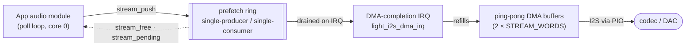

# Audio and MIDI — `light-audio`, `light-midi`

Two small, transport-independent subsystems. `light-audio` is the portable half of the framework's
audio providers: the codec register logic and the sample-format arithmetic, written against the
`hal` traits so the transport that actually moves the samples belongs to a port. `light-midi` is a
USB-MIDI forwarder engine: it decides which packet goes where, and reaches the wire through a
transport trait a USB host stack implements. Both crates are `no_std`, both hold no hardware, and
both are exercised on the host under `cargo test`.

The audio streaming *contract* — the shape an application's audio module drives — lives in
`light_core::hal::AudioStream`; the I2S transport that fulfils it lives in the port crate
`light-rp2` (`i2s.rs`). This document describes all three together, because the contract is only
legible alongside the transport that motivates it.

## `light-audio` — codecs and sample conversion

### Responsibility

- Configure an audio codec over I2C and expose its playback/capture controls, without owning the
  audio transport.
- Convert one source sample to the value a PWM transducer plays, in the one place that arithmetic
  is done.
- Stay portable: everything hardware-facing is a `hal` trait, so the codec driver and the
  conversion both run and test on the host.

The crate is deliberately the *transport-independent half* of each provider. For the ES8311, the
I2S data path (MCLK generation, the ping-pong DMA, the prefetch ring) is a port's business; for PWM
audio, the carrier, the pacing DMA and the tone mode are the port's. What remains here is the part
that is the same on every chip: register sequences and sample math.

### Public surface

- **`Es8311<B: I2cBus>`** — the reference codec driver, for the Everest ES8311 mono codec, generic
  over the `hal::I2cBus` trait so it shares a bus with the other I2C parts.
  - `new(bus)`, `probe() -> Option<u16>` (returns `Some(0x8311)` only when the right part answers
    on `0xFD`/`0xFE`), `init(sample_hz, &mut dyn Clock)`.
  - Capture path: `mic_enable()`, `mic_config(reg14, reg17)` (the analog-PGA and ADC-digital gain
    registers, split out so the pair can be tuned live), `set_adc_to_dac(on)` (the internal
    ADC→DAC monitor, a bring-up bisect).
  - Playback controls: `set_volume(0..=100)`, `mute(bool)`.
- **`pwm`** — PWM-audio sample conversion. `Encoding` (`PcmU8`, `PcmS16`), and
  `pcm_to_duty(sample, encoding, volume) -> u8`, with the anchoring constants `VOLUME_MAX` (1000,
  per-mille), `DUTY_MAX` (255) and `DUTY_SILENCE` (128).

### Behaviour and invariants

- The ES8311 is configured as the **I2S master**: this side feeds it MCLK and the codec generates
  BCLK/LRCLK from its own dividers. The clock arithmetic therefore lives in the codec's registers,
  where its datasheet documents it, rather than in the framework. `init` carries only the 256-Fs
  MCLK coefficient family — the family for an MCLK generated at 256× the sample rate — with the reference driver's
  coefficients verbatim, including the 24 kHz row's anomalous `bclk_div` of 8.
- An unsupported sample rate is a wiring-level configuration error and `init` panics rather than
  play at a silently wrong pitch.
- `set_volume` maps `0..=100` onto the DAC volume register (0 is a true zero); this is a
  register-domain mapping and is a different thing from the PWM path's per-mille attenuation.
- `pwm::pcm_to_duty` holds one load-bearing property: **silence is mid-scale** (`DUTY_SILENCE`), and
  volume attenuates *towards* mid-scale, never towards zero. Attenuating towards zero would slide
  the output's DC level with the volume, which a piezo renders as an audible click. The conversion
  brings every encoding to a zero-centred signed value, attenuates once, then re-centres; `PcmS16`
  uses an arithmetic shift, not a divide, so no flat step lands in the middle of the waveform. At
  full volume `PcmU8` is the identity, which lets a pre-baked asset play straight out of flash. The
  invariants (mid-scale silence, monotonicity, clamp-never-wrap, half-volume-is-half-excursion) are
  pinned by the test suite because every way of getting the arithmetic wrong is audible and none of
  them is visible in the code.

### Design decisions and constraints

- **The codec driver knows nothing of I2S.** It only configures registers over `I2cBus`; the sample
  transport is a port's, so a board with no I2S wiring still links the driver, and the driver still
  tests on the host against a mock bus. A new codec is a new driver over the same `I2cBus` seam;
  nothing above it changes.
- **Codec as I2S master.** Making the codec master keeps the whole clock-divider problem inside the
  part whose datasheet solves it; this side only has to emit a clean MCLK.
- **Sample math has exactly one home.** `pcm_to_duty` is the single place a source sample format is
  interpreted on the way to a PWM duty value; the `Encoding` enum is the seam a compressed format
  would slot into without changing the call signature.

## The streaming contract — `AudioStream` and `PioI2sOut`

`light_core::hal::AudioStream` is the transport contract that decouples an app's audio from the wire.
An audio module drives it; a port implements it: a new audio wire is a new `AudioStream`
implementation, and nothing above the trait changes. In mk4 the RP2 implementation is
`light_rp2::i2s::PioI2sOut`, which realises an I2S link on PIO with ping-pong DMA. The codec runs
as the I2S *master*; this side generates MCLK (a squarewave PIO program) and answers the codec's
BCLK/LRCLK as a slave data-out.

### The `AudioStream` trait (the contract)

- **Output, prefetch-ring model.** `stream_free() -> usize` reports the ring's contiguous free
  words; `stream_push(fill)` hands `fill` that free region and commits however many words it wrote;
  `stream_pending() -> usize` reports words still queued but not yet drained by the transport (zero
  means the last sample has reached the DMA — how a finishing track knows its tail has played);
  `stream_clear()` discards everything queued at once, so a Stop stops now rather than after the
  buffered lead.
- **Accounting.** `set_active(bool)` gates underrun counting, so an idle ring draining deliberately
  to silence is not miscounted as starvation; `underruns()` reports output buffers played as
  silence for want of data while active; `cap_overruns()` reports capture buffers dropped for want
  of draining; `reset_stats()` zeroes both.
- **Capture.** `capture_start()` / `capture_stop()`, and `capture_take(sink)` which invokes `sink`
  once per filled buffer. `debug_probe()` is an optional port-specific bring-up probe.
- **Formats.** The output buffer is one `u32` word per frame — the fill callback places a 16-bit
  sample in *both* halves to play it on both slots. Capture buffers are mono `u16` samples in the
  machine's byte order. The port owns the buffers, their sizes and the transport; the application
  owns only the samples.

### Two output paths, and why the IRQ path exists

`PioI2sOut` offers two ways to keep the DAC fed, both over the same two ping-pong DMA buffers
(~85 ms each, `STREAM_WORDS = 2048` frames at 24 kHz, sized against a *measured* worst-case
64.8 ms poll-to-poll gap from an SD card's internal read stall):

- **The polled path** (`start_stream` + `refill`): each completed DMA buffer waits for the poll
  loop to refill it. Simple, no interrupt, no prefetch ring — for a board too RAM-tight for the ring
  and with only light audio (a beep, a tone) a poll can keep fed. Both buffers idle means the stream
  starved: it is counted, refilled and restarted, not guessed about.
- **The IRQ prefetch-ring path** (`start_stream_irq` + `stream_push`/`stream_free`/`stream_pending`/
  `set_active`/`stream_clear`): the two DMA buffers are refilled from the **DMA-completion
  interrupt** (`light_i2s_dma_irq` on `DMA_IRQ_0`), which drains a larger backing **ring** (the
  board's store) that the poll loop tops up toward full each pass.

The IRQ path exists because a slow poll spends the *ring's lead*, not the codec's deadline. The
four-word TX FIFO holds only ~83 µs of audio and a single display draw is two hundred times that,
so polled FIFO writes were audibly choppy; the ping-pong buffers fix that, but on the polled path a
blocked main loop (a card read, a display push) can still miss a buffer's refill and starve the
codec directly. With the IRQ path, only the *ring* running dry starves it, and the ring carries a
lead that rides such gaps out. The interrupt handler is a pure RAM copy plus two register writes —
it never touches the card or the filesystem — so it is safe at interrupt time.

*The poll loop only tops the ring up toward full; the interrupt does the deadline-critical refill of
the DMA buffers. So a blocked loop spends the ring's lead, not the codec's deadline — the whole
reason the IRQ path exists.*

The ring is a single-producer (the poll loop, via `stream_push`), single-consumer (the IRQ) queue
on one core: monotonic wrapping head/tail cursors with acquire/release ordering are the whole
synchronisation, since each cursor is written by exactly one side. `start_stream_irq` publishes the
ring and DMA pointers *before* setting `armed`, and the handler bails until armed, so it never reads
a half-written pointer set. `stream_clear` resets both cursors inside a brief IRQ-off window — the
only place a cursor is touched by the other side's owner.

### Capture

The RP2 transport adds a capture (microphone) machine (`attach_capture`, `capture_start`,
`capture_stop`, `capture_take`) sampling the codec's ADC output against the same BCLK/LRCLK the
codec masters. Capture uses its own ping-pong DMA into mono `u16` buffers (`CAP_WORDS = 4800`,
200 ms at 24 kHz — sized against an SD card's 100–250 ms garbage-collection stall, not against the
poll). Both capture buffers filling before a take means audio was lost: it is counted, not guessed
at. Several `din_*` probes exist purely as bring-up bisects for silent capture.

## `light-midi` — the USB-MIDI forwarder

### Responsibility

- Forward USB-MIDI event packets between mounted devices, by one rule, without knowing the host
  stack, the wire, or MIDI itself.
- Track what is mounted and where it physically sits (hub port), and tell the application what a
  mount/unmount asks of it.
- Track RX/TX activity for a status display.

The one forwarding rule: incoming data on cable C of any mounted device is forwarded to cable C of
every *other* mounted device that has a cable C.

### Public surface

- **`Packet`** — `[u8; 4]`, a USB-MIDI event packet: byte 0 is `(cable << 4) | code_index_number`,
  bytes 1..4 the MIDI data. This fixed-size self-framing format is all any transport carries; the
  engine does no MIDI parsing.
- **`Transport`** — the packet path behind the device slots: `read(idx) -> Option<Packet>` (drained
  until `None` per service), `write(idx, packet)`, `flush(idx)` (once per service for each slot
  written; a transport whose writes are already complete bursts ignores it).
- **`Host: Transport`** — a full USB host stack: `task()` (run enumeration/transfers/callbacks each
  pass), `next_event() -> Option<MidiEvent>`, `reset()` (tear the controller down and bring it back,
  may block for a settle), `dropped_events()`. The port implements this over the real controller; a
  mock implements it for the host tests.
- **`Forwarder<const N: usize>`** — the engine, over `N` device slots (at least the host stack's
  MIDI-interface count, plus one for a linked peer). `mount(idx, Mount, Option<BusInfo>)`,
  `mount_link(idx)`, `unmount(idx)`, `service(transport, now_ms) -> Activity`, `indicators(now_ms)`,
  and queries: `device`, `mounted_count`, `usb_mounted_count`, `hub_addr`, `hub_port_of`,
  `hub_port_occupied`.
- Supporting types: `Mount` (`daddr`, `rx_cables`, `tx_cables`), `BusInfo` (`hub_addr`, `hub_port`),
  `MidiEvent` (`Mounted`/`Unmounted`), `Device`, `Kind` (`Usb` / `Link`), `Change`
  (`status_changed`, `any_usb_mounted`, `reset_host`), `Activity` (`received`, `forwarded`).

### Behaviour and invariants

- The engine holds no clock and calls nothing back. Mounts and unmounts come in as calls, traffic
  goes through the `Transport`, and everything the application must react to comes out as return
  values — a `Change` from a mount/unmount, an `Activity` from a service pass.
- **Slots are positional and index like the host stack indexes its interfaces.** A `mount` on a slot
  past `N` is refused (`None`) rather than written — a guard against the host stack's interface count
  and the engine's slot count drifting, since they are configured in two places.
- On every mount change the forwarding `table` is rebuilt: for each source cable, every *other*
  mounted device that has that destination cable. A source never forwards back to itself; a cable
  the destination lacks is skipped; the destination's own cable number is re-embedded in byte 0 while
  the CIN and MIDI bytes pass through unchanged.
- **Padding is dropped.** Code index numbers below 2 (a bulk transfer zero-fills unused 4-byte
  slots; CIN 0/1 never carry data) are not forwarded — otherwise up to 15 of every 16 bytes on the
  SPI link would be nothing. A cable number past `MAX_CABLES` (4) is counted in `dropped`.
- **Hub mode is position.** The host stack's mount index says nothing about which socket a cable is
  in and is not stable across a reconnect, so a device also records the 1-based hub port it arrived
  on — the physical identity a status display shows. The hub address is learned from the first
  device that mounts behind a hub; there is no "hub mounted" callback, because an empty hub is
  indistinguishable from none and has nothing to forward. The hub is forgotten only once nothing is
  mounted behind it, so pulling one instrument does not make a display claim the hub went away.
- **`reset_host` is requested only by the disconnect that empties the root port.** A controller reset
  drops every device on the bus, so behind a hub it must wait until the last device has gone —
  otherwise unplugging one instrument would lose all four.
- A `Link` device (an SPI-linked peer board) is a forwarding participant unconditionally, with no
  discovery or handshake; it is mounted for the life of the program and is *not* counted by
  `usb_mounted_count`, so the last USB device leaving still empties the bus, peer or no peer.
- `indicators` reports the RX/TX lights and whether they changed since the last call, so a display
  redraws on a transition rather than every pass; an indicator turns off by time passing
  (`INDICATOR_MS = 150`), which is why it must be called every pass.

### Design decisions and constraints

- **The engine names neither the host stack nor MIDI.** It sees only 4-byte packets over a
  `Transport`, and the concrete stack is a `Host` the port implements — so the whole forwarder tests
  on the host against a mock that stands in for TinyUSB's `tuh_midi_*` API.
- **Everything the app must do comes out as a return value.** No callbacks, no clock, no shared
  state: `Change` and `Activity` carry exactly the decisions (redraw the status, reset the
  controller, light an LED) an application acts on.
- **Two configuration counts, one guard.** Because the host stack's interface count and the
  `Forwarder`'s slot count are set independently, the out-of-range `mount` refusal is the deliberate
  seam that keeps a drift between them from corrupting a slot.
