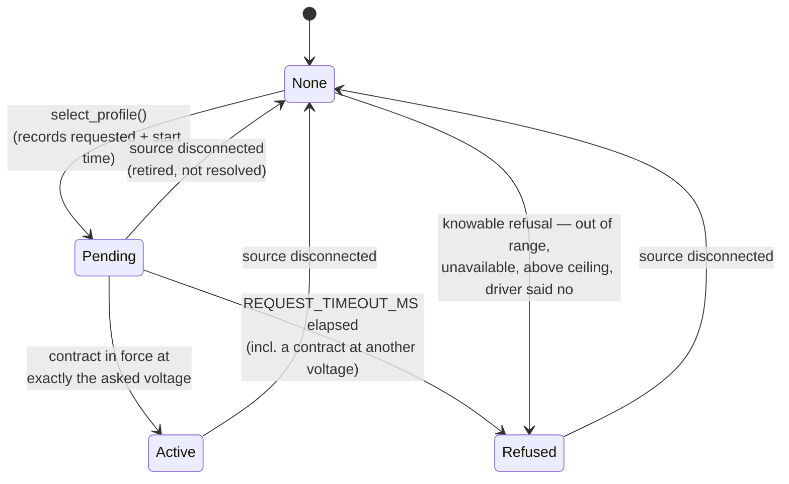
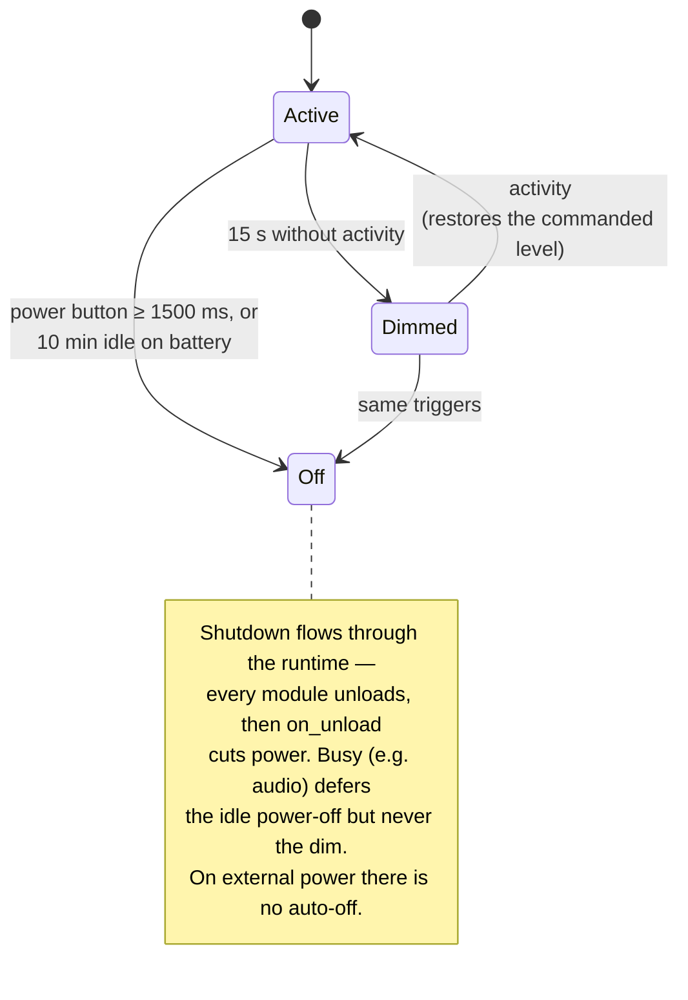

# Power and Time

This document describes the crates that manage a device's power and keep its clock: `light-power`
(power-*supply* management — operating points, negotiated PD contracts, a survivable request
ceiling, and the HUSB238 sink driver), `light-power-manager` (portable power *policy* — idle
backlight-dim and on-battery auto power-off over a per-board mechanism), and `light-rtc` (real-time
clock drivers, the PCF85063A so far). All three sit near the bottom of the layering, depend only on
`light-core`, and — like every portable crate — reach hardware only through `light_core::hal`
traits, so the whole of each runs under `cargo test` against a mocked bus, clock or mechanism.

This is an extraction of the mk4 status quo as built. It describes structure and behaviour; it does
not propose changes.

---

## `light-power` — power-supply management

### Responsibility

Own the *decision* half of power-supply management, separately from any one chip. A driver reads and
writes registers; every judgement — what the source offers, what this board can survive, what became
of a request — lives in one portable place that is identical for every device. `PowerSource` is the
seam a consumer implements for its own supply hardware; the crate ships that portable place
(`Power<S>`) and one reference driver behind it (the HUSB238 USB-PD sink).

Two hard-won properties, ported from the predecessor C framework, shape everything:

- **Safe by default.** Selecting a profile moves a real rail, and what hangs off that rail is a fact
  about the board this layer cannot see. A sink whose output feeds a downstream input rated for the
  default rail alone would be ended by a single successful request for a higher voltage. So a device
  starts with its request ceiling at the USB-C default rail (5 V) and anything higher is an explicit
  decision made through `set_max_millivolts` by whoever knows the wiring.
- **A selection is a message, not a function call.** A PD sink was asked (successfully, per the
  return codes) for 15 V and for 20 V, both advertised by the source, and the source granted
  neither. So a request's outcome is a `RequestState` the poll path resolves over time, never a
  return value.

### Public surface

- `Profile { millivolts, milliamps, available }` — one selectable operating point: a voltage the
  source can be asked to supply, the most current it offers there, and whether it is *currently* on
  offer. `available` is deliberately separate from the entry existing at all.
- `Reading { active_mv, active_ma, contract_active }` — what one hardware read reports about the
  rail: what is being supplied right now, and whether that is a *negotiated* contract as opposed to
  the bus default.
- `RequestState` — `None` / `Pending` / `Active` / `Refused`. The lifecycle of the last request.
- `trait PowerSource` — the driver contract: `is_pd()`, `init(&mut [Profile; MAX_PROFILES]) -> u8`
  (fill the fixed profile *shape* once, return the count), `poll(&mut profiles) -> Option<Reading>`
  (refresh availability and currents, read the rail; `None` = the device did not answer),
  `select(index) -> bool` (ask the hardware to switch; `true` = accepted *for sending*), and
  `can_select() -> bool` (default `true`).
- `Power<S: PowerSource>` — the model wrapping a driver: `new`, `poll(now_ms) -> bool`,
  `profile_count`, `profile(index)`, `find_profile(max_mv) -> Option<u8>`, `set_max_millivolts` /
  `max_millivolts`, `active() -> Reading`, `requested() -> Option<u8>`, `request_state`, `is_pd`,
  `set_poll_interval`, `select_profile(index, now_ms) -> bool`, and `source()` for anything
  device-specific the model does not cover.
- Constants: `MAX_PROFILES = 8`, `SAFE_MAX_MV = 5000`, `REQUEST_TIMEOUT_MS = 1500`,
  `DEFAULT_POLL_INTERVAL_MS = 500`.
- `husb238::Husb238<B: I2cBus>` — the driver, plus its register map constants and `I2C_ADDR = 0x08`.

### Behaviour and invariants

- **Profiles are indexed, never compacted.** A USB-PD source advertises a *fixed* set of voltages
  (5/9/12/15/18/20 V) and marks which it actually offers; a 45 W charger with no 18 V rail still has
  an 18 V entry, simply unavailable. `init` lays out that fixed shape once; `poll` thereafter only
  updates `available` and `milliamps`. Compacting would renumber every profile above a missing one
  when the supply changed, silently turning a stored "profile 4" into a request for a different
  voltage — so indices are stable and availability is a property of the entry.
- **The default rail is not a contract.** `contract_active: false` does not mean "no answer" — it
  means "this is what you are running on, and nobody negotiated it." A USB-C sink with nothing
  negotiated still sits at 5 V; conflating "5 V present" with "5 V agreed" was a bug in the first
  cut. `active()` is always meaningful (zeros before the device has reported anything).
- **Polling is throttled, the first poll is free.** `poll` reads the hardware only once
  `poll_interval_ms` has elapsed since the last read (interval `0` disables throttling); the very
  first poll always reads. It returns `true` only when the hardware was read *and* answered — an
  unelapsed interval and a failed read are both `false` and deliberately not distinguished, since
  neither is news.
- **Silence is an ordinary state, and losing the source retires everything.** For a bus-powered sink
  with nothing plugged in, `poll` returning `None` is the resting state, not an error. On the
  transition to not-answering the model clears the reading, drops `requested`, and marks every
  profile unavailable — leaving stale capabilities in place would let a consumer select a profile
  from a charger that is no longer attached. Answering/not-answering transitions are logged once
  each, not per poll.
- **A request resolves through the poll path.** `select_profile` records `requested`,
  `request_state = Pending` and the start time *before* calling the driver (the outcome must be
  attributable whether or not the write lands, and the timeout clock must start at the ask, not at
  the next look). `resolve_request` — run every poll, including failed ones — calls it `Active` only
  when a contract is in force *and* at the exact voltage asked for. A contract at a *different*
  voltage is not this request granted; it is the refused-request shape (an earlier contract still
  standing, this request ignored), which is left `Pending` until `REQUEST_TIMEOUT_MS` elapses and
  then becomes `Refused`. A source that has stopped answering still times an outstanding request out
  into `Refused` rather than leaving it pending forever — except a *disconnect*, which clears
  `requested` and so retires the request to `None` (resolving against a source that left would be
  inventing news).

*A request is a message resolved over time, never a return value: `select_profile` only records the
ask, and the poll path decides `Active` (contract at the exact voltage) or `Refused` (timeout, or a
refusal knowable before the wire).*

- **Refusals that are knowable never reach the wire.** `select_profile` refuses — with a log line
  and no driver call — an out-of-range index, an unavailable profile (the source has already said it
  cannot honour it; sending it anyway risks a renegotiation that drops the rail), a device that
  `can_select()` denies, and any voltage above `max_millivolts` (checked last, the one refusal about
  the *board* rather than the source). A driver `select` that returns `false` is the one refusal
  knowable immediately and goes straight to `Refused`.
- **`find_profile` and `select_profile` cannot disagree.** `find_profile(max_mv)` returns the
  highest available profile at or below `max_mv` *and* the device's own ceiling, whichever is lower,
  so it can never name a profile `select_profile` would then refuse. A find-then-select pair that
  contradicts itself is a trap this closes.

### Notable design decisions and constraints

- **The ceiling is about wiring, not the source.** `set_max_millivolts` is a claim that everything
  downstream of the rail tolerates the new voltage — a fact only the board's own wiring code can
  assert — so the call belongs beside the device's construction, not at a call site that wants
  power. Raising it logs at WARNING (the moment of the assertion; if it is wrong the only other
  evidence is a dead board); the one call that moves a live rail, `select_profile`, logs
  unconditionally.
- **The HUSB238 is a PD "trigger", not a PMIC.** It negotiates a contract with a USB-C source and
  hands the selected voltage downstream; it manages no rails of its own, which is why it is a
  `PowerSource` and not something larger. It has no reset pin and no ID register: an unpowered part
  is silent because nothing is plugged into its USB-C port, which no reset would fix, so `init`'s
  probe is simply whether it answers `PD_STATUS0` at all, log-and-continue.
- **Register map provenance.** The map comes from third-party libraries and a register-information
  sheet, not a datasheet the team holds; everything structural (address, register file, per-voltage
  detect flags) was confirmed against real hardware, and the current-code table is corroborated
  arithmetically — it yields 45 W at both 15 V/3.0 A and 20 V/2.25 A, which a wrong table would not.
  The six `SRC_PDO` registers are contiguous from 5 V upward, letting the driver walk them by index;
  `PD_STATUS0` codes voltage in the high nibble and current in the low, and voltage code 0 means
  "nothing negotiated" so a profile index becomes a selection code by adding one.
- **The hardware framing gotcha.** Every register is read and written one byte at a time, and writes
  go through `I2cBus::write_register_byte` — the strictly framed single transaction `S, addr+W, reg,
  value, P` with **no repeated START**. Measurement forced this: a general write path that sent
  register address and payload as two transfers separated by a repeated START had the chip
  acknowledge everything and store *nothing* — `SRC_PDO_SEL` took five writes of five values and
  read back `0x00` after each, so negotiation silently did nothing while every return code said
  success. (The `I2cBus` trait documents this at `write_register_byte`: "Some parts silently store
  nothing when the pair is split.")
- **`select` writes `SRC_PDO_SEL` then `GO_COMMAND`, in that order and never verified.** `GO_COMMAND`
  acts on whatever `SRC_PDO_SEL` holds the instant it is written, so the two are always a pair in
  that order — issuing GO first would re-request the *previous* selection, succeed, and leave the
  rail at the wrong voltage with every return code saying it worked. The driver deliberately does not
  read back: the request is handed to a negotiation that completes in its own time (12 V was measured
  landing inside 800 ms), and an immediate read would report the old contract and look like failure.
  `contract_active` is derived from `SRC_PDO_SEL`'s high nibble being non-zero, not from `PD_STATUS0`
  — observed on hardware: charger attached and supplying 5 V, `PD_STATUS0 = 0x13`, `SRC_PDO_SEL =
  0x00`, the two disagreeing being precisely the case the split exists to get right. An absent PDO
  reads `0x00`, whose current code would decode to the table's first entry (500 mA), so an
  unavailable profile's current is zeroed rather than decoded — 500 there is not a small measurement
  but a meaningless one that looks like one.
- The part is marked HUSB238; a board carrying one may read HUSB328 — the same part with the digits
  transposed.

---

## `light-power-manager` — portable power policy

### Responsibility

State the framework's *power behaviour* once, as portable policy: the screen dims after a spell of
no activity, and — on battery, never on external power — the board powers itself off after a longer
idle, with a power-button hold as the manual shutdown gesture. The policy is the timers and the
state machine. Everything a particular board can actually *do* — drive its backlight, tell whether
it is on external power, cut its own power, read its battery, read its power button — is a
`PowerMechanism` the port supplies. A port with nothing to manage simply does not build a manager,
or supplies a mechanism whose methods are the trivial defaults.

### Public surface

- `trait PowerMechanism` — what a board can do for power, every method defaulted so a port
  implements only what it has:
  - `set_backlight(level: u16)` — drive the backlight per-mille (`0..=1000`, 0 = off). Default: no
    backlight.
  - `on_external_power() -> bool` — default `true`, so a board that cannot tell never auto-powers-off.
  - `power_off(&mut self)` — cut the board's own power (a no-op parking on a board with no latch).
  - `power_button_pressed(&self) -> bool` — default `false` (no button).
  - `battery_mv(&mut self) -> Option<u32>` — default `None` (no gauge).
- `PowerManager<M: PowerMechanism, C: Clock>` — the policy over a mechanism and a `light_core::hal::Clock`:
  `new(mech, clock)`, `on_load`, `on_unload`, `note_activity`, `set_backlight(level)`,
  `set_busy(bool)`, `battery_mv`, `on_external_power`, and `tick() -> Poll`.
- Levels are **per-mille** throughout (`0..=1000`); the mechanism maps that scale to whatever the
  hardware wants (a PWM duty, an inverted duty, a byte).
- Timing constants (private, but the contract): dim to level 250 after 15 s idle; power off after
  600 s (10 min) idle on battery; a power-button hold of ≥ 1500 ms is the manual shutdown.

### Behaviour and invariants

- **The board module owns one and drives it.** It calls `on_load` from `Module::load` (full
  brightness, timers zeroed), routes activity and backlight commands in, sets a busy flag around
  long work, and reads a `Poll` out of `tick` each poll pass. `on_unload` (from `Module::unload`)
  sets the backlight to 0 and calls `power_off`.
- **Activity arrives through the beacon, not by wiring.** `tick` reads `light_core::activity::generation()`
  and resets the idle timers whenever it changes. Any input source — a touch driver, an IMU, a
  button — reports activity by calling `light_core::note_activity()` without knowing who consumes it;
  the beacon is a relaxed atomic generation counter, cross-core safe, needing no clock and nothing to
  clear. So the policy resets on real input with no per-app or per-board wiring and no knowledge of
  what the board's inputs even are. `note_activity` on the manager is the direct path, used
  internally and by `set_backlight`.
- **Dim and wake.** After `DIM_AFTER_US` without activity `tick` drops the backlight to `DIM_LEVEL`
  and marks itself dimmed; the next activity restores `level` — the last *commanded* level, not
  necessarily full — and clears the flag. `set_backlight` counts as activity and updates the level
  that a later wake restores.
- **Busy defers power-off, never dim.** While `busy` (e.g. audio playing) `tick` holds the
  power-off "quiet since" clock at *now* and returns `Idle`, so the 10-minute countdown runs only
  from when busy clears — long work is never cut short. Dim still applies while busy.
- **Two shutdown paths, one manual and one automatic.** A power-button hold of ≥ `POWER_OFF_HOLD_MS`
  returns `Poll::Shutdown` regardless of power source (a press also counts as activity; a released
  short press is forgotten). The automatic path returns `Shutdown` after `POWER_OFF_AFTER_US` idle
  **only when not on external power**. `Shutdown` flows into the runtime, which unloads every module;
  this module's `on_unload` then cuts power. So shutdown is one code path whether the trigger is a
  button, a long idle, or a console `quit`.

*Dim and power-off are independent timers over one activity beacon. The automatic power-off is the
only behaviour gated on "on external power", the single yes/no question the board's mechanism answers.*

### Notable design decisions and constraints

- **"On external power" is the mechanism's problem, on purpose.** Whether a board is externally
  powered is irreducibly per-board — a VBUS pin on one, USB enumeration on another, a charger status
  line on a third — and the policy must never have to know which. It is the single input that gates
  the automatic power-off, and it is delegated whole.
- **When a board cannot sense external power directly, the mechanism must derive it.** A board may
  have no VBUS line to sense, and a VBAT-trend heuristic can fail where the charger has no power-path
  (voltage does not cleanly indicate external supply). Such a board's `on_external_power` can instead
  report external power from USB-enumerated state (e.g. `tud_mounted`) — so the auto power-off is
  suppressed exactly while a USB host is attached. This decision lives entirely in the board's
  `PowerMechanism`; the portable policy only ever asks the yes/no question.
- **Levels are per-mille to keep the policy hardware-agnostic.** The manager reasons in `0..=1000`
  and never in duty cycles or bytes; each board's mechanism owns the mapping (including inverted
  backlights).

---

### mk5 decision — the power lifecycle is a framework runtime module

*Decided for mk5 (proposal B).* mk4 wrapped `PowerManager` in a per-app "board" module and copied it
into every app (five near-identical copies), fused with unrelated storage and PSRAM diagnostic
console commands. mk5 promotes the power lifecycle to a framework runtime module — a
`PowerMod<M: PowerMechanism, C: Clock, …>` in `light-power-manager` that runs `on_load` / `tick` /
`on_unload`, applies backlight commands, and reports battery and external-power stats — generic over
the board's mechanism, a clock, and the app event through a small power-event trait (the
backlight/stats recognisers), the same pattern [`BoardEvent`](03-input.md) established for input. The
storage and PSRAM diagnostics that mk4 fused into that module are a separate concern and are
**unfused** — they move to where storage lives, or remain app console commands. An app then adds the
module, not a hand-written copy.

## `light-rtc` — real-time clock

### Responsibility

Drive battery-backed real-time clocks over the `I2cBus` trait, present the wall-clock time as a
plain `Datetime`, and — critically — report whether the clock has actually *kept* time since it was
last set. The `I2cBus` trait is the seam a consumer drives its own RTC through; one part is
implemented so far as a reference driver: the NXP PCF85063A.

### Public surface

- `Datetime { year: u16, month: u8 (1..=12), day: u8 (1..=31), weekday: u8 (0..=6, 0 = Sunday),
  hour, minute, second }` — a decoded wall-clock instant, re-exported from the crate root.
- `Pcf85063a<B: I2cBus>` — the driver:
  - `new(bus)`.
  - `init() -> Result<(), I2cError>` — normal mode, 24-hour format, 12.5 pF crystal load; doubles as
    the probe, since an absent part NACKs the write.
  - `now() -> Result<(Datetime, bool), I2cError>` — the current time *and* a `kept` flag: `true` if
    the part has held time since it was last set, `false` if the oscillator stopped (battery ran
    out, first power-up) and the fields are not to be trusted until a `set`.
  - `set(&t: &Datetime) -> Result<(), I2cError>` — set every field in one write and clear the
    oscillator-stop flag.
- `I2C_ADDR = 0x51`, `YEAR_BASE = 1970`.

### Behaviour and invariants

- **BCD on the wire.** Time lives in registers `0x04..=0x0A` as BCD; the driver converts to and from
  binary at the edge. `now` masks the mode/flag bits out of each register before decoding (e.g. the
  hour's high bits, the seconds' flag bit).
- **The "time nobody set" flag.** Bit 7 of the seconds register is the oscillator-stop flag: it is
  set whenever the oscillator has stopped since the register was last written — i.e. power was lost
  and the battery did not carry it. `now` reads it as `kept = (seconds & 0x80) == 0` and masks it out
  of the returned seconds value, so an untrusted time still decodes to plausible fields but is
  flagged. Any `set` clears it (writing the seconds register is what clears it in silicon). This is
  how the framework distinguishes a real time from a powered-up-but-never-set clock.
- **A coherent set in one transaction.** `set` writes the register address then seven BCD bytes as a
  single `write_raw` frame; the part latches the time registers during a multi-byte access, so the
  written instant is coherent and no field can tear across the write. The year is stored as
  `year - 1970` clamped to `0..=99`.

### Notable design decisions and constraints

- **Reference-driver conventions are kept where the silicon leaves a choice.** The register map comes
  from the part's datasheet via a vendor reference driver. The year register's `0..=99` counts
  from 1970 (so a clock set by the factory demo reads back correctly), and `init` selects the
  12.5 pF crystal load the board's crystal wants.
- **`init` doubles as presence detection.** There is no separate probe: the configuration write
  either lands or NACKs, and a NACK is how an absent or unpowered part is detected.
- **Two I2C access shapes, deliberately.** Reads and single-register configuration use
  `read_register` / `write_register_byte`; the coherent multi-field set uses `write_raw`. The driver
  uses exactly the framing each operation needs from the shared `I2cBus` trait, the same trait the
  power and audio drivers reach the world through.

## mk5 decision — an RTC runtime module and an `Rtc` driver trait

*Decided for mk5 (proposal B).* mk4 wrapped the concrete RTC driver in a per-app module and copied it
into each app that has a clock (three near-identical copies). mk5 promotes it to a framework runtime
module — an `RtcMod<R: Rtc, C, …>` in `light-rtc` — generic over the RTC driver, a clock, and the app
event (a small rtc-event trait: show / set). This needs an **`Rtc` driver trait** (`init` / `now` /
`set`), which the concrete driver implements, mirroring `ImuDriver` and the new `TouchController` (see
[03-input.md](03-input.md)); a consumer's own RTC implements the same trait and drops into `RtcMod`.
