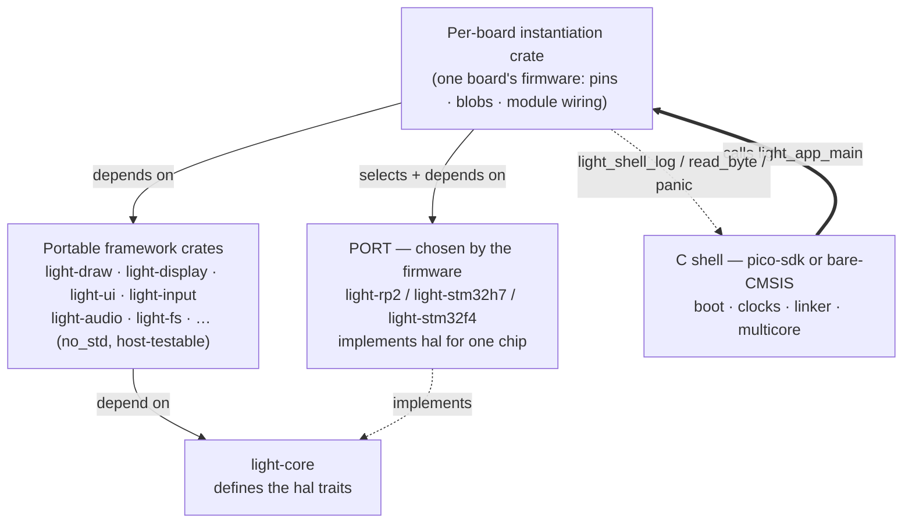

# 07 — Ports and the C Shell

This document describes the **ports** — the target-only crates that implement `light_core::hal`'s
traits for a specific chip — and the **C shells** that own the boot path and hand control to Rust.
A port is the extension point by which any consumer adds support for their own chip: implement the
`hal` traits their boards need and supply one `critical-section`. The ports and shells described here
are the reference ones that ship, an extraction of the mk4 status quo: the ports are `light-rp2`,
`light-stm32h7` and `light-stm32f4`; the shells are `light_mk4_shell` (the pico-sdk shell for the RP2
boards) and `light_mk4_shell_cmsis` (the bare-CMSIS shell for the STM32 boards).

---

*The portable stack depends only downward and never names a port; a port implements `light-core`'s
`hal` traits for one chip; the C shell boots the platform and hands control to the firmware's
instantiation crate, which is the one place that chooses the port and knows the board. Every arrow
except the two dashed callbacks is a compile-time dependency.*

## What a port is

A **port** is the crate that implements the `light_core::hal` traits for one chip family, in terms
of that chip's registers. It is the single place in the tree where portable code meets silicon:
every portable crate reaches the world only through `hal`'s traits, and a port is what makes those
traits real on a given part. It is also the framework's extension point for hardware: a consumer
supports a new chip by writing a port — implementing the `hal` traits their boards need and supplying
one `critical-section` — and nothing above `light-core` changes. The three ports below are the
reference ports that ship; a consumer's own port stands beside them on the same footing.

Three rules define the boundary:

1. **A port is chosen by the firmware, never by a library.** The portable stack depends only on
   `light-core`; nothing in it names a port. A per-board instantiation crate (see
   [09-application-model.md](09-application-model.md)) picks the port, constructs the peripherals
   behind their taken-once unsafe constructors, and hands them to the portable code as an owned set.

2. **A port stops at the chip.** It knows blocks — SPI, I2C, PIO, the timer — not boards. What is
   soldered to a pin (a panel, keys, an expansion board) is board wiring and belongs to the
   application. A port's constructors take pin numbers and clock rates as arguments; they assume no
   pinout.

3. **A port is not host-tested.** Its code reads real registers, so it compiles and runs only for
   `target_os = "none"`. The register-touching modules are gated behind that `cfg` (or are simply
   never built for the host), and — because the ports are members of the firmware workspace, not the
   portable one (see [10-build-and-release.md](10-build-and-release.md)) — `cargo test` on the
   portable workspace exercises the portable crates against a mocked board and never reaches a port,
   with no exclude list to maintain.

The `hal` traits a port implements are `Clock`, `Idle`, `OutputPin`, `InputPin`, `I2cBus`,
`SpiBus`, `SpiDisplayBus`, `QspiDisplayBus`, `AudioStream` and `BlockDevice` — the exact set a given
port provides depends on what its boards have needed. Each port also supplies the chip's
`critical-section` implementation, the primitive the portable atomics and locks are built on.

---

## `light-rp2` — the RP2040 and RP2350, one source

### Responsibility

Chip access for the whole RP2 family — the RP2040 (Cortex-M0+) and the RP2350 (Cortex-M33 **or**
Hazard3) — driven through the chip's `pac` register definitions, not through pico-sdk calls.
pico-sdk's peripheral API is almost all `static inline` in headers, which no binding generator can
export; every SDK call from Rust would need a hand-written C shim, whereas the pac reaches
everything the framework needs directly. pico-sdk stays in charge of the *runtime* — `crt0`,
`boot2`, clock configuration, timer start, multicore, USB — in the C shell that links this crate.

### One crate for both chips

The blocks this crate touches (SIO, pads, IO, SPI, I2C, DMA, PWM, the timer) are the same silicon IP
on both parts, and the two pacs (`rp2040-pac`, `rp235x-pac`) were produced by the same svd2rust
generation over near-identical SVDs, so the accessors are identical. The chip is selected by a cargo
feature — exactly one of `rp2040` or `rp2350`, enforced by `compile_error!` — and shows up in only
three places:

- which pac is re-exported as `pac`;
- the timer block's name (`TIMER` on the RP2040, `TIMER0` on the RP2350, which has two);
- the RP2350's pad-isolation bit, which the RP2040 lacks.

The Cortex-M0+ adds a fourth difference, invisible in the source: it has no atomic read-modify-write
instructions, so the framework's atomics are `portable-atomic`'s, which fall back to this crate's
critical section on that core and compile to native instructions everywhere else. The ISA (Arm vs
Hazard3) is selected by `LIGHT_ARCH` at the build level and needs no port code beyond the
critical-section's two inline-asm paths; the pac and every peripheral wrapper are ISA-agnostic.

Neither pac is pulled in with its `rt` feature: the vector table, reset handler and linker script
belong to pico-sdk's runtime in the C shell. This crate wants only the register definitions.

### Public surface

- `Clocks { sys_hz, peri_hz }` — the clock rates the runtime configured, passed in by the shell that
  knows them rather than assumed here.
- `now_us() -> u64` and `SysClock` (a `Clock`) — microseconds since boot off the 64-bit system
  timer that pico-sdk's runtime has already started.
- `Breathe` (an `Idle`) — what the runtime does between idle passes.
- The peripheral wrappers, each with an `unsafe`, construct-once `new` taking pins and clock rates:
  - `gpio` — `set_function`/`set_pull_up`, `Output` (`OutputPin`), `Input` (`InputPin`), covering
    both pin banks including the RP2350B's upper sixteen behind the SIO `GPIO_HI_*` registers;
  - `i2c` — `I2c0`/`I2c1` (`I2cBus`), one macro-stamped source for the two identical blocks;
  - `spi` — `Spi1Display` (`SpiDisplayBus`), the 4-wire display bus with DMA-backed bursts;
  - `spi_bus` — `Spi1Bus` (`SpiBus`), SPI1 as a plain full-duplex master (the TF slot's transport);
  - `qspi` — `PioQspiDisplayBus` (`QspiDisplayBus`), a QSPI panel bus on one PIO state machine;
  - `i2s` — I2S audio through PIO with ping-pong DMA, the codec as I2S master;
  - `pwm` — `PwmOutput`, one PWM output (a backlight, a buzzer);
  - `pwm_audio` — PCM out over PWM;
  - `adc` — `Adc`, one-shot analog reads;
  - `rgb` (RP2350 only) — a continuous RGB/DPI scanout engine on four PIO state machines, for
    GDDRAM-less panels;
  - `tinyusb_midi` (feature `usb-host`) — the USB-MIDI host transport behind `light_midi::Transport`.
- Its own `critical-section` implementation (target builds only).

### Behaviour and invariants

- **`now_us` is lock-free and cross-core safe.** The 64-bit timer is read as two halves and re-read
  until the high half is stable across the low read — the dance pico-sdk's `time_us_64()` does, but
  without the latching `TIMELR`/`TIMEHR` pair, which is per-core state that would race the other
  core's use of it.
- **Every peripheral constructor is `unsafe` and construct-once.** It takes ownership of a hardware
  instance (and, where relevant, a DMA channel or PIO state machine) that nothing else — Rust or the
  C shell — may touch while it lives. DMA channels are taken from the top of the range, where
  pico-sdk's `dma_claim_unused_channel` (counting up from 0) will not reach in a shell that claims
  none — a convention, not a claim the SDK can see.
- **Outputs settle before they drive.** `gpio::Output::new` drives the pin to its initial level
  before enabling the output, so a chip-select never glitches low on its way up.
- **The RP2350's pads power up isolated.** `set_function` clears the isolation bit on the RP2350,
  without which everything looks configured while the pin does nothing.
- **I2C carries a bus-clear and a per-byte timeout.** Before the peripheral touches the pins, `new`
  clocks nine SCL pulses and issues a manual STOP to free a slave left driving SDA low by a reset
  mid-transaction — a failure that, on a battery-backed board, no later reboot clears. Each transfer
  has a base-plus-per-byte deadline; a held-START (`nostop`) write that fails clears the
  "restart-next" flag so the failure does not leak a spurious RESTART into the next device's
  transaction. A timed-out transfer aborts the block and clears its FIFOs so the next one does not
  start behind a half-finished one.
- **The PIO buses assemble their own programs.** The C shell owns pioasm; this crate owns registers,
  so the QSPI, I2S and RGB programs are hand-assembled instruction words in the source. The QSPI bus
  runs command frames and pixel data on one state machine (command bytes software-expanded to land on
  D0 across eight clocks; pixels streaming four bits per clock, DMA-fed). The I2S path is ping-pong
  DMA, never polled FIFO writes — the four-word FIFO holds 83 µs and a single display draw is two
  hundred times that. The RGB engine is a two-channel hardware loop with no interrupt in the frame
  path: the data channel streams a whole frame and chains to a reprogram channel that reloads its
  read address, so a buffer flip is one store that takes effect at the next frame.

### Its `critical-section` implementation

The RP2 critical section is **interrupts off on this core AND a hardware spinlock held against the
other core**. There is exactly one implementation, and it is nesting-aware: a section entered while
interrupts are already disabled is treated as nested and does not touch the spinlock, which is what
makes it safe to call from inside another section.

- The restore state is one bool, "was this the outermost section".
- It uses spinlock 31, the lock pico-sdk and rp2040-hal leave free for exactly this purpose; the
  SDK's own `critical_section_t` uses claimed locks from a different range, so the two never contend
  — they simply do not protect each other's data, the expected split while the shell and the Rust
  side own separate state.
- One file serves both ISAs: the interrupt mask is PRIMASK on the Cortex-M33 pair (via `cortex-m`)
  and `mstatus.MIE` on the Hazard3 pair (via inline asm); the spinlock is the same SIO register
  either way. The `cortex-m` dependency is gated to `cfg(target_arch = "arm")`, so the Hazard3 build
  does not pull it in.
- It deliberately does **not** use `critical-section-single-core`: that implementation disables
  interrupts alone, which is wrong on a dual-core part.

---

## `light-stm32h7` and `light-stm32f4` — bare-CMSIS STM32 ports

### Responsibility

`light-stm32h7` is the STM32H743 port; `light-stm32f4` is the STM32F411 port. Both are written
against the reference manual directly — **no pac** — because the handful of registers each touches is
small enough that raw register access keeps the crate small and its failures legible. The C shell
(`light_mk4_shell_cmsis`) owns what a chip port's runtime owns: the
CMSIS startup file and linker script, the clock tree, the caches, and the console.

### Public surface

Both crates expose the same shape:

- a private `reg` module — `read`/`write`/`modify` over `read_volatile`/`write_volatile` — the
  port's whole peripheral vocabulary;
- `Clocks { sys_hz, apb2_hz, tim_hz }` — the rates the shell hands over;
- `clock_init(&Clocks)` — starts TIM2 as a free-running 1 MHz counter;
- `now_us() -> u64` and `SysClock` (a `Clock`) — microseconds since `clock_init`, the 32-bit TIM2
  count extended to 64 bits by tracking wraps;
- `Breathe` (an `Idle`);
- `gpio` — pin wrappers over the chip's GPIO block (on AHB4 for the H7, AHB1 for the F4).

`light-stm32h7` additionally has `spi` — `Spi4Display` (`SpiDisplayBus`), whose one carried finding
is that the H7's SPI is a different generation from the F4's: the transfer size is programmed per
transaction and the FIFO must be primed before the start. `light-stm32f4` has no bus drivers —
nothing that has run on the F411 has needed one yet.

### Behaviour and invariants

- **`now_us` is a wrap-extended 32-bit timer.** TIM2 runs at 1 MHz; each read compares against the
  last count and bumps a wrap counter on a decrease. The two words are relaxed atomics: there is one
  core and one caller in practice, and a torn or reordered pair could only misplace a wrap by one
  read. It stays monotonic as long as it is read at least once an hour, which a polled runtime does
  thousands of times a second.
- **The clock rates come from the shell.** The port never assumes a frequency; the shell measures
  what its clock tree actually produced and passes it in `Clocks`.

### The critical-section split — why the two flavours cannot coexist

Both STM32 ports take `cortex-m` with its `critical-section-single-core` feature: on a single-core
part the critical section is PRIMASK alone, and the dual-core spinlock the RP2350 port needs has no
counterpart here. That feature registers a **global** `critical-section` implementation via
`set_impl!` — and so does `light-rp2`. `critical-section` permits exactly one implementation in a
final binary; two is a link-time collision. This is why a port is a per-firmware choice and the
ports cannot share a workspace-wide build: each firmware links exactly one port, which supplies
exactly one critical-section implementation. Each STM32 `lib.rs` keeps a `use cortex_m as _;` so the
linker actually sees the crate that carries its acquire/release symbols — a crate nothing names is a
crate the linker drops.

---

## The C shell and its ABI (`light_mk4_shell`, pico-sdk)

### Responsibility

The C shell is the thin C layer that owns everything pico-sdk must own and nothing else. The runtime
comes up through the SDK's `crt0` and `runtime_init` exactly as for any SDK program; then control
passes to Rust on core 0 and does not come back. Keeping the shell to one `main.c` makes the size of
the Rust↔C boundary visible. It is built as a CMake *function*
(`light_mk4_shell_configure(<target> [USB_HOST])`) rather than a library, because
`pico_enable_stdio_*` and the panic hook are per-executable settings.

### The ABI

The whole boundary is a handful of functions.

**Shell → Rust** (the shell calls these):

- `light_app_main(const struct light_shell_info *info) -> !` — the Rust entry, called once on core 0
  with the resolved clock rates (`clk_sys_hz`, `clk_peri_hz`). It never returns: it constructs the
  peripherals, builds the modules, and runs the runtime loop forever.
- `light_app_core1_service(void)` — called repeatedly on core 1. It drains the log queue to stdio
  and pumps console input bytes into the app.

**Rust → shell** (Rust calls these; the SDK owns what they do):

- `light_shell_log(const char *msg, size_t len)` — a line already formatted on the Rust side, out to
  the console.
- `light_shell_read_byte(void) -> int` — one console input byte, or `-1` when none is waiting.
- `light_shell_panic(const char *msg, size_t len) -> !` — a Rust panic, already formatted, for the
  shell to print and then halt.

**Additional shell surface:**

- `light_shell_usb_mounted(void) -> bool` — the USB device enumeration state, the board's only "on
  external power" signal on parts with no VBUS-sense pin.
- `light_shell_panic_sdk(const char *fmt, ...)` — installed as `PICO_PANIC_FUNCTION` so the SDK's own
  panics (assertions, spinlock misuse) go through the same hand-off as Rust's.
- Host-role only (`LIGHT_SHELL_USB_HOST`): `light_shell_usb_host_init` / `_task` / `_reset`, which
  the `tinyusb_midi` transport calls to drive the host stack.

`ShellInfo` is the one thing the shell knows and Rust must not assume — the clock rates the SDK
runtime configured (pico-sdk's defaults are 125 MHz sys on the RP2040, 150 MHz on the RP2350).

### The two-core division

The shell's defining arrangement is that **USB lives on core 1 and core 0 never touches stdio.**

- `main` launches core 1 first (resetting it before launch, or a warm restart of core 0 hangs in the
  FIFO handshake) and waits for it to signal ready before calling `stdio_init_all` and
  `light_app_main`.
- In the default **device role**, core 1 runs `tusb_init()` and pumps `tud_task()` — because
  `dcd_int_enable()` enables `USBCTRL_IRQ` on the calling core and TinyUSB guards its queues with
  per-core IRQ-disable sections that are not cross-core safe. Every stdio write and read therefore
  happens from core 1, in `light_app_core1_service()`. Core 0 runs the render/runtime loop and can
  be arbitrarily busy without ever stalling the console.
- In the **host role**, the native port is a USB *host* for MIDI instruments, so there
  is no CDC console — stdio is the UART. The whole host stack runs on **core 0**, driven from the
  Rust runtime through `light_shell_usb_host_*`, so the class callbacks (implemented on the Rust
  side) fire in the same context as the packet reads. Core 1 keeps only the log drain and console
  read, which the UART serves from either core with no USB stack to protect.

### Behaviour and invariants

- **Logging never blocks the loop.** stdout is non-blocking (`PICO_STDIO_USB_STDOUT_TIMEOUT_US=0`):
  a write drops when the host is not reading rather than stalling core 1's drain. A blocking write
  here is a latent deadlock — while core 1 waits for CDC TX space it is not pumping `tud_task`, so
  the host's next write times out. Dropping matches the log queue's own push-side policy.
- **The panic hand-off keeps the board flashable.** A panic is formatted (memory only) on the dying
  core and printed by the core that owns USB; core 0 sets `panic_pending` and busy-waits (never
  sleeps, so a panic raised inside an IRQ does not re-enter the SDK's "sleep in exception handler"
  panic) for core 1 to relay it. Afterwards the device-role board drops into BOOTSEL
  (`reset_usb_boot`) so a halted board still takes a reflash; the host-role board, flashed over SWD
  with no CDC, halts at a breakpoint where a debugger can read the message.
- **Stack placement is load-bearing.** Core 1's stack is a static array in ordinary RAM, not the
  linker's `SCRATCH_X` default that sits directly below core 0's stack: a deep core-0 call chain was
  found landing on core 1's live frames, killing core 1 (the console) alone while the application ran
  on. Each core's stack is 4 KB with an MPU guard region at its base, so an overflow is a hard fault
  at the offending instruction rather than a silent overwrite. Module state lives in `.bss`, not on
  the stack.

The shell also disables the SDK's own TinyUSB init and IRQ background task
(`PICO_STDIO_USB_ENABLE_TINYUSB_INIT=0`, `PICO_STDIO_USB_ENABLE_IRQ_BACKGROUND_TASK=0`), since the
shell does that work itself on core 1; either left on would have the SDK do it from core 0.

---

### mk5 decision — the Rust-side shell glue is a `shell` module in the port

*Decided for mk5.* The ABI above is the C↔Rust contract; the small **Rust** helpers layered on it —
a `ShellInfo` accessor, the `service_core1` pump (log drain plus console pump), `panic_report`, and
the core-0 stack watermark — are identical for every board on a given shell. In mk4 one board's
support crate carried them, so any other board would have to copy them. In mk5 they live in a `shell`
module in the port crate, shared by every board and app on that port. Implemented in `light-rp2`
(`light_rp2::shell`), which the RP2 touch boards use. The bare-CMSIS glue is single-core (no
`service_core1`) *and* chip-independent — the handshake is the same for the h7 and the f411 — so it
does not belong in one STM32 port crate; it lives in a shared `light-shell-cmsis` crate
(`drain_log`, `read_console`, `panic_report`, `ShellInfo`) that every bare-CMSIS board uses. Either
way, a board's instantiation crate keeps only the thin `#[no_mangle]` / `#[panic_handler]` entry
points that call in. See [09-application-model.md](09-application-model.md).

## The bare-CMSIS shell (`light_mk4_shell_cmsis`)

### Responsibility

The same shape as `light_mk4_shell`, in miniature, for the STM32 ports — what pico-sdk's runtime
does for the RP2 boards, done here by the CMSIS startup file, ST's system file, and the small amount
this shell adds: the clock tree and caches where the chip has them, and the console. Two chips so
far: the H743 gets its caches and a 400 MHz clock tree; the F411 runs on its reset defaults (HSI at
16 MHz, every prescaler at 1). It is a CMake function,
`light_mk4_shell_cmsis_configure(<target> CHIP <stm32h743|stm32f411>)`, selecting the chip's
sources, arch flags, linker script and packaging step. The CMSIS device and core headers come from
the framework's vendored `lib/` checkouts, and the Rust staticlib is built for
`thumbv7em-none-eabihf` — hard float on both chips.

### The ABI

The same boundary crosses, minus the second core:

- `light_app_main(const struct light_shell_info *info) -> !` — the Rust entry, with
  `ShellInfo { clk_sys_hz, clk_apb2_hz, clk_tim_hz }`.
- `light_shell_log` and `light_shell_read_byte` — as on the RP2 shell.
- `light_shell_panic` — prints and halts at a breakpoint; there is no BOOTSEL to fall into, and an
  ST-Link reflashes a halted part.

There is **no `light_app_core1_service`**: with one core, the log drain the RP2 shell runs on core 1
is the Rust side's own job, called from within its runtime loop.

Internal to the shell (not Rust-facing): `light_shell_clock_init` / `_status` and
`light_shell_console_init` / `_console_read_byte`, declared in `shell.h`.

### Behaviour and invariants

- **The shell measures the clocks it built and passes them in.** On the H743 `main` enables the
  I-cache, runs the clock tree to 400 MHz, then computes `clk_sys`/`apb2`/`tim` from the RCC
  prescaler fields (the APB1 timers run at twice APB1 when APB1 is prescaled). On the F411 it takes
  the reset defaults, every bus at the core clock.
- **Order in the clock tree is load-bearing.** Voltage scaling before frequency, flash wait states
  before the clock that needs them, prescalers before the switch — each done late hangs the core.
  Every wait is bounded, so a missing crystal is a slow board (HSI fallback), not a dead one, and
  the status string reports what happened once the console exists. PLL1's Q output is configured
  even though it feeds no PLL directly, because `SPI123SEL` resets to it — leave it disabled and
  SPI1/2/3 configure perfectly while transferring nothing.
- **The data cache stays off on the H743, deliberately** — the frame buffer is DMA territory, and a
  cached buffer handed to DMA is silently wrong. The debug interface is kept alive across `WFI`, or a
  running application becomes unreachable over SWD.
- **The console is USART1 and ITM both, since they fail in opposite ways.** SWO needs a debugger
  attached; the USART needs a wire but no debugger. Neither may block forever: both TX paths spin on
  FIFO room with a bounded spin count and drop the byte on timeout — a debugger that enables ITM
  without draining SWO (as OpenOCD does after flashing) would otherwise stop the firmware dead inside
  a `printf`. A lost log line is a log line. `_write` is a strong symbol that beats libnosys's stub,
  so every `printf` lands here. The USART is a different generation on the two chips (ISR/TDR/RDR
  with FIFO flags on the H7, SR/DR on the F4), and every difference fails silently if carried
  across, so each is coded per chip.

---

## Notable design decisions and constraints (summary)

- **Ports never enter host tests.** Register access is gated to `target_os = "none"`; the host build
  runs the portable crates against a mocked board.
- **The pac vs. bare-register choice follows the SDK.** On RP2 the pac is a clean, generated surface
  that dodges pico-sdk's un-exportable inline API; on STM32 there is no SDK to dodge and the register
  set is small, so raw `read_volatile`/`write_volatile` keeps the crate legible.
- **One critical-section per firmware.** `critical-section` allows a single global implementation, so
  each firmware links exactly one port. The RP2 port supplies a nesting-aware dual-core section; the
  STM32 ports use `cortex-m`'s single-core PRIMASK section. The two cannot coexist in one binary, and
  that is by design — the port is a per-firmware choice. *(mk5 keeps this per-firmware property but
  moves the ports into a separate firmware workspace so it never constrains the host-test build — see
  proposal F in [mk5-proposals.md](mk5-proposals.md) and [10-build-and-release.md](10-build-and-release.md).)*
- **The shell owns the runtime; Rust owns everything above it.** `crt0`, `boot2`/startup, the linker
  script, the clock tree, multicore launch, PIO assembly and the USB stack live in C. Rust is handed
  the measured clock rates and a tiny callback surface, and runs the application forever from
  `light_app_main`.
- **The framework runs single-core or multi-core; the application always occupies one core.** On a
  two-core chip the console and USB live on the second core so a busy render loop cannot stall them
  (and logging is non-blocking end to end so it can never deadlock the loop); on a single-core chip
  the same housekeeping folds into the runtime loop, with no `light_app_core1_service`. The
  application, its modules and its event bus are identical either way — the second core is used where
  it exists, never required.
