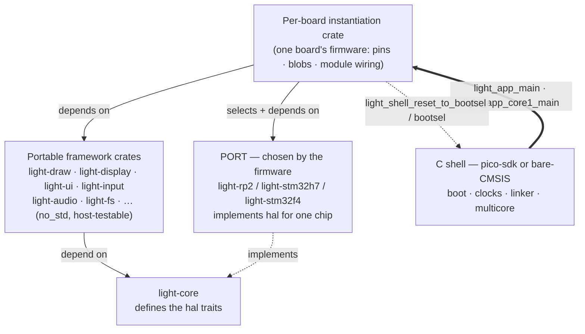

# 07 — Ports and the C Shell

This document describes the **ports** — the target-only crates that implement `light_core::hal`'s
traits for a specific chip — and the **C shells** that own the boot path and hand control to Rust.
A port is the extension point by which any consumer adds support for their own chip: implement the
`hal` traits their boards need and supply one `critical-section`. The ports and shells described here
are the reference ones that ship: the ports are `light-rp2`,
`light-stm32h7` and `light-stm32f4`; the shells are `light_shell` (the pico-sdk shell for the RP2
boards) and `light_shell_cmsis` (the bare-CMSIS shell for the STM32 boards).

---

*The portable stack depends only downward and never names a port; a port implements `light-core`'s
`hal` traits for one chip; the C shell boots the platform and hands control to the firmware's
instantiation crate, which is the one place that chooses the port and knows the board. Every arrow
except the two dashed callbacks is a compile-time dependency.*

## What a port is

A **port** is the crate that implements the `light_core::hal` traits for one chip family, in terms
of that chip's registers. It is the single place in the tree where portable code meets silicon:
every portable crate reaches the world only through `hal`'s traits, and a port is what makes those
traits real on a given part. It is also the framework's extension point for hardware: a consumer
supports a new chip by writing a port — implementing the `hal` traits their boards need and supplying
one `critical-section` — and nothing above `light-core` changes. The three ports below are the
reference ports that ship; a consumer's own port stands beside them on the same footing.

Three rules define the boundary:

1. **A port is chosen by the firmware, never by a library.** The portable stack depends only on
   `light-core`; nothing in it names a port. A per-board instantiation crate (see
   [09-application-model.md](09-application-model.md)) picks the port, constructs the peripherals
   behind their taken-once unsafe constructors, and hands them to the portable code as an owned set.

2. **A port stops at the chip.** It knows blocks — SPI, I2C, PIO, the timer — not boards. What is
   soldered to a pin (a panel, keys, an expansion board) is board wiring and belongs to the
   application. A port's constructors take pin numbers and clock rates as arguments; they assume no
   pinout.

3. **A port is not host-tested.** Its code reads real registers, so it compiles and runs only for
   `target_os = "none"`. The register-touching modules are gated behind that `cfg` (or are simply
   never built for the host), and — because the ports are members of the firmware workspace, not the
   portable one (see [10-build-and-release.md](10-build-and-release.md)) — `cargo test` on the
   portable workspace exercises the portable crates against a mocked board and never reaches a port,
   with no exclude list to maintain.

The `hal` traits a port implements are `Clock`, `Idle`, `OutputPin`, `InputPin`, `I2cBus`,
`SpiBus`, `SpiDisplayBus`, `QspiDisplayBus`, `AudioStream` and `BlockDevice` — the exact set a given
port provides depends on what its boards have needed. Each port also supplies the chip's
`critical-section` implementation, the primitive the portable atomics and locks are built on.

---

## `light-rp2` — the RP2040 and RP2350, one source

### Responsibility

Chip access for the whole RP2 family — the RP2040 (Cortex-M0+) and the RP2350 (Cortex-M33 **or**
Hazard3) — driven through the chip's `pac` register definitions, not through pico-sdk calls.
pico-sdk's peripheral API is almost all `static inline` in headers, which no binding generator can
export; every SDK call from Rust would need a hand-written C shim, whereas the pac reaches
everything the framework needs directly. pico-sdk stays in charge of the *runtime* — `crt0`,
`boot2`, clock configuration, timer start, multicore, and in the host role the USB host stack — in
the C shell that links this crate.

### One crate for both chips

The blocks this crate touches (SIO, pads, IO, SPI, I2C, DMA, PWM, the timer) are the same silicon IP
on both parts, and the two pacs (`rp2040-pac`, `rp235x-pac`) were produced by the same svd2rust
generation over near-identical SVDs, so the accessors are identical. The chip is selected by a cargo
feature — exactly one of `rp2040` or `rp2350`, enforced by `compile_error!` — and shows up in only
three places:

- which pac is re-exported as `pac`;
- the timer block's name (`TIMER` on the RP2040, `TIMER0` on the RP2350, which has two);
- the RP2350's pad-isolation bit, which the RP2040 lacks.

The Cortex-M0+ adds a fourth difference, invisible in the source: it has no atomic read-modify-write
instructions, so the framework's atomics are `portable-atomic`'s, which fall back to this crate's
critical section on that core and compile to native instructions everywhere else. The ISA (Arm vs
Hazard3) is selected by `LIGHT_ARCH` at the build level and needs no port code beyond the
critical-section's two inline-asm paths; the pac and every peripheral wrapper are ISA-agnostic.

Neither pac is pulled in with its `rt` feature: the vector table, reset handler and linker script
belong to pico-sdk's runtime in the C shell. This crate wants only the register definitions.

### Public surface

- `Clocks { sys_hz, peri_hz }` — the clock rates the runtime configured, passed in by the shell that
  knows them rather than assumed here.
- `now_us() -> u64` and `SysClock` (a `Clock`) — microseconds since boot off the 64-bit system
  timer that pico-sdk's runtime has already started.
- `Breathe` (an `Idle`) — what the runtime does between idle passes.
- The peripheral wrappers, each with an `unsafe`, construct-once `new` taking pins and clock rates:
  - `gpio` — `set_function`/`set_pull_up`, `Output` (`OutputPin`), `Input` (`InputPin`), covering
    both pin banks including the RP2350B's upper sixteen behind the SIO `GPIO_HI_*` registers;
  - `i2c` — `I2c0`/`I2c1` (`I2cBus`), one macro-stamped source for the two identical blocks;
  - `spi` — `Spi1Display` (`SpiDisplayBus`), the 4-wire display bus with DMA-backed bursts;
  - `spi_bus` — `Spi1Bus` (`SpiBus`), SPI1 as a plain full-duplex master (the TF slot's transport);
  - `qspi` — `PioQspiDisplayBus` (`QspiDisplayBus`), a QSPI panel bus on one PIO state machine;
  - `i2s` — I2S audio through PIO with ping-pong DMA, the codec as I2S master;
  - `pwm` — `PwmOutput`, one PWM output (a backlight, a buzzer);
  - `pwm_audio` — PCM out over PWM;
  - `adc` — `Adc`, one-shot analog reads;
  - `rgb` (RP2350 only) — a continuous RGB/DPI scanout engine on four PIO state machines, for
    GDDRAM-less panels;
  - `usb` — `UsbBus`, the USB device controller as a `usb_device::bus::UsbBus`, polled (below);
  - `uart` — `Uart`, a UART as a console transport (the debug-probe path, and the host role's only
    console);
  - `usb_host` (feature `usb-host`) — the USB-MIDI host role: the ecosystem's host stack over its
    controller driver for this chip, behind `light_midi::Host` (below).
- `assets` — `region()`, the storage a product's assets were written to, as a `&'static [u8]` for
  `light-assets` to read a pack out of. Two things portable code cannot do: ask the boot ROM where
  the flash map set that region aside, and make it addressable. The chip reads storage through four
  address-translation windows, and a bootloader handing over to an image narrows the first to the
  slot that image came from and closes the rest — deliberately, so a running image cannot reach past
  its own partition. So this opens one of the closed windows onto the region the map named, and
  nothing else. It answers `NoRegion` where there is no map, which is a board flashed straight to
  the start of storage.
- `shell` — the Rust side of the C shell's ABI, shared by every RP2 board (see the shell below).
- Its own `critical-section` implementation (target builds only).

### Behaviour and invariants

- **`now_us` is lock-free and cross-core safe.** The 64-bit timer is read as two halves and re-read
  until the high half is stable across the low read — the dance pico-sdk's `time_us_64()` does, but
  without the latching `TIMELR`/`TIMEHR` pair, which is per-core state that would race the other
  core's use of it.
- **Every peripheral constructor is `unsafe` and construct-once.** It takes ownership of a hardware
  instance (and, where relevant, a DMA channel or PIO state machine) that nothing else — Rust or the
  C shell — may touch while it lives. DMA channels are taken from the top of the range, where
  pico-sdk's `dma_claim_unused_channel` (counting up from 0) will not reach in a shell that claims
  none — a convention, not a claim the SDK can see.
- **A reset pulse is serialised across the cores.** The reset register is read-modify-written, and
  the two cores construct peripherals at the same moment at boot — core 1 its console UART, core 0
  everything else. Every constructor pulses its block through one helper that holds the cross-core
  critical section; unserialised, one core's write-back carried the other's stale reset bit and
  put the block that core was configuring back into reset under it (a bus fault on its next
  register read, with the fault handler in flash).
- **Outputs settle before they drive.** `gpio::Output::new` drives the pin to its initial level
  before enabling the output, so a chip-select never glitches low on its way up.
- **The RP2350's pads power up isolated.** `set_function` clears the isolation bit on the RP2350,
  without which everything looks configured while the pin does nothing.
- **I2C carries a bus-clear and a per-byte timeout.** Before the peripheral touches the pins, `new`
  clocks nine SCL pulses and issues a manual STOP to free a slave left driving SDA low by a reset
  mid-transaction — a failure that, on a battery-backed board, no later reboot clears. Each transfer
  has a base-plus-per-byte deadline; a held-START (`nostop`) write that fails clears the
  "restart-next" flag so the failure does not leak a spurious RESTART into the next device's
  transaction. A timed-out transfer aborts the block and clears its FIFOs so the next one does not
  start behind a half-finished one.
- **The PIO buses assemble their own programs.** The C shell owns pioasm; this crate owns registers,
  so the QSPI, I2S and RGB programs are hand-assembled instruction words in the source. The QSPI bus
  runs command frames and pixel data on one state machine (command bytes software-expanded to land on
  D0 across eight clocks; pixels streaming four bits per clock, DMA-fed). The I2S path is ping-pong
  DMA, never polled FIFO writes — the four-word FIFO holds 83 µs and a single display draw is two
  hundred times that. The RGB engine is a two-channel hardware loop with no interrupt in the frame
  path: the data channel streams a whole frame and chains to a reprogram channel that reloads its
  read address, so a buffer flip is one store that takes effect at the next frame.

### The USB device controller — `usb` (reference driver)

The port owns the chip's USB device controller and presents it as a `usb_device::bus::UsbBus`, so
the device side of USB is Rust from the register up, with the class layer (`usbd-serial` for the
console) reused from the `usb-device` ecosystem rather than written here. The controller is one
source for both chips over the pac, under the same feature split as the rest of the crate.

- **The trait is the whole contract.** `alloc_ep` assigns an endpoint its dual-port-RAM buffer and
  endpoint-control word; `enable` connects the pull-up; `reset` and `set_device_address` follow the
  bus; `write`/`read` drive the per-endpoint buffer-control word (the data-PID toggle and the
  AVAILABLE/FULL handshake, double-buffered where the class asks for it); `set_stalled`/`is_stalled`,
  `suspend`/`resume`; and `poll` reads the SIE and buffer status into a `PollResult` — bus reset,
  setup, IN complete, OUT ready, suspend, resume. Nothing above the trait names the chip.
- **Polled, never interrupt-driven.** The controller's interrupt stays masked and the stack is
  advanced by calling `poll` from the console loop on core 1. This is what lets USB live on one
  core without a per-core interrupt-enable question, and what keeps a busy application core from
  ever affecting the console.
- **The control endpoint's OUT buffer is armed lazily, never left armed.** A SETUP packet disarms
  it; the driver arms it for the DATA stage only when the request has one (an IN request, or an OUT
  request with a non-zero length), and re-arms after a full-length packet only. An EP0 OUT buffer
  left permanently armed carries a stale data PID into the next control transfer, and the host's
  first write to the port (the line-coding request) hangs. Every other OUT endpoint is re-armed
  continuously, as the class layer expects.
- **The chip's PHY isolation is cleared.** Where the controller's main-control register resets with
  the PHY isolated (the RP2350 does), the driver clears it on enable; a port that leaves it set is
  fully configured and never enumerates.
- **The device's identity is the framework's, not the port's** — the vendor and product ids and the
  manufacturer and product strings are constants of `light_core::usb`, presented identically by
  every port's console device, and the framework's scripts find a board by them. Only the serial
  string is the port's (its chip family), so two boards on one host stay distinct devices. The
  identity is the one the SDK's console presented, so the tooling's detection is unchanged.
- **The 1200-baud trigger.** The CDC class reports the host's line coding; when the host sets 1200
  baud the console enters the BOOTSEL bootloader through the shell (`light_shell_reset_to_bootsel`).
  This is the reflash path for a board with no debug pads, so it is part of the contract, not a
  convenience.
- **Enumeration state is exposed, not consumed here.** The loop publishes whether the device is
  configured (`shell::usb_mounted`); the power manager reads it as the "on external power" signal on
  boards with no VBUS-sense pin.

### The USB host role — `usb_host` (feature `usb-host`)

A board whose native USB port hosts instruments builds the port with `usb-host` instead of
`usb-console`, and the port then provides [`light_midi::Host`] over the ecosystem's host stack —
`cotton-usb-host`, over its own controller driver for this chip (vendored under `lib/` with the
framework's fixes and its RP2350 driver; every change is listed in its `LIGHT_PATCHES.md`). The
stack does enumeration, hub topology and hot-plug; the port owns the MIDI class, the device slots,
and the way the stack is driven.

- **Polled from the runtime, no executor, no interrupt.** The stack is written for an async
  executor woken from the controller's interrupt, but every one of its futures re-reads the
  controller when polled, so one poll per runtime pass with a waker that does nothing drives it
  completely. The interrupt its constructor unmasks is masked again before interrupts are
  re-enabled. The bus task is one future, type-erased into aligned storage in `.bss` and driven as
  `dyn Future`; `Host::task` is one poll of it.
- **A MIDI IN endpoint is a hardware-polled pipe, never a bulk read.** On these chips the stack
  runs bulk transfers on the one general-purpose pipe and holds it until data arrives; a bulk read
  pending on a silent instrument would stall every other transfer on the bus. The controller's
  polled interrupt pipes are per endpoint and serviced by the hardware, so each instrument's IN
  endpoint is opened as one, at a 1 ms interval and at the endpoint's own `wMaxPacketSize` (not
  a guessed maximum), and the MIDI OUT writes go as bulk transfers. The mount log line records
  what the descriptor walk found — interface, endpoints, cable counts, packet size, endpoints
  seen — so an instrument that mounts but misbehaves can be read off the console.
- **The host's constructor pulses the controller's reset inside the port's critical section**, as
  every reset pulse in the port is (the two cores construct peripherals at the same moment).
- **The control endpoint's completion flags are cleared only when a completion is consumed.**
  Cleared on every pending poll as well, a completion landing between the read and the clear was
  wiped and the transfer — and the whole device-event stream behind it, hub status pipes included
  — never resolved. Woken from the interrupt that window is rarely hit; polled continuously it was
  hit within a few enumerations.
- **Mount reports carry the bus position** — the hub in front of the device and that hub's port —
  from the stack's topology, so a status display can show which socket an instrument is in.
- **Nothing resets the controller.** Hot-plug, hub-level and per-port, is handled by the stack; the
  application has no root-port workaround to run.

### Its `critical-section` implementation

The RP2 critical section is **interrupts off on this core AND a hardware spinlock held against the
other core**. There is exactly one implementation, and it is nesting-aware: a section entered while
interrupts are already disabled is treated as nested and does not touch the spinlock, which is what
makes it safe to call from inside another section.

- The restore state is one bool, "was this the outermost section".
- It uses spinlock 31, the lock pico-sdk and rp2040-hal leave free for exactly this purpose; the
  SDK's own `critical_section_t` uses claimed locks from a different range, so the two never contend
  — they simply do not protect each other's data, the expected split while the shell and the Rust
  side own separate state.
- One file serves both ISAs: the interrupt mask is PRIMASK on the Cortex-M33 pair (via `cortex-m`)
  and `mstatus.MIE` on the Hazard3 pair (via inline asm); the spinlock is the same SIO register
  either way. The `cortex-m` dependency is gated to `cfg(target_arch = "arm")`, so the Hazard3 build
  does not pull it in.
- It deliberately does **not** use `critical-section-single-core`: that implementation disables
  interrupts alone, which is wrong on a dual-core part.

---

## `light-stm32h7` and `light-stm32f4` — bare-CMSIS STM32 ports

### Responsibility

`light-stm32h7` is the STM32H743 port; `light-stm32f4` is the STM32F411 port. Both are written
against the reference manual directly — **no pac** — because the handful of registers each touches is
small enough that raw register access keeps the crate small and its failures legible. The C shell
(`light_shell_cmsis`) owns what a chip port's runtime owns: the CMSIS startup file and linker
script, the clock tree and the caches. The console, on every transport, is the port's and the shared
Rust shell glue's (below).

### Public surface

Both crates expose the same shape:

- a private `reg` module — `read`/`write`/`modify` over `read_volatile`/`write_volatile` — the
  port's whole peripheral vocabulary;
- `Clocks { sys_hz, ahb_hz, apb2_hz, tim_hz }` — the rates the shell hands over;
- `clock_init(&Clocks)` — starts TIM2 as a free-running 1 MHz counter;
- `now_us() -> u64` and `SysClock` (a `Clock`) — microseconds since `clock_init`, the 32-bit TIM2
  count extended to 64 bits by tracking wraps;
- `Breathe` (an `Idle`);
- `gpio` — pin wrappers over the chip's GPIO block (on AHB4 for the H7, AHB1 for the F4);
- `uart` — `Usart1`, the chip's USART1 on its default console pins as a console transport
  (`light_shell_cmsis::Transport`), non-blocking both ways;
- `usb` — the chip's USB OTG controller as a `usb_device::bus::UsbBus`, polled (below).

`light-stm32h7` additionally has `spi` — `Spi4Display` (`SpiDisplayBus`), whose one carried finding
is that the H7's SPI is a different generation from the F4's: the transfer size is programmed per
transaction and the FIFO must be primed before the start. `light-stm32f4` has no bus drivers —
nothing that has run on the F411 has needed one yet.

### Behaviour and invariants

- **`now_us` is a wrap-extended 32-bit timer.** TIM2 runs at 1 MHz; each read compares against the
  last count and bumps a wrap counter on a decrease. The two words are relaxed atomics: there is one
  core and one caller in practice, and a torn or reordered pair could only misplace a wrap by one
  read. It stays monotonic as long as it is read at least once an hour, which a polled runtime does
  thousands of times a second.
- **The clock rates come from the shell.** The port never assumes a frequency; the shell measures
  what its clock tree actually produced and passes it in `Clocks`.

### The USB device controller — `usb` (the Synopsys OTG cores)

Both chips carry a Synopsys OTG core — the H743's second instance (OTG_FS, the one on the PA11/PA12
pins) and the F411's OTG_FS. The core is shared by a whole family of parts and the ecosystem's driver
for it, `synopsys-usb-otg`, already carries the per-revision quirks (the two opposite meanings of
the VBUS-sense bit, when an OUT endpoint is re-enabled) that a fresh driver would have to find on
hardware again. So on these ports the **controller driver is the ecosystem's, and the port
implements its `UsbPeripheral` seam**: the register base, the PHY (the internal full-speed one), the
FIFO depth and endpoint count, and `enable()` — the bus clock and reset, the pins, and on the H7 the
PHY's supply detector (`USB33DEN`), without which a fully configured controller never enumerates.
The 48 MHz kernel clock is the shell's, part of the clock tree it builds (PLL3 on the H7; the PLL's
Q output on the F411). The port also owns the driver's endpoint memory (in `.bss`) and constructs
the bus once (`usb::init`), handing back the `UsbBusAllocator` the class layer builds on.

Above the trait everything is as on the RP2: the CDC class is `usbd-serial`, the device is polled
from the console loop, and the identity is the framework's shared one (`light_core::usb`). Where the
RP2 port writes its own driver over the pac, these ports reuse one — the contract each satisfies is
the same trait, and which side of it the port stops at is the port's business.

### The critical-section split — why the two flavours cannot coexist

Both STM32 ports take `cortex-m` with its `critical-section-single-core` feature: on a single-core
part the critical section is PRIMASK alone, and the dual-core spinlock the RP2350 port needs has no
counterpart here. That feature registers a **global** `critical-section` implementation via
`set_impl!` — and so does `light-rp2`. `critical-section` permits exactly one implementation in a
final binary; two is a link-time collision. This is why a port is a per-firmware choice and the
ports cannot share a workspace-wide build: each firmware links exactly one port, which supplies
exactly one critical-section implementation. Each STM32 `lib.rs` keeps a `use cortex_m as _;` so the
linker actually sees the crate that carries its acquire/release symbols — a crate nothing names is a
crate the linker drops.

---

## The C shell and its ABI (`light_shell`, pico-sdk)

### Responsibility

The C shell is the thin C layer that owns everything pico-sdk must own and nothing else. The runtime
comes up through the SDK's `crt0` and `runtime_init` exactly as for any SDK program; the shell
launches the second core, reads the resolved clocks, and hands control to Rust — core 0 through
`light_app_main`, core 1 through `light_app_core1_main` — and does not get it back. It has **no
stdio and no USB**: the console, on both its transports, is the port's, in Rust (the `usb` and
`uart` modules above, driven by the core-1 loop below), and so is the USB host role (the `usb_host`
module, on core 0). What stays in C is what only the SDK can do — boot, clocks, multicore launch,
the bootrom (BOOTSEL entry and the BOOTSEL button read), the SDK's own panic hook, and the
hard-fault handler. Keeping the shell to one `main.c` makes the size of the Rust↔C boundary
visible. It is built as a CMake *function* (`light_shell_configure(<target>)`) rather than a
library, because the panic hook is a per-executable setting; the same shell serves both roles,
which differ only in which feature the port crate is built with.

### The ABI

The whole boundary is a handful of functions.

**Shell → Rust** (the shell calls these):

- `light_app_main(const struct light_shell_info *info) -> !` — the Rust entry, called once on core 0
  with the resolved clock rates (`clk_sys_hz`, `clk_peri_hz`). It never returns: it constructs the
  peripherals, builds the modules, and runs the runtime loop forever.
- `light_app_core1_main(const struct light_shell_info *info) -> !` — the Rust entry for core 1,
  called once after launch with the same clock rates (the UART's baud divisor needs the peripheral
  clock). It owns the whole of core 1: it brings up the console transports and runs the housekeeping
  loop forever (below).
- `light_app_panic(const char *msg, size_t len) -> !` — the SDK's own panics (assertions, spinlock
  misuse), formatted by the shell's `PICO_PANIC_FUNCTION` hook, hand their message to the Rust
  panic relay, which prints it and finishes the panic (below). Rust's own panics take the same relay
  directly, so every panic on the board — whichever side and core raises it — ends the same way.

**Rust → shell** (Rust calls these; the SDK owns what they do):

- `light_shell_reset_to_bootsel(void) -> !` — enter the BOOTSEL bootloader through the bootrom, so a
  reflash needs no button. The panic relay calls it on a device-role board, and the console calls it
  when the host asks (the 1200-baud trigger).
- `light_shell_bootsel(void) -> bool` — whether the BOOTSEL button is pressed, read at runtime. The
  button shares the flash chip-select (QSPI_SS), so the read is flash-safe: it runs from RAM with
  interrupts off, floats the chip-select, samples the pin (pressed is low), and restores it before
  returning. The chip-select bit differs between the RP2040 and the RP2350, which is why the read
  lives in the shell and not above it. Each read is a short interrupts-off window, so a caller
  samples it at a modest rate (a few times a second), never every pass beside a USB host. A board
  with no other button uses it as its one input. **And the other core is parked meanwhile**: core 1
  runs the console from flash, and a cache miss while the chip-select floats fetches garbage — a
  literal-pool read handed the console loop a pointer made of a spin count, and it died silently.
  The read is bracketed by the SDK's multicore lockout, the mechanism its own flash writes use.

- `light_shell_data_region(uint32_t *offset, uint32_t *size) -> bool` — where the flash map set a
  region aside for data, for firmware that keeps its assets out of its own image. Only the boot ROM
  can be asked: the map was read at boot and is not in this image. The region is found by what it
  **accepts** rather than by name or number, because that is what decides where a download of assets
  lands. False on a device with no map, or a map with nothing in it that accepts data.

`ShellInfo` is the one thing the shell knows and Rust must not assume — the clock rates the SDK
runtime configured (pico-sdk's defaults are 125 MHz sys on the RP2040, 150 MHz on the RP2350).

### The two-core division

The shell's defining arrangement is that **the console lives on core 1 and core 0 never touches
it.** Core 1 is a Rust loop; the C shell only launches it.

- `main` launches core 1 first (resetting it before launch, or a warm restart of core 0 hangs in the
  FIFO handshake) and waits for the launch handshake before calling `light_app_main`.
- In the default **device role**, core 1 brings up the port's USB device stack — the `UsbBus`
  controller driver with a CDC-ACM class on it — and the UART where the board has one to give, then
  each pass polls the USB device, drains the log queue to every transport it has, pumps input bytes
  from any of them into the app, and publishes the enumeration state. The stack is polled, never
  interrupt-driven, so core 0 can be arbitrarily busy without ever stalling the console.
- In the **host role**, the native port is a USB *host* for MIDI instruments, so there is no CDC
  console: the console is the UART alone. The host stack runs on **core 0**, one poll per pass of
  the runtime, in the application's own context (see the host role below). Core 1 keeps the UART
  console pump and the panic relay.
- **The UART is the board's decision.** The console's UART pins (the port's `UART_TX`/`UART_RX`,
  the chip's default console pair) are ordinary GPIO that a board may have committed to something
  else — an audio interface, a buzzer. The board's instantiation crate constructs the `Uart` and
  hands it to the loop, or hands `None`, and the loop is the same either way; a board that gives up
  the UART keeps the CDC console and its reflash path. The USB device stack is a feature of the port
  crate (`usb-console`), on for every device-role board and off for the host role, which then carries
  no device stack at all.

### Behaviour and invariants

- **Logging never blocks the loop.** A console write the CDC class has no room for — the host not
  reading — **drops** the line rather than waiting. A blocking write there is a latent deadlock:
  while core 1 waits for CDC TX space it is not polling the device, so the host's next transfer
  times out. Dropping matches the log queue's own push-side policy. The UART, whose FIFO is shorter
  than a line, is waited for byte by byte with a bounded spin: a line costs the console core its
  wire time and no more, and a wedged transmitter costs a bounded spin, never a hang.
- **Boot-time lines wait in the queue, not the loop.** The application starts as soon as core 1 is
  running; there is no wait for a host to open the console. Lines logged before the host connects sit
  in the bounded log queue and are drained when it does; beyond the queue's depth they are dropped, as
  at any other time.
- **The 1200-baud trigger enters BOOTSEL.** When the host sets the CDC line coding to 1200 baud the
  console calls `light_shell_reset_to_bootsel`. This is how the flash script reflashes a board with
  no debug pads — open the console at 1200 baud, then write the UF2 to the volume that appears — so a
  device-role board is always reflashable while its console enumerates.
- **The panic hand-off keeps the board flashable.** A panic is formatted (memory only) on the dying
  core and printed by core 1, which owns the console: the raising side stores the message, sets a
  pending flag, and busy-waits (never sleeps, so a panic raised inside an interrupt does not re-enter
  the SDK's "sleep in exception handler" panic) for core 1 to relay it; core 1 prints it and keeps
  polling the device so the bytes actually leave. Afterwards a device-role board drops into BOOTSEL so
  a halted board still takes a reflash; the host-role board, flashed over SWD with no CDC, halts at a
  breakpoint where a debugger can read the message. If core 1 never relays it — blocked on a lock the
  dying core held, typically — the message stays in memory for a debugger.
- **The enumeration state is the "on external power" signal.** `light_rp2::shell::usb_mounted()`
  reports whether the device is configured — the only such signal on boards with no VBUS-sense pin,
  which the power manager gates power-off on.
- **Stack placement is load-bearing, and core 1's stack is measured.** Core 1's stack is a static
  array in ordinary RAM, not the linker's `SCRATCH_X` default that sits directly below core 0's
  stack: a deep core-0 call chain was found landing on core 1's live frames, killing core 1 (the
  console) alone while the application ran on. Core 0's stack is 4 KB (its scratch bank); core 1's
  array is 8 KB, sized by the shell itself (the SDK's `PICO_CORE1_STACK_SIZE` only sizes the linker's
  unused reservation). There is **no MPU guard** on either (the SDK's faulted core 1 at boot when
  tried, and would guard the linker's symbols rather than the array), so an overflow is *silent*: the
  Rust console loop measured 5.3 KB deep through enumeration, and at 4 KB it overran into whatever
  `.bss` the linker placed below the array — on one board harmless, on another the scanout engine's
  DMA control word, and the board went dark with no console to say why. So the shell paints the
  array before launch, `light_rp2::shell::core1_stack_headroom()` reads back the untouched bytes, and
  the console logs `core 1: N of M stack bytes never touched` once after boot, when a host is
  listening. Module state lives in `.bss`, not on the stack.
- **A hard fault records itself.** The shell's handler copies the stacked frame and the faulting core
  into `light_shell_fault[core]` and hands the fact to the panic relay before halting, where a
  debugger can read it. The SDK's default handler breakpoints, which with no debugger attached is a
  second fault inside the first: a lockup that leaves nothing behind but a PC of `0xFFFFFFFE`.
- **A hard fault records itself.** The shell's handler copies the stacked frame and the faulting core
  into `light_shell_fault[core]` and hands the fact to the panic relay before halting, where a
  debugger can read it. The SDK's default handler breakpoints, which with no debugger attached is a
  second fault inside the first: a lockup that leaves nothing behind but a PC of `0xFFFFFFFE`.

Neither role's build links **any SDK stdio or USB stack**: `pico_stdio_usb`, `pico_stdio_uart` and
their knobs are absent, and no application supplies a `tusb_config.h`. pico-sdk is used as shipped.

---

### The Rust-side shell glue is shared, not per-board

The ABI above is the C↔Rust contract. The **Rust** side of the shell on the RP2 port is the `shell`
module of the port crate (`light_rp2::shell`), used by every RP2 board and app and never copied into
one: the `ShellInfo` accessor; the core-1 loop itself (`core1_main(push, uart)`, the body of
`light_app_core1_main` — the board passes its console-byte sink and its `Uart` or `None`) and the
console transports it drives — the CDC class over the `usb` module and the `uart` module; the panic
relay (`panic_report`, and the `light_app_panic` entry the C hook calls); `usb_mounted()`; the
core-0 stack watermark; and the `bootsel` reader. The bare-CMSIS glue is
single-core (no core-1 loop) *and* chip-independent — the handshake is the same on every STM32 chip
— so it does not belong in one STM32 port crate; it is the shared `light-shell-cmsis` crate
(`Console`, `install`, `service`, `flush`, `usb_mounted`, `panic_report`, `ShellInfo`) that every
bare-CMSIS board uses. Either
way, a board's instantiation crate keeps only the thin `#[no_mangle]` / `#[panic_handler]` entry
points that call in. See [09-application-model.md](09-application-model.md).

## The bare-CMSIS shell (`light_shell_cmsis`)

### Responsibility

The same shape as `light_shell`, in miniature, for the STM32 ports — what pico-sdk's runtime
does for the RP2 boards, done here by the CMSIS startup file, ST's system file, and the small amount
this shell adds: the clock tree, and the caches where the chip has them. Two chips so far: the
H743 gets its caches and a 400 MHz clock tree with the 48 MHz USB kernel clock off PLL3; the F411
gets a 72 MHz clock tree off its crystal (falling back to HSI) with the 48 MHz USB clock off the
PLL's Q output. It is a CMake function,
`light_shell_cmsis_configure(<target> CHIP <stm32h743|stm32f411>)`, selecting the chip's
sources, arch flags, linker script and packaging step. The CMSIS device and core headers come from
the framework's vendored `lib/` checkouts, and the Rust staticlib is built for
`thumbv7em-none-eabihf` — hard float on both chips. Like the RP2 shell it has **no stdio and no
console**: the console, on every transport, is Rust's.

### The ABI

The boundary is one call in and nothing back:

- `light_app_main(const struct light_shell_info *info) -> !` — the Rust entry, with
  `ShellInfo { clk_sys_hz, clk_ahb_hz, clk_apb2_hz, clk_tim_hz, clock_status }` — the measured
  rates, and a static string saying what the clock tree did (which clock, which fallback), for the
  Rust side to log once its console is up.

There is **no `light_app_core1_main`**: with one core, the console loop the RP2 shell runs on core 1
is the Rust side's own job, called from within its runtime loop. There is no panic callback either:
a panic prints through the Rust console and halts at a breakpoint — there is no BOOTSEL to fall
into, and an ST-Link reflashes a halted part.

Internal to the shell (not Rust-facing): `light_shell_clock_init` / `_status`, declared in `shell.h`.

### The Rust shell glue — `light-shell-cmsis`

The single-core, chip-independent counterpart of `light_rp2::shell`, shared by every bare-CMSIS
board: the `ShellInfo` type; the **console** — `Console<B, U>` over the port's `UsbBus` (the CDC
class on it, through `usbd-serial`) and its USART (any `Transport`: non-blocking `write` and
`read`), plus the ITM stimulus port whenever a debugger has enabled it; and the panic path. A board
builds the console once from the port's `usb::init` and `uart` and **installs** it, and its console
module calls `service(push)` each poll: poll the USB device, publish the enumeration state
(`usb_mounted`), drain a bounded number of log lines to every transport, and pump input from any of
them to `push`. `flush(max)` at shutdown drains the last words while still polling the device so
they leave. The board's `#[panic_handler]` calls `panic_report`.

### Behaviour and invariants

- **The shell measures the clocks it built and passes them in.** On the H743 `main` enables the
  I-cache, runs the clock tree to 400 MHz, then computes `clk_sys`/`ahb`/`apb2`/`tim` from the RCC
  prescaler fields (the APB1 timers run at twice APB1 when APB1 is prescaled). On the F411 it runs
  the PLL to 72 MHz — 2 wait states, APB1 halved, the timers at the core clock — and 48 MHz on the
  PLL's Q output; the same multiplier and dividers serve the crystal and the HSI fallback, so a
  missing crystal is a USB clock out of tolerance (reported in the status string), not a different
  clock tree.
- **Order in the clock tree is load-bearing.** The supply configuration first, voltage scaling
  before frequency, flash wait states before the clock that needs them, prescalers before the
  switch — each done late hangs the core or silently fails. Every wait is bounded, so a missing
  crystal is a slow board (HSI fallback), not a dead one, and the status string reports what
  happened once the console exists. PLL1's Q output is configured even though it feeds no PLL
  directly, because `SPI123SEL` resets to it — leave it disabled and SPI1/2/3 configure perfectly
  while transferring nothing.
- **On the H743 the supply configuration must be written before voltage scaling is requested.**
  The chip applies no VOS change until `PWR_CR3` has been written once after power-up (the write
  that clears `SCUEN`); a VOS request made before it waits for a `VOSRDY` that never comes, the
  clock tree falls back to HSI, and the board runs at 64 MHz reporting a fallback nobody reads. The
  shell writes the LDO configuration first and waits for `ACTVOSRDY`.
- **The data cache stays off on the H743, deliberately** — the frame buffer is DMA territory, and a
  cached buffer handed to DMA is silently wrong. The debug interface is kept alive across `WFI`, or a
  running application becomes unreachable over SWD.
- **Three transports, because they fail in opposite ways.** The CDC console needs a host that has
  opened the port; the USART needs a wire but no host; SWO needs a debugger attached and one wire
  already on the SWD header. None may block: the USART and ITM TX paths spin on FIFO room with a
  bounded count and drop the byte on timeout — a debugger that enables ITM without draining SWO (as
  OpenOCD does after flashing) would otherwise stop the firmware dead — and a line the CDC class has
  no room for is dropped, never waited for. A lost log line is a log line. The USART is a different
  generation on the two chips (ISR/TDR/RDR with FIFO flags on the H7, SR/DR on the F4), and every
  difference fails silently if carried across, so each port codes its own.
- **A panic prints through the console it has, then halts.** `panic_report` formats the message
  into a static buffer, takes the installed console if nothing else holds it (a panic raised inside
  `service` itself cannot), writes the message to every transport while polling the device for a
  moment so the bytes leave, and halts at a breakpoint with the message still in memory for a
  debugger. The USB device stays connected but unserviced from then on; the host sees a port that
  has stopped answering, and the ST-Link reflashes the halted part.
- **The enumeration state is exposed** (`usb_mounted`), as on the RP2, for a board that has a use
  for it; no bare-CMSIS board yet gates power on it.

---

## Notable design decisions and constraints (summary)

- **Ports never enter host tests.** Register access is gated to `target_os = "none"`; the host build
  runs the portable crates against a mocked board.
- **The pac vs. bare-register choice follows the SDK.** On RP2 the pac is a clean, generated surface
  that dodges pico-sdk's un-exportable inline API; on STM32 there is no SDK to dodge and the register
  set is small, so raw `read_volatile`/`write_volatile` keeps the crate legible.
- **One critical-section per firmware.** `critical-section` allows a single global implementation, so
  each firmware links exactly one port. The RP2 port supplies a nesting-aware dual-core section; the
  STM32 ports use `cortex-m`'s single-core PRIMASK section. The two cannot coexist in one binary, and
  that is by design — the port is a per-firmware choice. The ports live in the separate firmware
  workspace, so this property never constrains the host-test build (see
  [10-build-and-release.md](10-build-and-release.md)).
- **The shell owns the runtime; Rust owns everything above it.** `crt0`, `boot2`/startup, the linker
  script, the clock tree, multicore launch, PIO assembly and, in the host role, the USB host stack
  live in C. USB in the device role is Rust's, from the port's controller driver up. Rust is handed
  the measured clock rates and a tiny callback surface, and runs the application forever from
  `light_app_main` (and, on a two-core chip, the console forever from `light_app_core1_main`).
- **The framework runs single-core or multi-core; the application always occupies one core.** On a
  two-core chip the console and USB live on the second core so a busy render loop cannot stall them
  (and logging is non-blocking end to end so it can never deadlock the loop); on a single-core chip
  the same housekeeping folds into the runtime loop, with no `light_app_core1_main`. The
  application, its modules and its event bus are identical either way — the second core is used where
  it exists, never required.
