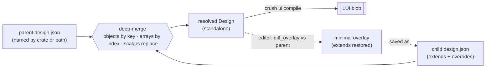

# Assets and tooling

This document covers the host tooling that turns authored files into the binary
blobs firmware embeds, and the blob formats themselves: `tools/crush-core` (the pure compilation
core), `tools/crush` (the CLI over it), `tools/light-host-gui` and `tools/light-ui-editor` (the
desktop preview and editor), and the LGF/LTH/LUI formats. None of this is linked into firmware; all
of it is host-only, built by the workspace but excluded from the device targets.

## Assets are data, not code

A font, a look-and-feel theme, and a whole UI layout are each authored as a file — a TrueType face,
a theme JSON, a design JSON — and compiled by `crush` to a binary blob that firmware pulls in with
`include_bytes!(env!("<VAR>"))`. Restyling or relaying an interface is a data change: a file edited
and one CMake call, with no firmware source touched. This is principle 4 of the overview, made
concrete by three CMake helpers and one Rust convention.

The helpers live in `cmake/`: `light_add_font` (`LightFont.cmake`), `light_add_theme`
(`LightTheme.cmake`), and `light_add_ui` (`LightUi.cmake`). All three follow the same shape:

- A `crush` invocation compiles the source to a blob under the build directory (`<name>.lth`,
  `<name>.lui`, or the render's `<...>_font.lgf`).
- The blob's path is handed to the consuming Rust crate as an environment variable via Corrosion's
  `corrosion_set_env_vars(<crate> "<VAR>=<path>")`, so the crate reads it with
  `include_bytes!(env!("<VAR>"))`.
- Ordering is the whole point. cargo cannot know a CMake-generated file exists, so the crate's
  `cargo-prebuild_<crate>` target (Corrosion's hook for work that must finish before cargo runs) is
  made to depend on the compile. A change to the source re-runs the compile, and because the env var
  names a file cargo tracks through `include_bytes!`, the crate rebuilds.

A worked example — a representative app's `CMakeLists.txt` — wires all three into one app crate
(the display token, dimensions and crate names are illustrative):

    light_add_font(app_font
            FONT .../TypeLightSans.ttf
            DISPLAY <display> WIDTH 172 HEIGHT 640 DIMENSION 23.0x85.6
            POINT_SIZE 14 PIXEL_SIZE 16
            CRATE light_app_demo ENV LIGHT_FONT_LGF)
    light_add_theme(app_theme
            CRATE light_app_demo ENV LIGHT_THEME_LTH)
    light_add_ui(app_ui
            UI .../light_app_demo/design.json
            CRATE light_app_demo ENV LIGHT_UI_LUI)

Each helper guards that the `crush` host target has been imported (`corrosion_set_hostbuild`) and
fails at configure time otherwise. `light_add_theme` and `light_add_ui` glob their base
directory (`themes/*.json`, `crates/*/design.json`) at configure time and depend on every file
there, so editing a shared base rebuilds every consumer — with the caveat that a brand-new base
file wants one reconfigure before edits to it retrigger builds.

## crush-core: the pure compilation core

`crush-core` is the compilation logic with no CLI, no file I/O, and no logging: bytes in, bytes out.
It exists because the same three jobs are wanted by two consumers — `crush` the binary and the
`light-ui-editor` — and mirroring them per consumer would let the two drift. It has four modules:
`render` (TrueType → LGF), `theme` (theme JSON → LTH), `design` (the UI data model), and `lui` (the
design → LUI compiler). The resolvers for a theme's and a design's `extends` chain live here too, so
crush's build-time compile and the editor's live preview resolve a hierarchy identically.

### render — rasterising a face to LGF

`render::rasterize(ttf, face_index, pixel_size, point_size, ppi_h, ppi_v, mono)` drives FreeType
over a fixed character set (`CHAR_SET`, the 95 printable ASCII glyphs) and returns a `Rasterized` — the resolved cell metrics, the per-glyph packed 1-bpp
bitmaps (for the C emitter), and the encoded LGF blob. The contract carries three hard-won rules,
ported from the C backend:

- The cell comes from the face's **nominal metrics** (`max_advance`, `height`, `ascender`), not from
  scanning glyph extents.
- An explicit `pixel_size` is the **vertical** size; the horizontal pixel size is derived through the
  display's pixel aspect (`ppi_h / ppi_v`), because FreeType's width-0 shorthand silently assumes
  square pixels. When `pixel_size` is 0, `point_size` and the densities set the size instead.
- Glyph bitmaps are placed by their bearings relative to the shared baseline row (`cell_ascent`),
  clipping pixel by pixel — a glyph's bitmap may exceed the cell while its ink still lands inside.

`mono` must be set for LGF's 1-bpp packing to be read correctly. The blob itself is built with
`light_font::Encoder`, so the format lives in one place (see LGF below).

### theme — colour/key logic and LTH emission

A theme is authored as `ThemeSource`: `colors`, `surfaces` (button/focus gradients), `metrics`
(radii), and a page `descent`, plus an optional `extends`. `deny_unknown_fields` makes an unknown
JSON key an **error** — the governing rule is strictness at authoring, tolerance at runtime: a typo
should stop the build, while the firmware skips an unknown *binary* key for forward compatibility.
Colours have two spellings, both resolving to RGB565: four raw hex digits (`"4C5D"`), or `"#RRGGBB"`
truncated to 565.

`resolve_file`/`resolve_source` walk an `extends` chain (deepest base first, each level overriding)
into a flat `Resolved`, which `emit` writes as an LTH blob. `extends: "name"` resolves to
`name.json` in the themes directory; a path (contains a slash or ends `.json`) resolves relative to
the source; and `extends: "default"` is an alias for whatever base the board's build declared —
`steel`, or `mono` under `light_add_theme`'s MONO flag. A child's explicit `null` surface stays
in the resolved map and *suppresses* the base's shade rather than inheriting it. The metric keys are
u8 on the toolkit side, so a value past 255 is rejected at authoring rather than saturating quietly.
`compile_flat` and `compile_source` skip resolution for a self-contained theme. `MAX_EXTENDS_DEPTH`
is 8; a deeper chain is reported as a probable cycle.

### design — the UI data model

`design::Design` is the pure data a UI is authored as, shared by the editor (which edits and
previews it) and `lui` (which compiles it). It is `device` (screen width/height/corner_radius), an
`orientation` (`portrait` default, or `landscape` — the design's own copy of the toolkit's layout
axis so a preview matches the device without guessing the firmware's rotation), an `actions`
registry, a `root` page index, and a `Vec<PageDef>`. A `PageDef` is a title, layout (`stack`, `row`,
`linear` or `grid`), gap, a grid's `cols` (its column count, 2 when unnamed), scroll and subtitle
flags, and a flat list of `ChildDef`. A `ChildDef` is a button, a label, or a **frame** — a container
with its own layout/gap/cols/scroll grouping a flat list of children **one level deep** (a frame's
children are leaves, never frames). `deny_unknown_fields` holds throughout; serialisation drops
defaults so a round-trip stays terse.

An `ActionDef` is the design's mirror of the firmware's behaviour: a named action carrying an app
`event` id, a `goto`/`back` navigation, and an optional `transition` edge. A button names one action
and crush expands it; this binds a design to its app (a UI is authored in terms of actions, defined
once) while keeping the editor's preview and the device in agreement.

**The `extends` mechanism.** A design may extend a parent, named either by the **crate** whose
`design.json` is the parent (resolved under a crates directory) or by a relative **path**. The
child's fields deep-merge over the parent's: objects by key, arrays element-wise by index (an empty
`{}` leaves that element untouched, extra elements append), scalars replace. So one shared design
takes per-board overrides — device size, titles, touch-target metrics — the way a theme extends a
base. `resolve_file` flattens the chain into one `Design` (dropping the `extends` marker, so a
resolved design is standalone). `resolve_parent` returns the `extends` target and the resolved parent
separately, which is what lets an editor save minimally: `diff_overlay(parent, child)` computes the
minimal overlay that, deep-merged over the parent, reproduces the child, and `overlay_json` writes it
with the `extends` key restored at the front. The one thing the merge cannot express, so neither can
the overlay, is **removing** an element the parent has — the merge only overrides or appends, so a
child that drops an inherited page or widget must be authored on the parent.

*Compile resolves the chain forward into a standalone `Design`; the editor runs the inverse
(`diff_overlay`) to save a child as only its minimal difference from the resolved parent, so the file
stays an override, not a flattened copy. The two are round-trip tested against each other.*

### lui — the LUI compiler

`lui::compile(design)` produces the LUI blob (format below). Two behaviours are notable:

- **Named actions expand at compile time.** A button naming an action gets that action's event and
  navigation written inline; a button with no named action falls back to its own raw
  `event`/`goto`/`back`. An unknown action name stops the build.
- **A navigating action's transition lands on the page it opens.** The transition is authored on the
  action but stored per-page as a `descent` byte (where the runtime's `navigate_lui` reads it, and
  where `back` navigation mirrors it). Two actions opening one page with different transitions is a
  contradiction and is rejected. The one-level frame rule, over-long strings, and counts past the
  format's field widths are all compile errors.

## crush: the CLI

`crush` is the command-line tool over `crush-core`: the context, file I/O, and logging around the
pure jobs. Its command surface — `font add`, `display add`, `render new`, `context`, `console` — is
stable and shared with the C `crush` it supersedes, because that is what the font CMake helper's
generated script drives and what the acceptance tests exercise. A render emits an LGF blob (the data
the firmware embeds) beside the C header/source pair that consumers of the C output link, so one
tool serves both.

The **context** is a directory of JSON files (`.crush/` in the working directory, or
`$CRUSH_CONTEXT`) holding fonts, displays and renders. File names and top-level keys match the C `crush`'s
(`font.json` with `contextFonts`, and so on), so a context template written for it seeds this one. A `font add` opens the face through FreeType before recording it (so a bad file is refused
where the message names it) and copies it into the context. A `display add` records a resolution and,
from an optional `--dimension` in millimetres, a pixel density — without it, 96 ppi is assumed and a
warning notes that point sizes will not match the glass. A `render new` runs the rasteriser and
writes the LGF (and, for C consumers, a matching `.c`/`.h` pair byte-for-byte in the old shape).

Three commands sit directly on `crush-core` (or, for packs, on the format crate) and take no
context:

- `theme compile <in> <out> [--themes <dir>] [--default <name>]` resolves a theme's `extends` chain
  and writes the LTH blob. `--themes` is where an `extends: "name"` base is found; `--default` is
  what `extends: "default"` aliases to.
- `ui compile <in> <out> [--crates <dir>]` resolves a design's `extends` chain and writes the LUI
  blob. `--crates` is where an `extends: "<crate>"` parent's `design.json` is found; a design
  extending by path, or not at all, needs none.
- `pack build <out> --entry <name>=<file> ... [--digest <file>]` gathers already-compiled blobs
  into one LAP pack, and writes the digest that identifies it where the firmware build can pick it
  up. Packing is assembly, not compilation: the blobs arrive finished, and the format belongs to
  the crate that reads it on the device. `pack info <in>` reports what a pack holds, which is what
  a person asks when a device says the pack is not the one.

## Where the blobs live: embedded, or in a pack

Embedding a blob with `include_bytes!` is one of two destinations, not the only one. The same
compiled blob can instead be gathered into an **asset pack** written to a region of storage the
firmware image does not cover, and read from there at startup.

Which of the two a product uses is the product's choice, made where the asset is declared:
`light_add_font`, `light_add_theme` and `light_add_ui` take `CRATE`/`ENV` to embed, and without
them compile the blob and stop — recording where it landed for `light_add_asset_pack`
(`LightAssets.cmake`) to collect:

    light_add_font(app_font FONT ... DISPLAY ... POINT_SIZE 12 PIXEL_SIZE 16)
    light_add_theme(app_theme MONO THEME .../theme.json)
    light_add_ui(app_ui UI .../design.json)
    light_add_asset_pack(app_assets
            ENTRIES font=app_font theme=app_theme ui=app_ui
            CRATE light_app_demo ENV LIGHT_ASSETS_SHA256
            FAMILY data)

**Why a product would.** Assets are the part of a product most likely to change and least likely to
need the scrutiny firmware gets. Kept apart they can be replaced without rebuilding, re-signing and
re-shipping the application; they stop crowding the slot the application must fit in; and on a
device holding two application slots they are not stored twice.

**The digest is the joint.** crush writes the pack and, beside it, the SHA-256 that identifies it.
The application is built with that digest — which is what `ENV` names, the crate reading the file
with `include_bytes!` — and checks the pack against it at startup, so a pack is covered by the
image's own signature at one remove and substituting assets means substituting a digest inside a
signed image. **There is deliberately no fallback:** an application whose pack is missing, stale,
half-written or edited reports it and stops, because a copy of the assets kept in the image as a
safety net would undo the reason for taking them out of it, and an interface with no font is not an
interface.

**Reaching the region** is the port's business, not the toolkit's: it is where a region set aside
for data is, and whether it is addressable at all, that differ per chip. See
[07-ports-and-shell.md](07-ports-and-shell.md) for the seam and
[11-secure-boot-and-update.md](11-secure-boot-and-update.md) for the flash map that names the
region and the delivery that writes it.

## The blob formats and their versioning

The formats share one convention: a four-byte **magic** that is the frozen format-family tag,
followed immediately by a **u8 schema version**. A format revision bumps the version byte, *not* the
magic — the LUI magic is `LUI3` yet its current schema version is 3. Each format is owned jointly by
its `crush`-side writer and its firmware-side reader, which must agree; the readers are strict about
the version and reject what they do not understand. Authoring is strict (unknown keys are errors);
runtime is tolerant (an unknown binary key is skipped for forward compatibility).

### LGF — fonts

`light-font` owns the LGF format: a `no_std` reader (`Font`, a `Copy` view that borrows the blob) and
an `alloc`-gated `Encoder`. Magic `LGF1`, version 1. A 48-byte header carries the cell width/height,
the ascent (baseline row), the pitch (bytes per row), the glyph count, and the resolved vertical
pixel size, followed by a 32-byte **present bitmap** (one bit per char code) and then the packed
1-bpp glyphs in ascending code order. A glyph's index is the popcount of present codes below it, so
lookup is a popcount over at most 32 bytes with no offset table to keep in step with the data. The
flags byte fixes the only encoding so far (1 bpp, MSB-first, row-major); `parse` validates magic,
version, flags, the pitch/width relationship, that the present count matches the glyph count, and
that the blob is long enough.

### LTH — themes

Written by `crush-core::theme`, read by light-ui's `theme` module. Magic `LTH1`, version 1. The
header is magic + version + a u16 entry count; entries follow as `key` (u16), `length` (u16),
`payload` triples, little-endian. The key numbers (bg, frame, title, text, the button/focus surfaces,
radius, screen_radius, descent, …) are assigned by light-ui's `theme::key` and mirrored as constants
in the writer — one table with two homes, the firmware's parse tests being the contract between them.
A colour is a 2-byte RGB565; a surface is a `from`/`to` pair; a null surface emits nothing.

### LUI — UI designs

Written by `crush-core::lui`, read by light-ui's `lui` module. Magic `LUI3`, version 3 (version 1 was
the one-level-nesting layout; version 2 added the per-page descent byte; version 3 added the `cols`
byte on pages and frames). All little-endian:

- **Header (16 bytes):** magic, version u8, orientation u8 (0 portrait, 1 landscape), page_count
  u16, root u16, and device width/height/corner_radius u16 each.
- **Page-offset table:** `page_count` u32 offsets from the blob start.
- **Pages:** each a length-prefixed title, then layout/gap/cols/scroll/subtitle/descent bytes and a
  child count, then its children.
- **Child:** a common prefix (kind, nav, nav_page, event, tag, min/max width/height, grow), then by
  kind — a frame carries its own layout/gap/cols/scroll and a count of **leaf** children; a button
  or label carries its length-prefixed text.

Strings are inline and length-prefixed so the reader returns `&str` views into the blob with no copy,
the same pattern as LGF. The nav byte encodes none/back/goto; the descent byte encodes the edge a
page enters from (top/bottom/left/right) or 0 for the toolkit default; the layout (stack/row/linear/
grid) and scroll codes match light-ui's own modules, and `cols` is a grid's column count (0 for any
other layout). Frame nesting is one level deep by construction, enforced at compile.

### LAP — asset packs

`light-assets` owns the LAP format: a `no_std` zero-copy reader (`Pack`, a `Copy` view that borrows
the region) and an `alloc`-gated `build::Builder`, which crush's `pack build` drives. Magic `LAP1`,
version 1. A 48-byte header carries the entry count, the pack's total length and a 32-byte
**SHA-256**; then a directory of 24-byte entries (a 16-byte NUL-padded ASCII name, a u32 offset from
the pack start, a u32 length), then the blobs, each starting on a four-byte boundary.

The digest covers bytes 0..16 followed by bytes 48..total_len — two ranges rather than one because
it cannot cover the bytes it is written into, and the first range is what brings the count and the
length under it. `open` takes the digest the image carries and rejects a pack that does not hash to
it; `open_unchecked` checks structure alone, for a tool with no image to compare against. Entries
ascend by name, so a pack built from the same inputs is byte-for-byte the same pack and a duplicate
name cannot hide behind an earlier one; the reader validates that ordering, and that every entry's
extent lies inside the pack and clear of the directory, once at open, so a later lookup is
arithmetic on values already known to be in range.

A region read this way was verified by nothing on the way in, so the reader distinguishes the cases
a person acts on differently: blank storage (`BadMagic`), a pack of a schema this build does not
read, a structurally broken one, and one that is intact but is not this firmware's
(`DigestMismatch`). A pack may sit anywhere in a region larger than itself — the header's length is
what bounds it, not the region's.

## light-host-gui: rendering a UI on the desktop

`light-host-gui` is a **host library**, not the embedded shell: it links no C shell and never reaches
a device — a desktop tool depends on it the way firmware depends on the shell, and the two never
meet. Its purpose is to drive the framework's one hardware-facing render seam, the
`light_display::DisplayDriver` trait, into a desktop window, so a `light-ui` UI previews exactly as it
renders on a panel.

It re-exports `eframe`/`egui` (so a consumer names only this crate and never the versions) and
supplies the glue:

- `NullDriver`, a `DisplayDriver` that pushes nothing — the `Display` renders into its own buffer,
  which the host reads back with `Display::front`. It reports no chunks and completes instantly,
  since there is no transport.
- `rgb565_color_image`, which expands a big-endian RGB565 framebuffer into an `egui::ColorImage`
  (replicating the high bits into the low so full white stays full white); a short buffer yields a
  black image rather than panicking.
- `HostClock`/`now_us`, a process-global monotonic clock for `Display::init`, and `run`, the boilerplate
  over `eframe::run_native`.

So a tool renders a UI offscreen through the identical `light-ui`/`light-draw`/`light-display` path
firmware uses, then shows the pixels in a native window with egui chrome around them. The eframe app
owns the event loop and lets each platform's own windowing system do what is native there.

## light-ui-editor: the desktop editor

`light-ui-editor` is a prototype desktop editor built on that runtime. Its chrome — a mode toggle, a
page list, an inspector of real OS-grade controls — is egui; the device **preview** in the centre is
still rendered by `light-ui`/`light-draw` into a pixel buffer through the `DisplayDriver` seam and
shown as an egui image, so it stays pixel-faithful to the firmware while the surrounding UI gets
proper controls. The preview compiles the design to an LUI blob with `crush-core` and builds its
widget tree with `light_ui::Ui::build_lui` — the *same* binary path a device uses, so there is no
separate host render path to drift from the firmware.

It has four modes:

- **Edit** — structural editing: select a widget in the preview or the outline list, edit its text,
  size, grow, navigation and event through the inspector; add/move/delete widgets and pages; set
  page and device properties. Every edit mutates the `Design`, recompiles the blob, rebuilds the
  page, and saves.
- **Run** — taps drive the UI as on the device: a tapped button's child index is resolved against
  the blob's navigation and the page transition is animated the way `navigate_lui` would.
- **Actions** — editing the design's action registry (name, event, navigation, transition). A rename
  is followed through every button that names the action; a removed action is cleared from them.
- **Theme** — live look editing over `crush-core::theme`: colour pickers, surface gradients, metrics
  and page descent, resolved through the theme's `extends` chain exactly as the build resolves it,
  and saved to `theme.json` beside the design.

Two invariants matter. First, **saving is minimal.** A design that extends a parent is written back
as only its overrides against the resolved parent (via `diff_overlay`/`overlay_json`, with `extends`
restored), so the file stays a minimal override rather than a flattened copy; a flat design is
written whole. Only the JSON is saved — the build compiles it to a blob, so a stray `.lui` beside the
source would just be clutter. Second, **an invalid edit never corrupts the file.** If a recompile
fails (e.g. two actions giving one page conflicting transitions), the editor holds the last good blob
on screen, shows the error as a banner, and does not save; the edit lives in memory until it is made
valid. A hand-broken file that no longer compiles opens on a starter design with the error shown
rather than panicking.

The editor finds its context by walking up from the design file: the framework `themes/` directory
for an `extends: "name"` theme base, and `crates/` for an `extends: "<crate>"` parent design — so it
resolves the same hierarchy the CMake build does, and falls back gracefully when edited outside the
repo. The preview font is rasterised at runtime from a bundled TTF through the very same
`crush-core::render` rasteriser the build runs on device, so the preview's glyphs match the
firmware's and the editor mirrors none of that logic.
