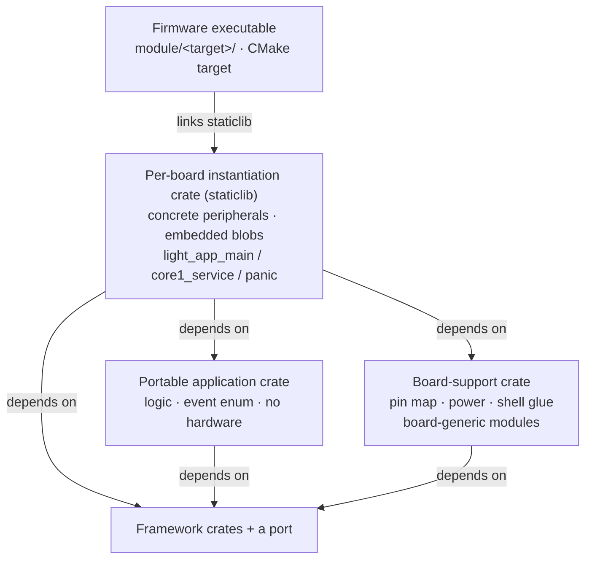

# The Application Model

How an application is structured on the framework: where its logic lives, how a board instantiates
it, and how its interface is authored as data. This is the model the worked examples in the tree —
the widget demo, the dictaphone, the crossfire USB-MIDI host — all follow.

## Responsibility

Separate an application into layers with one direction of dependency, so that:

- the application's **logic** is a portable crate with no hardware in it, testable on the host;
- a **board-support** crate holds what is specific to a tangible board but common to every app on it;
- a **per-board instantiation** crate wires the two together and produces the firmware;
- the application's **interface** is authored as data, not code.

## The crate layers of an application

From portable to tangible:

1. **The portable application crate** — the app's logic and event vocabulary, `no_std`, depending
   only on framework crates, never on a port. It defines the app's event enum, its modules'
   behaviour, its console commands, and its rendering machinery — everything but the pins and the
   panel. It is exercised on the host under `cargo test`.

   Some apps split this further: an *engine* crate plus one *interface* crate per variant. The
   dictaphone is `light_dictaphone_core` (WAV capture/playback over a card, the event vocabulary,
   the console, the display-driving machinery) with `light_app_dictaphone` (portrait) and
   `light_app_dictaphone_wide` (landscape) supplying only what the interface looks like.

2. **The board-support crate** — everything specific to a board but independent of which app runs on
   it: the pin map and peripheral hand-over (`board::take` yielding a taken-once `Peripherals`), the
   default power behaviour, the shell ABI glue, and any board-generic runtime modules. It must NOT
   depend on an application crate. A typical one holds `board` (pins, constants, `Peripherals`,
   `take`), a `PowerManager`, the `shell` module (the ABI glue every app on that board shares), and
   generic `TouchMod`/`ImuMod` modules over the `light_input::BoardEvent` trait.

3. **The per-board instantiation crate** — the crate the firmware executable links (a `staticlib`).
   It constructs the concrete peripherals, embeds the compiled assets, wires the portable app's
   modules to the board's hardware, and provides the thin shell entry points (`light_app_main`,
   `light_app_core1_service`, the `#[panic_handler]`). It depends on the portable app crate + the
   board-support crate + the ports it needs.

   Where several executables share one board's wiring, that wiring is itself a shared crate. For
   instance the two dictaphone executables (portrait and landscape) are ~60-line crates over a shared
   board-specific crate that exposes `run(&ShellInfo, RunConfig)` — the whole firmware — with a small
   `RunConfig` for the handful of per-orientation differences (the rotation map, the starting
   rotation, the page-transition flow).

4. **The firmware executable** — a thin CMake target (`module/<target>/`) that links the
   instantiation crate's staticlib into the C shell. Its name matches its directory so
   `light-flash.ps1` finds `module/<target>/<target>.uf2`. See [10-build-and-release.md](10-build-and-release.md).

*The instantiation crate is the hub: it alone knows the board and combines the portable app with the
board-support crate and a port. Note that the board-support crate depends on the framework but
**not** on the application crate — that independence is what lets several apps share one board's
wiring.*

### The exe/crate naming constraint

The CMake executable and a Corrosion-imported crate share one target namespace, so an executable and
a linked crate **cannot share a name**. Hence the `_app` suffix on some instantiation crates (an
executable `foo` alongside its linked crate `foo_app`), and the distinct names where a crate is
linked by an executable of a related name.

## The runtime shape of an application

At `light_app_main` the instantiation crate: paints the stack watermark, sets the log clock, takes
the board's peripherals, parses the embedded font/theme/UI blobs, constructs the modules (display,
touch, IMU, audio, board/power, console, and the app's own), adds them to a `Runtime`, and calls
`run` — which never returns. Every module subscribes to the one `EventBus<AppEvent, …>`; a tapped
button, a swipe, a console command, an elapsed second all become events that the interested modules
react to. The app event type is `Event<Ext>` / `DemoEvent<Ext>` etc. — the app's own events plus a
board **extension** `Ext` (audio, RTC, card probe, PD, …) that rides the same bus without the
portable crate naming it.

## The interface as data

An application's UI is authored as a `design.json` and compiled by `crush` to a binary **LUI** blob
that the firmware `include_bytes!`'s and the toolkit builds its widget tree from — the same
assets-as-data path a font (LGF) or theme (LTH) blob takes. See
[08-assets-and-tooling.md](08-assets-and-tooling.md) for the formats and the tool.

- A design declares the device, the pages (each a titled window with a layout, gap, scroll and
  children), and an **actions** registry that mirrors the app's event contract — each action a name
  with an app event id, optional `goto`/`back` navigation, and an optional transition. A button
  names an action; crush expands it to the button's event and navigation, so the same design behaves
  identically in the editor's preview and on the device.
- A design may **`extends`** a parent design (by crate name or relative path), overriding only what
  differs — one shared design takes per-board overrides (device size, titles, touch-target metrics).
  The widget demo's four boards share one `light_app_ui_demo/design.json` with a small per-board
  override each.
- The toolkit exposes both paths behind a `UiSource` (`Const` — a hand-written page tree — or `Blob`
  — an LUI design). An app can run either; the const path remains for interfaces not yet expressed
  as data.

An app maps a design's event ids to its own events with a small `ui_event`/`map_child` function; the
navigation (`goto`/`back`) and the transition (`descent`) come from the blob. The design's event ids
and widget tags are the contract between the JSON and the firmware.

## The board-generic modules seam

Runtime modules that read board hardware but produce app-generic events — the touch and IMU modules —
live in the board-support crate, generic over the app's event type through the `light_input::BoardEvent`
trait (touch/gesture/orientation constructors, `is_stats`/`drag_consumed` inspectors, see
[03-input.md](03-input.md)). On a board that shares them, several apps (for example a dictaphone and
the widget demo) use the same `TouchMod`/`ImuMod`. Modules that consume app-specific extension events
(the RTC, the audio, the power/board module) stay in the app or the shared app-board crate, since
they are app-coupled.

## The worked examples

- **Widget demo** (`light_app_ui_demo`) — three pages (toggles, a detail page, a scrolling list) on
  every touch board, driven by touch with swipe-back, reorientable from the IMU, themed, and
  instrumented from the console. Its interface is an LUI design shared across the four boards. The
  reference application for the display/UI/input/audio stack.
- **Dictaphone** (`light_dictaphone_core` + portrait/landscape interface crates) — WAV record and
  playback to a FAT card through the audio codec, a recordings list, an RTC, in two UI orientations
  over one engine and one shared board crate.
- **Crossfire** (`light_app_crossfire`) — a USB-MIDI forwarder between every instrument on a USB host
  port, with a small OLED status display; runs on an RP2040/RP2350 board. The reference application
  for the USB-host and MIDI stack.

## Design decisions and constraints

- **The board wiring is the application's, never a crate's.** A framework crate never knows a pin;
  the instantiation crate does. This is what keeps the framework crates portable and the board facts
  in one honest place.
- **App-agnostic vs app-coupled decides where code lives.** Code that is board-specific but does not
  name an app goes in the board-support crate; code that names the app's events stays app-side. This
  line is why the touch/IMU modules could be shared but the RTC/audio/board modules could not.
- **The interface is data so restyling and relaying are not code changes**, and so an interface can
  be previewed and edited on the desktop exactly as it renders on the panel.
