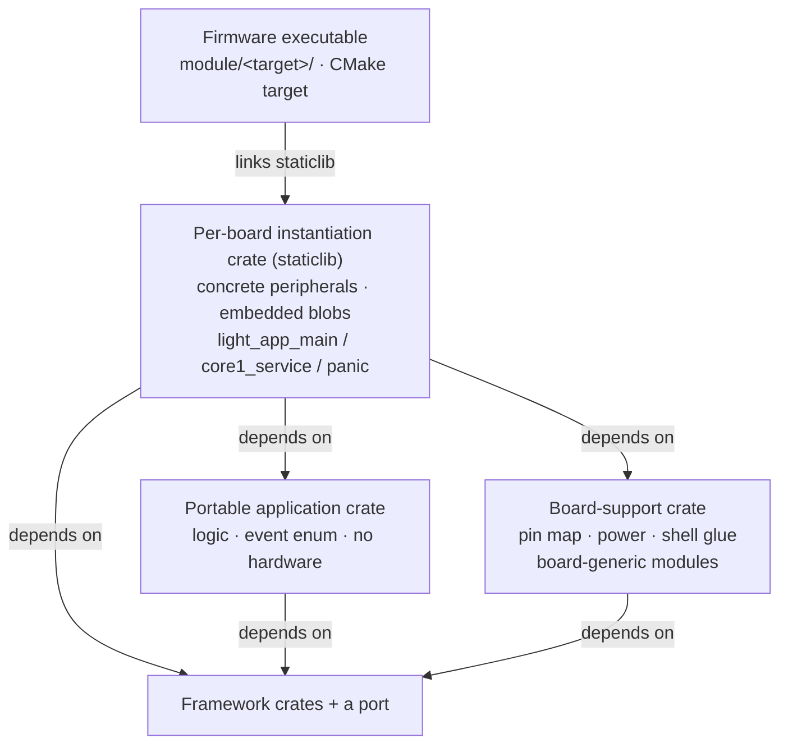

# The Application Model

How an application is structured on the framework: where its logic lives, how a board instantiates
it, and how its interface is authored as data. This is the model the worked examples in the tree —
the widget demo and the dictaphone — all follow.

## Responsibility

Separate an application into layers with one direction of dependency, so that:

- the application's **logic** is a portable crate with no hardware in it, testable on the host;
- a **board-support** crate holds what is specific to a tangible board but common to every app on it;
- a **per-board instantiation** crate wires the two together and produces the firmware;
- the application's **interface** is authored as data, not code.

## The crate layers of an application

From portable to tangible:

1. **The portable application crate** — the app's logic and event vocabulary, `no_std`, depending
   only on framework crates, never on a port. It defines the app's event enum, its modules'
   behaviour, its console commands, and its rendering machinery — everything but the pins and the
   panel. It is exercised on the host under `cargo test`.

   Some apps split this further: an *engine* crate plus one *interface* crate per variant. The
   dictaphone is `light_dictaphone_core` (WAV capture/playback over a card, the event vocabulary,
   the console, the display-driving machinery) with `light_app_dictaphone` (portrait) and
   `light_app_dictaphone_wide` (landscape) supplying only what the interface looks like.

2. **The board-support crate** — everything specific to a board but independent of which app runs on
   it: the pin map and peripheral hand-over (`board::take` yielding a taken-once `Peripherals`), the
   board's `PowerMechanism`, and the board's coordinate/axis maps. It must NOT depend on an
   application crate. It is board-specific *only*: the Rust shell glue lives in the port's `shell`
   module (see [07-ports-and-shell.md](07-ports-and-shell.md)) and the generic `TouchMod`/`ImuMod`
   modules live in `light-input`, so this crate wires drivers, not modules.

3. **The per-board instantiation crate** — the crate the firmware executable links (a `staticlib`).
   It constructs the concrete peripherals, embeds the compiled assets, wires the portable app's
   modules to the board's hardware, and provides the thin shell entry points (`light_app_main`,
   `light_app_core1_main`, the `#[panic_handler]`). It depends on the portable app crate + the
   board-support crate + the ports it needs.

   Where several executables share one board's wiring, that wiring is itself a shared crate. For
   instance the two dictaphone executables (portrait and landscape) are ~60-line crates over a shared
   board-specific crate that exposes `run(&ShellInfo, RunConfig)` — the whole firmware — with a small
   `RunConfig` for the handful of per-orientation differences (the rotation map, the starting
   rotation, the page-transition flow).

4. **The firmware executable** — a thin CMake target (`module/<target>/`) that links the
   instantiation crate's staticlib into the C shell. Its name matches its directory so
   `light-flash.ps1` finds `module/<target>/<target>.uf2`. See [10-build-and-release.md](10-build-and-release.md).

*The instantiation crate is the hub: it alone knows the board and combines the portable app with the
board-support crate and a port. Note that the board-support crate depends on the framework but
**not** on the application crate — that independence is what lets several apps share one board's
wiring.*

### The board layering is required, and board-agnostic code is framework-level

The three-crate shape is **required** for every board, and the split is strict: a board crate holds
only what is genuinely board-specific, so it can be reused without any board-agnostic code being
copied alongside it. (A board crate that bundles board-agnostic code — shell ABI glue, generic input
modules, a power-manager wrapper — cannot be reused without duplicating that majority, which is
how every board ends up re-implementing its own wiring.)

- **A `light-board-<board>` crate per board holds only board-specific facts** — the pin and constant
  set, the touch `CoordMap` and IMU `AxisMap`, backlight inversion, DMA-channel assignments, the
  `Peripherals` struct and its taken-once `take()`, and the board's `PowerMechanism`. Nothing
  board-agnostic lives here.
- **Board-agnostic code is framework code.** The shell ABI glue (`ShellInfo`, the core-1 service
  pump, panic reporting, the stack watermark) is the port's `shell` module (see
  [07-ports-and-shell.md](07-ports-and-shell.md)); the generic runtime input modules
  (`TouchMod`/`ImuMod`) live in `light-input`, generic over the driver, the clock, and the app event
  (see [03-input.md](03-input.md)); the reusable RTC and power modules live in `light-rtc` and
  `light-power-manager` (see [06-power-and-time.md](06-power-and-time.md)).
- **The per-board instantiation crate stays thin** — construct peripherals via `board::take`, build
  the drivers, wire the framework modules and the portable app, embed the assets, and provide the
  three entry-point wrappers. Tens of lines.

Adding a board is a small board-specific crate plus a thin instantiation crate, with no
board-agnostic code copied.

### The exe/crate naming convention

The CMake executable and a Corrosion-imported crate share one target namespace, so an executable and
a linked crate **cannot share a name**. The naming convention keeps them apart uniformly: the
instantiation crate is always `light_app_<name>` and the executable is `<name>`, so the two never
share a stem and cannot collide. See [10-build-and-release.md](10-build-and-release.md).

## The runtime shape of an application

At `light_app_main` the instantiation crate: paints the stack watermark, sets the log clock, takes
the board's peripherals, parses the embedded font/theme/UI blobs, constructs the modules (display,
touch, IMU, audio, board/power, console, and the app's own), adds them to a `Runtime`, and calls
`run` — which never returns. Every module subscribes to the one `EventBus<AppEvent, …>`; a tapped
button, a swipe, a console command, an elapsed second all become events that the interested modules
react to. The app event type is `Event<Ext>` / `DemoEvent<Ext>` etc. — the app's own events plus a
board **extension** `Ext` (audio, RTC, card probe, PD, …) that rides the same bus without the
portable crate naming it.

## The interface as data

An application's UI is authored as a `design.json` and compiled by `crush` to a binary **LUI** blob
that the firmware `include_bytes!`'s and the toolkit builds its widget tree from — the same
assets-as-data path a font (LGF) or theme (LTH) blob takes. See
[08-assets-and-tooling.md](08-assets-and-tooling.md) for the formats and the tool.

- A design declares the device, the pages (each a titled window with a layout, gap, scroll and
  children), and an **actions** registry that mirrors the app's event contract — each action a name
  with an app event id, optional `goto`/`back` navigation, and an optional transition. A button
  names an action; crush expands it to the button's event and navigation, so the same design behaves
  identically in the editor's preview and on the device.
- A design may **`extends`** a parent design (by crate name or relative path), overriding only what
  differs — one shared design takes per-board overrides (device size, titles, touch-target metrics).
  The widget demo's four boards share one `light_app_ui_demo/design.json` with a small per-board
  override each.
- Every interface is authored as data: an app hands the display module a parsed LUI `Blob`. The
  toolkit's hand-written page-tree API (`Page`/`Desc`/`navigate`/`build`) is not an app-facing
  construction path — no app uses it — but stays available as the machinery behind the `file_list!`
  list helper and the toolkit's own tests (below).

An app maps a design's event ids to its own events with a small `ui_event`/`map_child` function; the
navigation (`goto`/`back`) and the transition (`descent`) come from the blob. The design's event ids
and widget tags are the contract between the JSON and the firmware.

### One UI construction path: data only

**The LUI blob is the one app-facing UI construction path.** Each app's display config holds a parsed
`Lui` blob directly; there is no alternative hand-written construction path to keep behaviourally
identical to it. Every application is blob-authored — the touch fleet and the key-driven boards alike:
each embeds a `design.json`, builds it with `build_lui_with`, and drives navigation from the design's
`goto`/`back` through a small `map_child`.

The const-tree API — `navigate(&Page)`/`build(&Desc)` and the `Page`/`Desc` descriptor types — is
**not an app-facing whole-page construction path**: no application uses it. It is retained,
because it remains the machinery behind the `file_list!` list helper (which emits `Desc` rows a
`FilePicker` fills) and the toolkit's own test fixtures, so it stays `pub`. The low-level widget
creators (`create_window`/`create_button`/`create_label`) stay — the LUI builder is written on them.

Boards that share a near-identical interface author it once and override: the key-driven boards extend
a shared `design.json` (a data-only `crates/*/` entry resolved by `extends` name), overriding only
device size and list-row height — the same authored-once-overridden-per-board pattern the touch fleet
uses against `light_app_ui_demo`. Every interface is authored as data.

## The board-generic modules seam

Runtime modules that read board hardware but produce app-generic events — the touch and IMU modules —
are the generic `TouchMod`/`ImuMod` in `light-input`, instantiated in the board-support crate over
that board's drivers, clock and axis map. They are generic over the app's event type through the
`light_input::BoardEvent` trait (touch/gesture/orientation constructors, `is_stats`/`drag_consumed`
inspectors, see [03-input.md](03-input.md)), so on a board that shares them several apps (for example
a dictaphone and the widget demo) use the same modules.

### The reusable runtime modules are framework, not per-app

A runtime module that is the same for every app that has the hardware is a framework crate, never a
per-app copy. The power lifecycle is `PowerMod` in `light-power-manager` and the real-time clock is
`RtcMod` in `light-rtc` (see [06-power-and-time.md](06-power-and-time.md)), each generic over its
driver or mechanism, a clock, and the app event. Audio has no such module: a recorder is an
application, and its reusable unit is the generic `light_dictaphone_core` crate (see
[04-audio-and-midi.md](04-audio-and-midi.md)).

How a framework module reads the app's events depends on where those events live. An event that is
the app event's *own* variant (touch, gesture, orientation) is reached through a trait —
`light_input::BoardEvent`. An event that lives in the app's board-specific *extension* type (an RTC
request, a backlight command) is reached through **recognizer functions** passed to the module
(`is_report: fn(&A) -> bool`, `backlight_of: fn(&A) -> Option<u16>`, …), because the orphan rule
forbids implementing a framework trait on the app's extension type. So an app wires *drivers,
mechanisms and recognizer fns*, not hand-written modules; what stays app-side is genuinely app-shaped
logic (a recorder, an app's own console commands).

## The worked examples

- **Widget demo** (`light_app_ui_demo`) — four pages (toggles, a detail page, a scrolling list, a
  keypad on a grid — each a layout the toolkit offers, exercised on glass) on every touch board,
  driven by touch with swipe-back, reorientable from the IMU, themed, and instrumented from the
  console. Its interface is an LUI design shared across the four boards. The reference application
  for the display/UI/input/audio stack.
- **Dictaphone** (`light_dictaphone_core` + portrait/landscape interface crates) — WAV record and
  playback to a FAT card through the audio codec, a recordings list, an RTC, in two UI orientations
  over one engine and one shared board crate.
- **The USB host-role probe** (`usb_host_probe`) — the smallest firmware that puts a native USB port
  in its host role and reports what enumerates. It carries no application: it exists so the host
  seam is built and exercised by this repository, rather than only by the products that use it. The
  reference for bringing the host stack up and draining its events.

## Design decisions and constraints

- **The board wiring is the application's, never a crate's.** A framework crate never knows a pin;
  the instantiation crate does. This is what keeps the framework crates portable and the board facts
  in one honest place.
- **App-agnostic vs app-coupled decides where code lives.** Code that is board-specific but does not
  name an app goes in the board-support crate; code that names the app's events stays app-side. This
  line is why the touch/IMU modules could be shared but the RTC/audio/board modules could not.
- **The interface is data so restyling and relaying are not code changes**, and so an interface can
  be previewed and edited on the desktop exactly as it renders on the panel.
