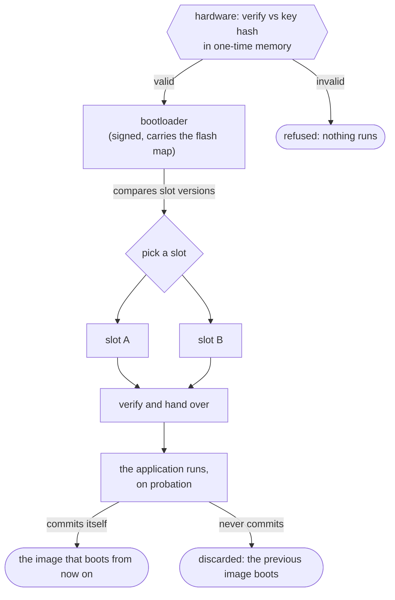

# Secure boot and field update

Firmware is **signed when it is built and verified by the hardware before it runs** — every boot, not
only when it is programmed. An update is delivered as a whole image into a slot the running firmware
is not executing from, and becomes the image that boots only after it has proved itself.

The hardware is the root of trust: it verifies the first thing it runs, against a key it holds in
one-time memory. That first thing is a small **bootloader** the framework supplies, because hardware
that verifies an image does not thereby choose between two of them — a device with an A/B pair needs
something to compare the slots' versions, pick one, and hand over. The bootloader does only that, on
the chip's own facilities, and is itself verified before it runs.

*Immutable hardware verifies the bootloader; the bootloader picks between the slots and verifies
what it hands over to. A new image is on probation until it commits itself, so an image that cannot
run is discarded rather than kept.*

---

## Responsibility

Define what is signed and when it is checked, how an update reaches a device without risking the
image it replaces, how a version is prevented from returning once it is revoked, and where assets
live so that a look-and-feel change is not a firmware change. The signing itself belongs to the
build ([10-build-and-release.md](10-build-and-release.md)); the verification belongs to the port's
chip facility ([07-ports-and-shell.md](07-ports-and-shell.md)); this document is the contract
between them.

## Public surface

- **Build.** `light_seal_image(<target> [VERSION] [ENCRYPT])` signs a target's image and stamps the
  version a device compares between slots; `light_bootloader_map(<bootloader> LAYOUT <json>)` embeds
  the flash map in the bootloader that reads it, so the two are one signed artefact. Both default to
  the development key, overridden for a release.
- **The bootloader** is a firmware target of the framework's, built per chip family: it loads the
  map, picks the better of an A/B pair, and chains to it. An application names no part of it.
- **Assets.** The blob helpers (`light_add_font`, `light_add_theme`, `light_add_ui`), called without
  a crate to embed into, feed `light_add_asset_pack(<name> ENTRIES ... CRATE ... ENV ... FAMILY
  data)`: one pack delivered to the data partition, and a digest the image is built with. The port
  resolves that partition to a `&'static [u8]` at runtime, which is what the portable readers
  already take. The pack is covered by the image's signature at one remove — an application refuses
  a pack that does not hash to the digest it carries, so substituting assets means substituting a
  digest inside a signed image. See [08-assets-and-tooling.md](08-assets-and-tooling.md) for the
  format and the build calls.
- **Update.** `light-update`'s `Update` session takes an image in whatever pieces a transport deals
  in, writes it into the slot that is not running, reads every page back, and hands a `Staged`
  image to the hardware to start. The slot, the writing and the hand-over are the port's, behind
  `light_core::hal::UpdateTarget`; **where the bytes came from is nobody's business above the
  transport that fetched them**, which is what lets a console, a cable, a card and a radio all end
  at the same three calls. `Staged::commit` is the other half, for an image started on approval.

## Behaviour and invariants

- **The root of trust is immutable hardware, never flash.** A public key's hash lives in one-time
  memory; the verifier is the chip's own boot facility. Anything stored in flash can be replaced by
  whoever can write flash, so nothing in flash can be the root.
- **Verification is at every boot, not at programming.** Programming-time-only checking is bypassed
  by anyone who can write the flash directly, and gives an assurance it does not hold.
- **An update never writes the image it is running.** Staging targets the inactive slot, and the
  hardware enforces the permission, so a fault in the update path cannot destroy the working image.
- **A new image runs on probation and must commit itself.** Until it does, a reset returns to the
  previous image. An image that hangs, panics or cannot drive its display is therefore self-
  discarding: the failure mode of a bad update is a device still running the old firmware.
- **And it has seconds to do so, not minutes.** The hardware does not wait for a reset to undo an
  image that never commits: it runs such an image under a watchdog, and one that has not committed
  when the watchdog expires is dropped in favour of the previous image. On the reference part the
  window is on the order of twenty seconds. So whatever an application checks before keeping itself
  has to be quick and has to be early — and a commit issued after the window has closed reports
  success having done nothing, because there was no mark left to clear.
- **Versions do not come back.** Each image carries a version; a counter in one-time memory records
  the oldest version still accepted, so an image whose flaw has been fixed cannot be re-presented.
- **Assets are signed as their own partition.** Fonts, themes and interfaces update independently of
  firmware and carry their own authenticity; a restyle ships without a new firmware image, which is
  what the data-asset formats exist for.
- **Encryption is the application's choice, and it costs RAM.** Authenticity is always on;
  confidentiality is opt-in per application. An encrypted image is decrypted to RAM and executes
  from there, so it spends its own size in RAM — a board whose framebuffer already dominates RAM
  cannot take it, and this is a per-board fact to check before promising it.
- **Development and production keys are different, and the development key is public.** It lives in
  the repository, protects nothing, and exists so that the whole path — sign, verify, update,
  commit — is exercisable by anyone with the source. The production key never leaves its secret
  store.
- **A shipped device has no debugger.** Closing debug access is part of securing a unit, so the
  console, the panic relay and the fault recorder are the only diagnostic channel a field unit has;
  they are not optional comforts.

## Notable design decisions and constraints

- **The bootloader exists because choosing is not verifying.** Hardware verifies the one image it is
  pointed at; it does not compare two slots' versions and elect one. So the framework supplies a
  bootloader that does exactly that and nothing else — load the flash map, pick the better of an A/B
  pair, hand over — on the chip's own facilities, itself signed and verified before it runs. It is
  kept deliberately small and free of application concerns, because it is the one image a device can
  never recover from by an update.
- **The flash map travels inside the bootloader.** The map and the code that reads it are one signed
  artefact, so a device cannot hold a map its bootloader disagrees with, and verifying the
  bootloader verifies the map. The first slot therefore begins after the bootloader, not at the
  start of flash.
- **The bootloader's scratch memory lies outside the memory the chosen image claims.** Handing over
  is not a jump: the chip's boot facilities place the image's own initialised memory before they
  enter it, and an application's memory begins at the bottom of main memory — exactly where a
  bootloader's variables are. Scratch lent to those facilities and left in main memory is therefore
  overwritten part-way through the hand-over by the very image being launched, and what the hardware
  does next depends on how closely it is watching its own bookkeeping. So the bootloader's work area
  goes somewhere no image loads: a peripheral's memory, or whatever region the part's own boot code
  uses for the same purpose.
- **Writing a board is writing all of it.** Once a product is a bootloader, an application in a
  slot and a pack in a data partition, putting the build on the bench means all three at their own
  addresses — and an image written where it was linked rather than where the map puts it overwrites
  the bootloader with the application. The script layer takes those addresses from the built
  bootloader rather than from a second copy of the map (see
  [10-build-and-release.md](10-build-and-release.md)).
- **The bench path and the field path are the same mechanism.** An update is delivered through the
  chip's ordinary image-download route, routed to the right partition by the image's family, so a
  developer's flash and a field update differ in who initiates them, not in what happens.
- **A staged image is read back before anything is asked to run it.** Storage that accepts a write
  and does not keep it is a real failure, and one that otherwise surfaces as a device rebooting
  into an image the hardware then refuses — true, safe, and very hard to read. Caught during
  staging it names the offset while the firmware that can report it is still the one running. And
  nothing is offered to the hardware until the whole image is there, so a transport that gives up
  half way leaves a slot the hardware will not run and the next attempt simply overwrites.
- **What protects a bad image that was nonetheless written correctly is the hardware, not the
  updater.** It verifies an image before running it and falls back to the other slot when it does
  not like what it finds, so a damaged or unsigned image cannot take a device down. An image that
  boots and is *wrong* — one that verifies and then fails at its job — is a different problem, and
  the answer to it is a **probationary boot**.
- **A probationary image is marked as it is staged, not as it is built.** The mark lives in the
  image's own header, and the build tooling exposes no way to set it — but it is **excluded from
  the image's hash**, so an updater can set it on the way past without invalidating a signature.
  That is what makes it the updater's business: the port sets it page by page as the image is
  written, which is also the only moment it can, because storage takes a bit one way only and
  putting it in afterwards would mean erasing what was just written.
- **A hand-over into a probationary image must say that it IS the update boot.** Such an image is
  only allowed to run as part of the boot that installed it, so the bootloader signals that by
  **negating the window base** it chains into when that window is the one the update went to.
  Without the sign the hardware finds a perfectly good image, refuses it as ineligible, and the
  bootloader hands the board to the host's — which looks like a bad image and is nothing of the
  kind.
- **The scratch a commit borrows is the caller's, and a commit given too little destroys the image
  it was asked to keep.** Clearing the mark means rewriting the storage the running image sits in,
  so the chip's facility wants a buffer to hold that storage in while it does — and it keeps its
  own bookkeeping in the same buffer. Sized to the storage alone, the bookkeeping lands inside the
  copy and the spoiled copy is written back over the image, **reported as a success**. Sized to
  twice it, the same call is correct. A port therefore states the size as a constant of its own,
  in words rather than bytes so that the alignment the facility also requires cannot be got wrong
  either, and an application borrows that constant rather than a number it read somewhere.
- **Over-the-air delivery is a transport, and the contract above names none.** The decisions taken
  for the first one, on a board with a radio: a **plain HTTP fetch, with no transport security** —
  the image is signed and the hardware verifies it before running it, so a tampered download is
  rejected by the chip and the transport carries no trust it would have to be given; and a
  **Rust-native network stack** over the radio rather than the platform SDK's C one, which is the
  same direction every other transport in the framework has moved.
- **What limits an over-the-air update is writing it down, not carrying it** (mk5, measured). A
  305 KiB image over a radio at the weak end of usable arrived in 6.6 seconds -- of which 6.4 was
  spent programming storage and 0.2 waiting for the network, in reads averaging 1.4 KiB. So the link
  has a great deal of headroom, and anything done to make an update faster belongs on the storage
  side. Worth stating because the opposite was believed for a while, on a figure three times slower
  measured before the build carried its optimisation settings: an unoptimised write path looked
  exactly like a slow radio, and the number was recorded as unexplained rather than as suspect.
- **Making a device secure is irreversible and belongs to manufacture.** Writing the key hash and
  enabling verification cannot be undone; a development board is either left open or given the
  development key, and no bench procedure writes one-time memory.

### Reference implementation — the RP2350 port

The part-specific facts live with the port ([07-ports-and-shell.md](07-ports-and-shell.md)); in
outline: images are signed with **secp256k1/SHA-256**, and the boot ROM verifies what it finds at
the start of flash against a **SHA-256 of the public key held in OTP** once secure boot is enabled
there. **The ROM boots the image at the start of flash and does not search the partitions for one**
— it is the bootloader there, with the map embedded in it, that loads the map, picks the better of
the A/B pair (the ROM offers the comparison as a routine) and chains to the chosen slot, which the
ROM verifies in turn. An image may be marked **try-before-you-buy**, which runs it on probation
until the firmware calls the ROM's buy routine; the ROM also offers partition-permission-checked
flash operations for staging, and a reboot that names the slot to boot. Downloads are routed to a
partition by **UF2 family**, which is what makes the data partition separately updatable. A
rollback counter, a glitch detector and debug-disable all live in the same one-time memory.

Two details of the hand-over are worth naming, because both are silent when they are wrong. The
ROM's scan routines want a work area from the caller, and the bootloader gives them **the USB
controller's packet memory** — the region the ROM uses for its own boot scan, and the reason it can
apply an image's load map (which covers the bottom of main memory) without destroying what it is
still reading. A work area in the bootloader's own variables is overwritten by that load map and the
redundancy coprocessor stops the chip with a non-maskable interrupt, no message and no return code.
And the A/B comparison has two forms: the plain one, and a "during update" wrapper that protects a
pending buy's bookkeeping. The wrapper judges the chosen slot by reading the ROM's work area at
fixed offsets, and outside a flash-update boot that judgement reports no valid image; the bootloader
therefore uses the wrapper only on an update boot, where it is what the wrapper is for.
