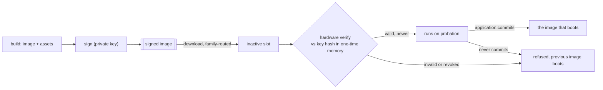

# Secure boot and field update

Firmware is **signed when it is built and verified by the hardware before it runs** — every boot, not
only when it is programmed. An update is delivered as a whole image into a slot the running firmware
is not executing from, and becomes the image that boots only after it has proved itself. The
framework carries no bootloader of its own: the chip's own verified-boot facility is both the root of
trust and the slot selector, and the build produces images and a partition map it accepts.

*The private key signs; immutable hardware verifies. A new image is on probation until the
application commits it, so an image that cannot run is discarded rather than kept.*

---

## Responsibility

Define what is signed and when it is checked, how an update reaches a device without risking the
image it replaces, how a version is prevented from returning once it is revoked, and where assets
live so that a look-and-feel change is not a firmware change. The signing itself belongs to the
build ([10-build-and-release.md](10-build-and-release.md)); the verification belongs to the port's
chip facility ([07-ports-and-shell.md](07-ports-and-shell.md)); this document is the contract
between them.

## Public surface

- **Build.** `light_partition_table(<target> LAYOUT <json> [SIGN <key>])` produces the device's
  signed partition map; `light_seal_image(<target> [ENCRYPT])` signs a target's image and stamps its
  version, taking the version the build already derives from the repository. The signing key is
  selected by the build, defaulting to the development key.
- **Assets.** The blob helpers (`light_add_font`, `light_add_theme`, `light_add_ui`) emit into the
  data partition rather than into the firmware image; the port resolves a partition to a
  `&'static [u8]` at runtime, which is what the portable readers already take.
- **Update.** The port offers staging an image into the inactive slot, a reboot that asks the
  hardware to select it, and the **commit** an application calls once it is satisfied with itself.
  An application supplies the self-test that decides whether to commit.

## Behaviour and invariants

- **The root of trust is immutable hardware, never flash.** A public key's hash lives in one-time
  memory; the verifier is the chip's own boot facility. Anything stored in flash can be replaced by
  whoever can write flash, so nothing in flash can be the root.
- **Verification is at every boot, not at programming.** Programming-time-only checking is bypassed
  by anyone who can write the flash directly, and gives an assurance it does not hold.
- **An update never writes the image it is running.** Staging targets the inactive slot, and the
  hardware enforces the permission, so a fault in the update path cannot destroy the working image.
- **A new image runs on probation and must commit itself.** Until it does, a reset returns to the
  previous image. An image that hangs, panics or cannot drive its display is therefore self-
  discarding: the failure mode of a bad update is a device still running the old firmware.
- **Versions do not come back.** Each image carries a version; a counter in one-time memory records
  the oldest version still accepted, so an image whose flaw has been fixed cannot be re-presented.
- **Assets are signed as their own partition.** Fonts, themes and interfaces update independently of
  firmware and carry their own authenticity; a restyle ships without a new firmware image, which is
  what the data-asset formats exist for.
- **Encryption is the application's choice, and it costs RAM.** Authenticity is always on;
  confidentiality is opt-in per application. An encrypted image is decrypted to RAM and executes
  from there, so it spends its own size in RAM — a board whose framebuffer already dominates RAM
  cannot take it, and this is a per-board fact to check before promising it.
- **Development and production keys are different, and the development key is public.** It lives in
  the repository, protects nothing, and exists so that the whole path — sign, verify, update,
  commit — is exercisable by anyone with the source. The production key never leaves its secret
  store.
- **A shipped device has no debugger.** Closing debug access is part of securing a unit, so the
  console, the panic relay and the fault recorder are the only diagnostic channel a field unit has;
  they are not optional comforts.

## Notable design decisions and constraints

- **No bootloader of the framework's own.** A second stage would itself have to be verified, kept in
  step with the images it loads, and made un-erasable — all of which the chip's boot facility
  already does. The framework supplies a signed partition map and signed images instead.
- **The bench path and the field path are the same mechanism.** An update is delivered through the
  chip's ordinary image-download route, routed to the right partition by the image's family, so a
  developer's flash and a field update differ in who initiates them, not in what happens.
- **Over-the-air delivery is not in scope yet.** The contract above names no transport, so a
  transport is added without revisiting any of it.
- **Making a device secure is irreversible and belongs to manufacture.** Writing the key hash and
  enabling verification cannot be undone; a development board is either left open or given the
  development key, and no bench procedure writes one-time memory.

### Reference implementation — the RP2350 port

The part-specific facts live with the port ([07-ports-and-shell.md](07-ports-and-shell.md)); in
outline: images and the partition table are signed with **secp256k1/SHA-256** by the build's
`seal`/`partition` steps, and the boot ROM verifies them against a **SHA-256 of the public key held
in OTP** once secure boot is enabled there. The ROM selects between the A/B slots by version, runs a
**try-before-you-buy** image on probation until the firmware calls the ROM's buy routine, and offers
partition-permission-checked flash operations for staging. Downloads are routed to a partition by
**UF2 family**, which is what makes the data partition separately updatable. A rollback counter, a
glitch detector and debug-disable all live in the same one-time memory.
